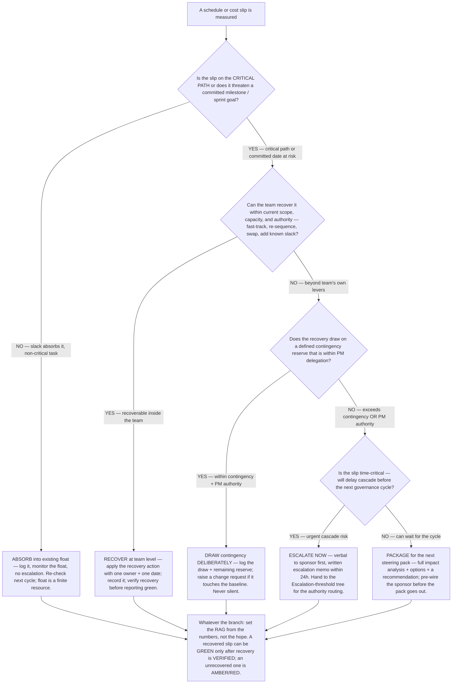

# Schedule-slip decision tree — recover within the team, absorb into contingency, or escalate?

**Last reviewed:** 2026-06-05 · **Confidence:** medium (built on PMBOK earned-value + integrated-change-control framings and the Scrum Guide, web-verified this date; the CPI/SPI threshold numbers mirror the Status-RAG tree and are conventions, not laws — calibrate to the engagement). The earned-value formulas referenced are standard; the decision boundaries are illustrative and must be confirmed against the engagement's delegation thresholds and governance.

> Canonical decision tree owned jointly by [`delivery-lead`](../agents/delivery-lead.md) (the baseline + earned value) and [`stakeholder-comms-lead`](../agents/stakeholder-comms-lead.md) (the escalation memo), with the recovery-vs-replan call on the agile side routing to [`scrum-master`](../agents/scrum-master.md). Traverse top-to-bottom **before** deciding what to do about a slip — and **before** writing the status RAG. It complements the existing **Escalation-threshold** tree in [`pm-decision-trees.md`](pm-decision-trees.md): that one triages a *generic issue* (a blocker, a conflict, a resource gap) by authority level; **this one is specific to a measured schedule or cost variance** and answers the prior question — *recover, absorb, or escalate the slip itself* — feeding the escalation tree only once escalation is the chosen path.

---

## When this applies

A schedule or cost variance has been **measured**, not just feared: a milestone is forecast late, a sprint is trending to miss its goal, an SPI/CPI has dropped below 1, or a critical-path task has slipped. Observable triggers: "we're going to miss the date", "SPI is 0.85", "the sprint won't make it", "do we tell the sponsor?". The failure this prevents — the **watermelon** status — is silently absorbing a slip (green on the outside, red on the inside) instead of consciously choosing to recover, draw contingency, or escalate.

## The tree

## Rationale per leaf

- **ABSORB into float** — a slip on a non-critical task that existing slack covers does not need escalation; log it and **watch the float as a finite resource** (repeated absorption silently consumes the buffer that protects the critical path). This is the only legitimate "absorb", and it is absorbing into *float*, never into silence.
- **RECOVER at team level** — when the team can claw the time back with its own levers (fast-tracking, re-sequencing, a known-good swap, overtime within reason), apply the recovery with **one owner and one date** (house opinion #1) and **verify the recovery before the status goes green**. A recovery plan is not a recovery; reporting green on a hoped-for recovery is how watermelons form.
- **DRAW contingency deliberately** — contingency reserve exists to be used; the discipline is to draw it *consciously and visibly* — log the draw and the remaining reserve, and raise a change request if the draw touches the baseline (hand to the Change-request tree). Drawing contingency without recording it is indistinguishable from silent absorption.
- **ESCALATE NOW** — a slip that exceeds contingency or PM authority **and** will cascade before the next governance cycle cannot wait for a scheduled meeting: verbal to the sponsor first, written memo within 24 hours. The *authority routing* (PM → sponsor → steering) is owned by the Escalation-threshold tree; this leaf decides that the slip *is* an escalation.
- **PACKAGE for steering** — a material slip that is not immediately time-critical belongs in the next steering pack with a full impact analysis, options, and a recommendation — and the sponsor pre-wired so the pack confirms a conversation rather than detonating one.

## The watermelon test (why the RAG node is on every path)

Every leaf converges on the same rule: **the RAG comes from the numbers, not from the recovery you hope to land.** A slip that has been *recovered and verified* can be green; a slip you are *trying* to recover is amber; a slip you cannot recover, draw for, or have escalated is red. A green RAG sitting on an unrecovered SPI < 1 is the watermelon — green skin, red flesh — and it is a governance failure, not optimism. This is the entry condition that hands off to the **Status-RAG** tree in [`pm-decision-trees.md`](pm-decision-trees.md).

| Slip handled by | Baseline / reserve touched? | Who decides | Earliest RAG that's honest |
|---|---|---|---|
| Absorb into float | No | PM (log only) | GREEN if float comfortably covers; else AMBER |
| Recover at team level | No | Team + PM | GREEN only after recovery is **verified** |
| Draw contingency | Reserve (+ baseline if CR) | PM within delegation | AMBER while drawing; GREEN after |
| Escalate now | Likely baseline | Sponsor | AMBER/RED — sponsor decision pending |
| Package for steering | Likely baseline | Steering committee | AMBER/RED — decision pending |

## See also

- [`pm-decision-trees.md`](pm-decision-trees.md) — the **Escalation-threshold** tree (authority routing once escalation is chosen), the **Change-request** tree (when a draw/recovery touches the baseline), and the **Status-RAG** tree (the colour this one feeds).
- [`pm-estimate-confidence-decision-tree.md`](pm-estimate-confidence-decision-tree.md) — sizing the band a slip breaches; a slip is often the estimate's spread coming true.
- [`../best-practices/`](../best-practices/) — `scope-absorption-is-a-defect`, `status-leads-with-narrative-and-matches-the-numbers`, `earned-value-tells-two-stories`, `critical-path-is-the-schedule-not-the-wishlist`.
- [`../scripts/evm_calc.py`](../scripts/evm_calc.py) — `evm` quantifies the slip (CV/SV, CPI/SPI, EAC) and prints the RAG read this tree references.
- [`../../../docs/best-practices/decision-trees-in-knowledge-files.md`](../../../docs/best-practices/decision-trees-in-knowledge-files.md) — the format this tree follows.

## Refresh triggers

- A change in PMBOK earned-value / integrated-change-control or Scrum-Guide guidance these framings cite → re-verify + re-date.
- The engagement sets explicit delegation thresholds → replace the illustrative CPI/SPI + authority boundaries with the engagement's own.
- `Last reviewed:` older than 90 days (the marketplace anti-staleness backstop).
