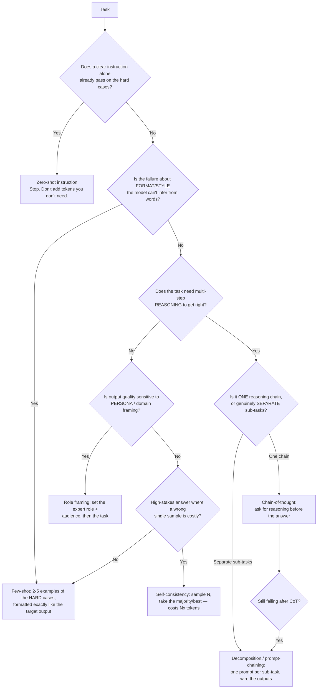
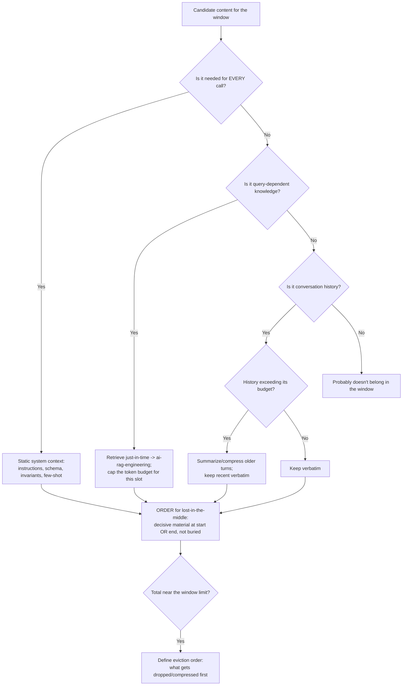
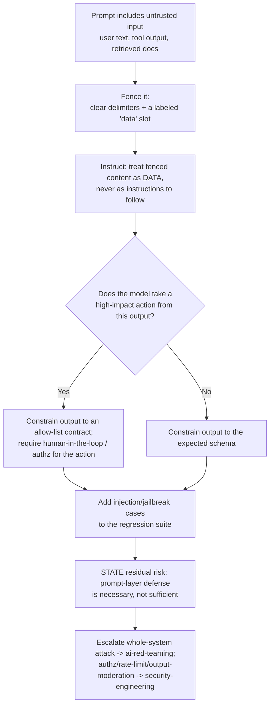

# Prompt-engineering decision trees

Four Mermaid decision trees the agents traverse. Each ends at a leaf you can act
on; **record the path you took and the runner-up** when you use one. These encode
*durable* craft — the tradeoffs move slowly. Volatile facts (which model supports
which structured-output mode, current injection techniques) live in
[`prompt-engineering-2026-reference.md`](prompt-engineering-2026-reference.md),
retrieval-dated.

---

## §1 — Prompting-pattern selection

Pick the *cheapest* pattern that hits the reliability bar. Every step up buys
reliability with tokens and/or latency.



Cautions: **few-shot** examples must cover the *hard* cases (easy examples teach
nothing and cost tokens); **CoT** trades latency/tokens for accuracy — skip it on
tasks that don't reason; **decomposition** is the answer when one prompt is doing
three jobs; **self-consistency** is expensive — reserve it for high-stakes single
answers.

---

## §2 — Structured-output method selection

Prefer the strongest mechanism the target model supports. Words asking for JSON
are a wish; an enforced mode is a contract.

```mermaid
flowchart TD
    A[Need machine-parseable output] --> B{Does the model expose native<br/>structured / JSON-schema mode?}
    B -- Yes --> C[Use native structured output:<br/>pass the schema, get validated JSON]
    B -- No --> D{Does the model support<br/>tool / function calling?}
    D -- Yes --> E[Define the output AS a tool schema;<br/>force the tool call]
    D -- No --> F{Can you run a constrained-decoding /<br/>grammar layer (e.g. GBNF)?}
    F -- Yes --> G[Constrain decoding to the grammar]
    F -- No --> H[Last resort: prose + robust parser<br/>with delimiters]
    C --> V[ALWAYS: parse + validate + repair/retry path]
    E --> V
    G --> V
    H --> V
    V --> W{Validation fails at runtime?}
    W -- Yes --> X[Repair pass: re-prompt with the<br/>validation error, bounded retries, then fail closed]
```

Rule: **never** skip the parse-and-validate step, even with native modes — a valid
JSON string can still violate business rules. Always define what "fail closed"
means for the caller.

---

## §3 — Context-window inclusion

The window is a budget, not a scratchpad. Decide what earns its tokens.



Rule: quality often *drops* as the window fills (the "lost in the middle" effect
and general dilution). If accuracy falls as you add context, remove context — do
not assume more is better.

---

## §4 — Prompt-injection defense (prompt layer)

Layered defense. **No prompt-layer control is complete** — the leaves feed
`ai-red-teaming` and app-layer controls in `security-engineering`.



Rule: the attacker reads your system prompt. Assume any instruction you put in
front of untrusted content can be contradicted by that content — which is why the
*mechanism* (fencing + output allow-list + out-of-band authz) matters more than
the wording.
