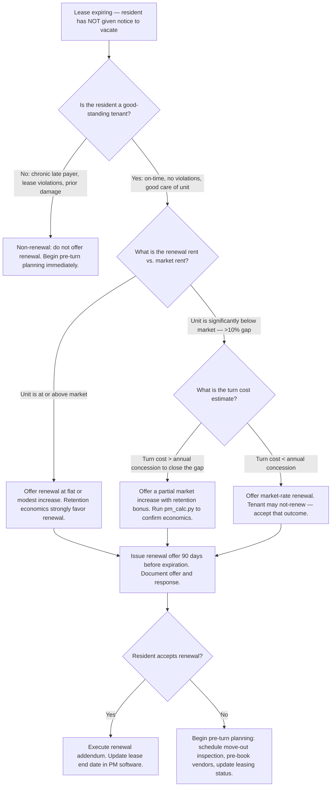
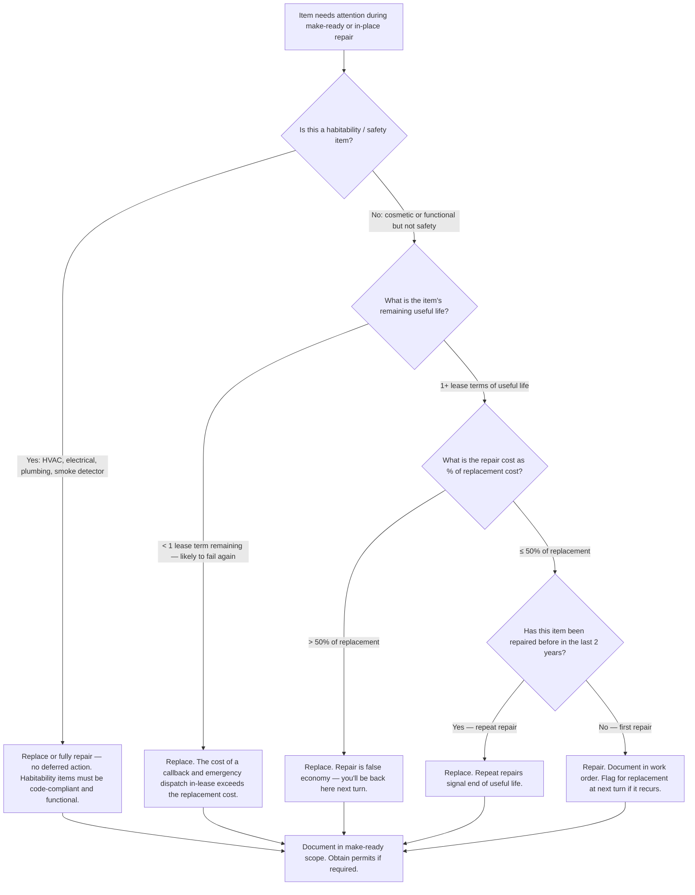
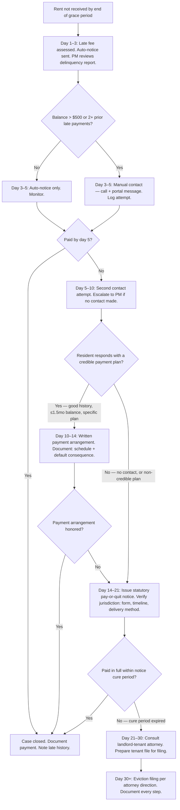

# Property Management — Residential Decision Trees + 2026 Capability Map

> Canonical knowledge bank for `property-management-residential`. **Traverse the relevant Mermaid
> tree top-to-bottom before choosing** — the proactive complement to the Capability Grounding
> Protocol. Volatile product/pricing facts carry a retrieval date and a re-verify-at-use rider.

---

## Decision Tree 1: Renew vs. Turn

**Leaf rule:** the economics of turning a unit (days-vacant × daily rent + make-ready cost) almost
always favor retaining a good-standing tenant within a reasonable rent range. Run the numbers with
`scripts/pm_calc.py` before pushing a market-rate renewal that risks losing a reliable resident.
A 10-day vacancy at $1,800/month = $600 in lost rent alone, before make-ready costs.

---

## Decision Tree 2: Repair vs. Replace / Make-Ready

**Leaf rule:** for make-ready decisions, the guiding question is not "can we fix it cheaply today?"
but "will it fail again before this lease ends?" A callback during tenancy costs more than the
in-turn replacement — in vendor time, resident satisfaction, and potential habitability liability.

---

## Decision Tree 3: Delinquency Action Ladder

**Leaf rule:** work the ladder in order — skip no steps. Every contact attempt, every notice, and
every payment arrangement is documented in the tenant file before moving to the next step. An
eviction filing without documented prior notices and contact attempts is legally and factually weak.
Always verify state/local statutory notice requirements before issuing a legal notice.

---

## 2026 Capability Map — PM Software, Screening, and Payments (dated, re-verify at use)

_Retrieved 2026-06-08. Product features, pricing, and integrations are volatile — re-confirm at
use. This is orientation, not a procurement recommendation. [verify-at-use]_

### PM Software Platforms

| Platform | Best fit | Notable capabilities |
| --- | --- | --- |
| **AppFolio Property Manager** | Mid-market to enterprise residential (50+ units) | Resident portal, online leasing, integrated screening, AI maintenance triage, owner portal, advanced reporting [verify-at-use] |
| **Buildium** | Small to mid-market residential (1–5,000 units) | Leasing, accounting, maintenance, resident portal, owner portal — straightforward onboarding [verify-at-use] |
| **Yardi Breeze / Breeze Premier** | Small to mid-market residential and commercial | Clean UI, Breeze Premier adds more accounting depth; scales to Yardi Voyager for enterprise [verify-at-use] |
| **Rent Manager** | Mid-market, especially mixed portfolios | Deep accounting, flexible configuration, strong for single-family and mixed portfolios [verify-at-use] |
| **DoorLoop** | Small portfolio / owner-operators | Low entry cost, modern UI, basic leasing and accounting [verify-at-use] |
| **Propertyware** | Single-family residential | Purpose-built for SFR portfolios; strong maintenance and inspection tools [verify-at-use] |

### Screening Integrations (as of 2026) [verify-at-use]

| Provider | Notes |
| --- | --- |
| **TransUnion SmartMove** | Resident-initiated pull; widely used for smaller PM operations |
| **RentSpree** | Integrated into Zillow / Trulia listing flow; credit + background |
| **Checkr** | Background-focused; strong for individualized criminal history assessment (HUD 2016 guidance-aligned workflows) |
| **AppFolio Screening (native)** | Built into AppFolio; credit + criminal + eviction + income verification |
| **Buildium Screening (native)** | Integrated screening via TransUnion or tenant-initiated |

**HUD criminal history guidance (2016) [verify-at-use — guidance has not been formally rescinded
as of 2026-06-08 but has been subject to ongoing policy review; verify current status before use]:**
Blanket bans on criminal history create disparate impact. The defensible approach is an
individualized assessment: nature and severity of offense, time elapsed, evidence of rehabilitation,
nexus to tenancy risk.

### Payment Collection Integrations [verify-at-use]

| Tool | Notes |
| --- | --- |
| **PayLease (Zego)** | Widely used; ACH, card, cash-pay (PayNearMe network) |
| **Forte** | ACH-focused; bank-level integrations |
| **PM software native ACH** | AppFolio, Buildium, Yardi all offer native ACH collection — lowest friction for residents |
| **PayNearMe** | Cash-pay at retail; reaches unbanked residents |

> Provenance: product positioning based on vendor documentation and PM industry reports, 2026-06-08.
> Shares, feature sets, and integrations change; verify at use. No invented products.

---

## See also

- [`../CLAUDE.md`](../CLAUDE.md) — team constitution and seams.
- [`../best-practices/README.md`](../best-practices/README.md) — the named, citable rules.
- [`../scripts/pm_calc.py`](../scripts/pm_calc.py) — occupancy, NOI, delinquency rate, turn cost,
  rent-to-income ratio calculator.
- Neighbor decision trees: `commercial-real-estate`, `skilled-trades-contracting`,
  `field-service-management`.

_Last reviewed: 2026-06-08 by `claude`._
