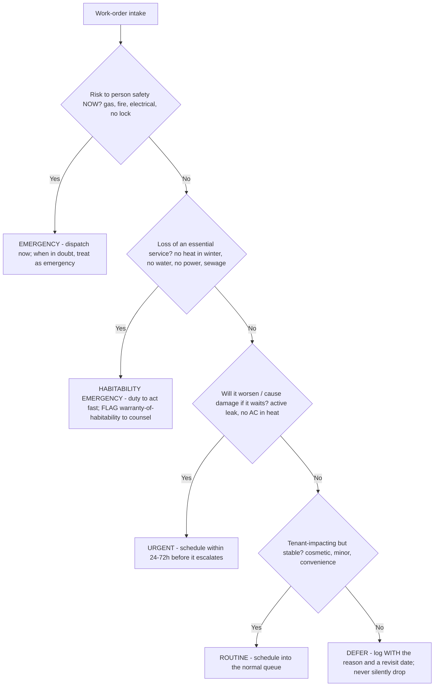
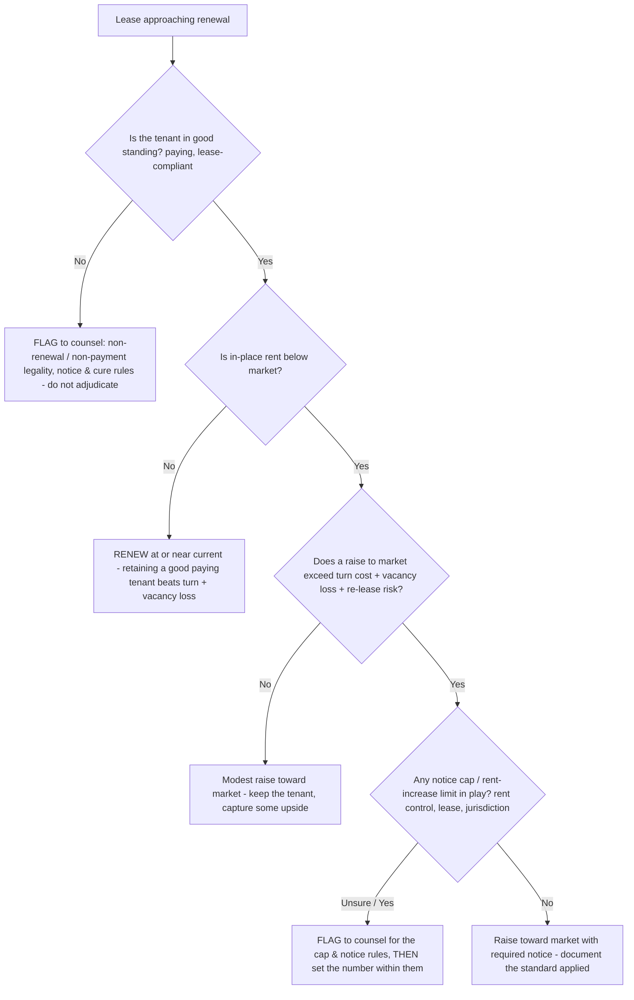
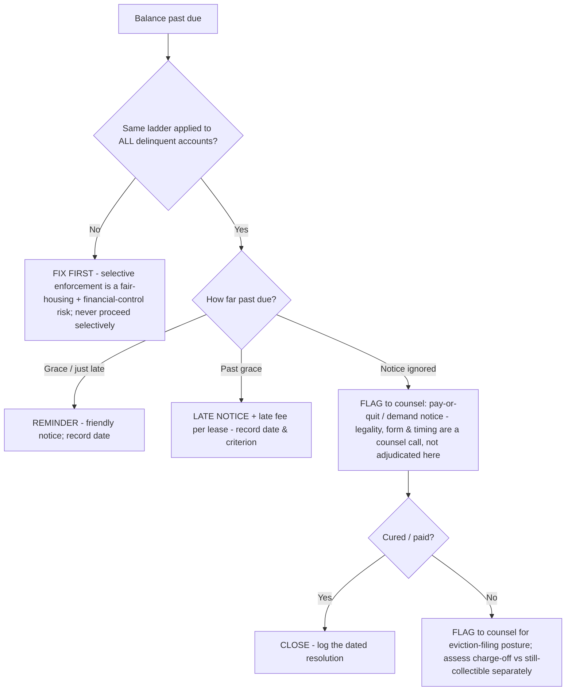
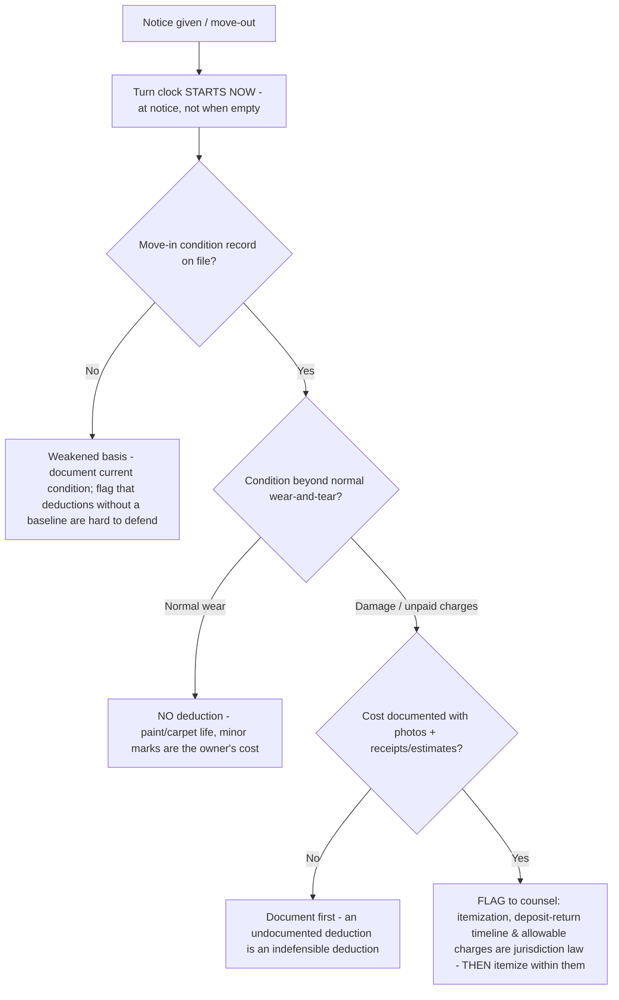

# Property Management (Residential) — Decision Trees

_Decision trees + a dated reference map. Reference rows are `[verify-at-build]` — re-check against current law/vendor before relying on them. Fair-housing, eviction, and habitability are **legal** questions: these trees route operational decisions, they do not state the law. Last reviewed: 2026-06-08._

Traverse before classifying a maintenance request or deciding a lease renewal. Anything that turns on legality stops and routes to qualified counsel.

## Decision Tree: Maintenance triage — emergency, routine, or deferred?

Classify by risk to person and habitability first; cost is the tie-breaker, never the gate.



_No-heat-in-winter, no-water, sewage, gas, and no-lock are habitability/emergency events with a duty to act fast — they never sit in the routine queue. Whether a condition legally breaches the warranty of habitability is a counsel question, not a triage output._

## Decision Tree: Lease renewal — renew, raise, or non-renew?

The number is a math problem framed by law: market vs. in-place rent and turn/vacancy cost decide it; the *legality* of the increase or non-renewal is always a counsel question.



_A renewal decision is uniform and documented: the same market-vs-in-place + turn-cost logic for every unit. Steering a renewal/non-renewal by anything protected-class-adjacent is a fair-housing flag, not a judgment call._

## Decision Tree: Delinquency — where on the collections ladder?

One dated ladder, applied identically to every account. Selective enforcement ("let the good tenant slide") is both a fair-housing and a financial-control risk; the legal rungs flag to counsel, they are not executed as if the legality were settled.



_Each rung is dated and recorded; the pay-or-quit and eviction rungs are flagged to counsel, not run as settled law. A balance that doesn't reconcile to the ledger is a rent-roll data-integrity problem before it is a collections problem — fix the rent roll first._

## Decision Tree: Move-out — security-deposit deduction or normal wear?

Deductions rest on a documented condition record and the wear-vs-damage line; the deduction's *legality* (itemization rules, timelines, allowable charges) is jurisdiction-specific law that flags to counsel.



_Wear-and-tear vs. damage and the deduction itemization are operational; the deposit-return timeline, the allowable-charge list, and the penalty for getting it wrong are counsel questions. Document the condition and the reason for every deduction, dated._

## Decision Tree: Vacancy & turn — minimize days-vacant

Every day vacant is unrecoverable revenue. The turn clock starts at notice; market the unit before it empties; sequence the turn so it doesn't gate the lease-up.

```mermaid
graph TD
  A[Notice to vacate received] --> B[Start turn clock + begin pre-marketing NOW - do not wait for the unit to empty]
  B --> C{Renew-vs-raise already evaluated?}
  C -- No --> D[Run the renewal tree first - retaining a good tenant often beats turn + vacancy loss]
  C -- Yes / non-renewing --> E{Unit make-ready scope known?}
  E -- No --> F[Walk + scope the turn; classify each line opex (turn) vs capex (renovation) - capex stays out of NOI]
  E -- Yes --> G{Any habitability/safety item in the scope?}
  G -- Yes --> H[Those route through maintenance triage as priority - a turn never ships an unsafe/uninhabitable unit]
  G -- No --> I[Sequence turn to finish AT lease-up, not before - measure days-vacant against vacancy-loss, not turn-cost alone]
```

_The turn clock starts at notice, not at empty; pre-market against the vacancy-loss number, not turn-cost in isolation. Renovation-grade turn lines are capex and stay out of NOI — route the opex/capex line to `finance` when it's a books question._

---

## Reference map (2026, `[verify-at-build]`)

| Area | Reference points | Notes |
|---|---|---|
| Fair-housing protected classes (federal) | Race, color, national origin, religion, sex (incl. gender identity / sexual orientation per HUD guidance), familial status, disability | Federal Fair Housing Act baseline; **many state/local laws add classes** (source of income, age, marital status, etc.) `[verify-at-build]` |
| Fair-housing — what agents do | FLAG and route to counsel | Agents never adjudicate ads, denials, accommodations, or steering — they surface the risk `[verify-at-build]` |
| Screening signals (consistent, documented) | Income multiple (e.g. ~2.5-3x rent), credit history, prior eviction/judgment history, rental references, occupancy standard | Apply the SAME written standard to every applicant; criminal-history and source-of-income use is legally constrained — `[verify-at-build]` |
| Habitability / emergency list | No heat (cold), no water, no power, sewage backup, gas leak, no working lock, no hot water | Implied warranty of habitability varies by jurisdiction; the OPERATIONAL duty-to-act-fast does not `[verify-at-build]` |
| PM-software landscape | AppFolio, Yardi (Voyager / Breeze), RealPage, Buildium, Rent Manager, DoorLoop, TenantCloud | Agents are system-neutral; map the schema to whatever the client runs `[verify-at-build]` |
| Screening / tenant-data providers | TransUnion SmartMove, Experian/RentBureau, RentGrow, Checkr-style background | Screening reports are sensitive PII — minimize, never quote in outputs `[verify-at-build]` |
| Rent-roll fields | Unit, tenant, lease start/end, market rent, actual rent, balance/aging, status (occupied / vacant / notice / down) | The source of truth; reconcile to reality every period `[verify-at-build]` |
| NOI & owner-reporting metrics | NOI = operating income − operating expenses (EXCL. debt service, capex, depreciation); occupancy (physical vs. economic); vacancy loss; delinquency aging; renewal rate; time-to-lease; turn time | NOI is operating-only and is NOT cash flow; the books of record are `finance`'s `[verify-at-build]` |

_Legal disclaimer: fair-housing, eviction, rent-control/notice, and warranty-of-habitability rules are jurisdiction-specific law that changes. These rows orient operations; they are not legal advice and must be verified with qualified counsel before any consequential action. The books of record (trust-account, GL, tax) belong to `finance`._
