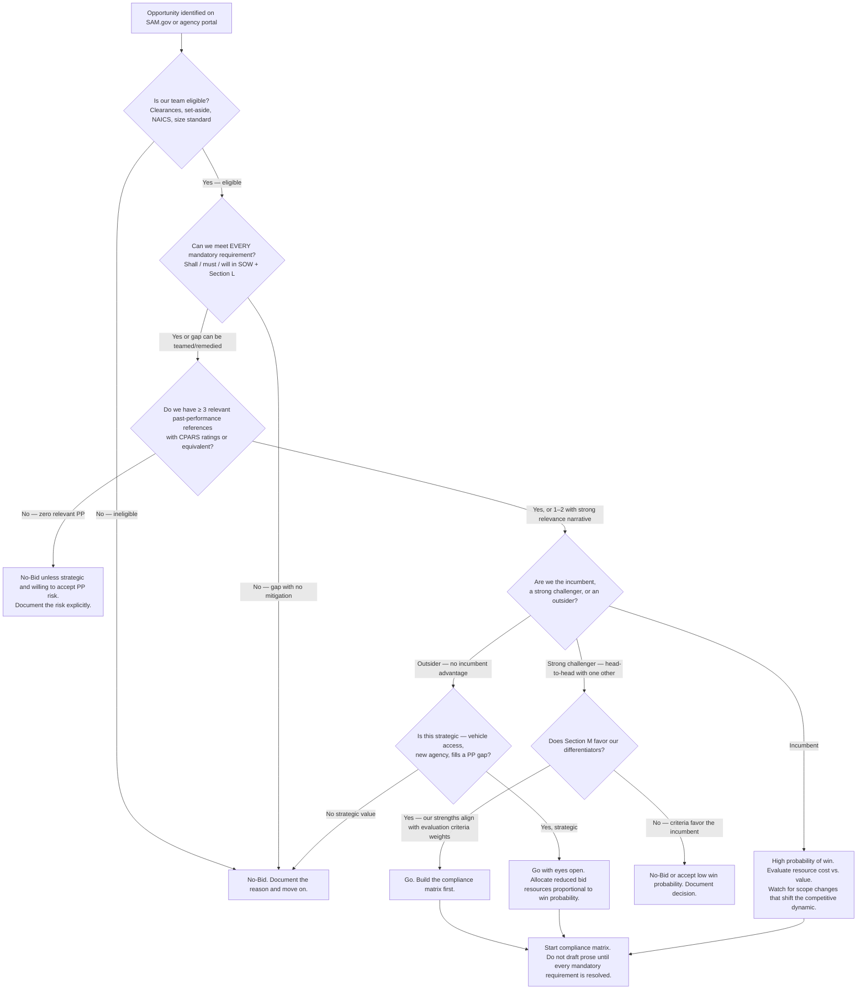

# Government / GovTech — Decision Trees + 2026 Capability Map

> Canonical knowledge bank for `public-sector-govtech`. **Traverse the relevant Mermaid tree
> top-to-bottom before choosing** — the proactive complement to the Capability Grounding Protocol.
> Volatile product/version/program facts in the capability map carry a retrieval date and a
> `[verify-at-use]` rider. Statutory and regulatory citations are accurate as of the last-reviewed date;
> confirm against current CFR/USC when making compliance decisions.

---

## Decision Tree 1: Bid-No-Bid



**Leaf rule:** the bid-no-bid decision is a resource allocation decision, not a motivational one.
Go only when: eligible, mandatory requirements achievable, past performance defensible, and the
evaluation criteria favor our differentiators — or the strategic value justifies a long-shot bid
with deliberately reduced investment.

---

## Decision Tree 2: FedRAMP / StateRAMP Posture Needed?

```mermaid
flowchart TD
  A[Is the product / system operated by or for a federal agency?] -->|No — state/local only| B{Does the state require StateRAMP<br/>or an equivalent cloud-security authorization?}
  B -->|No requirement found| Z[No FedRAMP/StateRAMP required. Follow agency-specific cloud policy and NIST 800-53 as good practice.]
  B -->|Yes — StateRAMP or state-specific| S[StateRAMP authorization required.<br/>Determine Ready / Authorized / Progressive path.<br/>Engage a StateRAMP-authorized 3PAO. [verify-at-use]]
  A -->|Yes — federal agency operator or tenant| C{What is the impact level of the data?<br/>FIPS 199 categorization}
  C -->|Low| D[FedRAMP Low authorization required.<br/>~125 controls. Fastest path: FedRAMP Ready via CSP self-attestation<br/>for SaaS at Low. [verify-at-use]]
  C -->|Moderate| E[FedRAMP Moderate authorization required.<br/>~325 controls. Most common path for government SaaS.<br/>Engage a FedRAMP-authorized 3PAO for a full assessment. [verify-at-use]]
  C -->|High| F[FedRAMP High authorization required.<br/>~420 controls. Required for systems processing law-enforcement,<br/>financial, or health data at federal scale. Very limited authorized CSPs. [verify-at-use]]
  D --> G{Use an existing FedRAMP-authorized service<br/>vs. pursue your own authorization?}
  E --> G
  F --> G
  G -->|Use an authorized service| H[Confirm the authorized service is in-scope for your use case.<br/>Review the FedRAMP Marketplace listing and P-ATO boundary. marketplace.fedramp.gov [verify-at-use]]
  G -->|Pursue own authorization| I{Agency partner for a JAB P-ATO<br/>vs. agency-specific ATO?}
  I -->|Agency-specific ATO| J[Engage the sponsoring agency's ISSM/ISSO.<br/>Prepare the SSP, SAP, SAR, POA&M package.<br/>Timeline: 6–18 months typical for Moderate. [verify-at-use]]
  I -->|JAB P-ATO| K[JAB prioritization required. Apply via FedRAMP PMO.<br/>Highly competitive — reserved for high-reuse services.<br/>Timeline: 12–24 months. [verify-at-use]]
  S --> L[Check the StateRAMP Authorized Product List before starting.<br/>stateramp.org/authorized-product-list [verify-at-use]]
```

**Leaf rule:** establish your FedRAMP or StateRAMP posture *before* bidding on cloud-based government
work — an ATO timeline of 6–18+ months for Moderate is a program risk if not started early. If you
can use an already-authorized platform (IaaS/PaaS layer), do so and inherit controls rather than
re-authorizing the stack.

---

## Decision Tree 3: 508 Conformance Path

```mermaid
flowchart TD
  A[Is the ICT used by or provided to a federal agency, or funded by federal dollars?] -->|No| Z[508 does not apply federally. Check state/local equivalent — many states have equivalent laws.]
  A -->|Yes| B{What type of ICT artifact?}
  B -->|Web content / web application| C[Applicable standard: WCAG 2.1 AA<br/>Test: automated axe/WAVE/ANDI + manual keyboard + screen reader NVDA/JAWS/VoiceOver]
  B -->|Software application / desktop| D[Applicable: 508 Chapter 5 + WCAG 2.1 AA for software<br/>Test: keyboard access, AT compatibility, focus management]
  B -->|Mobile application| E[Applicable: WCAG 2.1 AA for mobile<br/>Test: VoiceOver/iOS, TalkBack/Android, touch target size, orientation]
  B -->|Electronic document PDF| F[Applicable: PDF/UA-1 + WCAG 2.1 AA equivalent<br/>Test: PAC 3 automated + Acrobat Accessibility Checker + screen reader]
  B -->|Video / multimedia| G[Applicable: Captions SC 1.2.2 + Audio Description SC 1.2.5<br/>Test: closed-caption accuracy, audio-description completeness]
  B -->|Hardware / kiosk| H[Applicable: 508 Chapter 4 (hardware)<br/>Test: physical access, operable parts, biometric alternatives]
  C --> I{VPAT / ACR required by agency or solicitation?}
  D --> I
  E --> I
  F --> I
  G --> I
  H --> I
  I -->|Yes| J[Author VPAT 2.x using ITIC template.<br/>Per-criterion: Supports / Partially Supports / Does Not Support / Not Applicable + remarks.<br/>Never mark Supports without documented test evidence.]
  I -->|No immediate requirement| K[Produce an internal conformance report and a remediation tracker.<br/>Blockers fixed before release; majors in next sprint; minors in backlog.]
  J --> L[Integrate 508 testing in CI/CD pipeline and sprint definition-of-done.<br/>Re-run on every major release.]
  K --> L
```

**Leaf rule:** 508 testing belongs in Sprint 0 and in the definition of done — not as a pre-ship
checkpoint. Automated tools catch ~30–40% of issues; manual testing with a screen reader is required
for every VPAT marked "Supports." The cost of remediation grows exponentially after code is shipped.

---

## 2026 Capability Map — GovTech Tooling and Programs

> All product/program/pricing details are `[verify-at-use]`. This map reflects the known state
> of the ecosystem as of the last-reviewed date; government programs change frequently.

### Public Procurement Platforms

| Platform | Scope | Notes |
|---|---|---|
| SAM.gov | Federal — primary procurement and grants registry | Contract opportunities, entity registration, exclusions, wage determinations. UEI replaced DUNS 2022. `[verify-at-use]` |
| beta.SAM.gov | Same as SAM.gov — unified interface | Replaces FBO.gov (legacy Federal Business Opportunities site) |
| GSA eBuy | GSA Schedule / MAS task orders | Buyers post RFQs to Schedule holders; requires active MAS contract `[verify-at-use]` |
| SEWP V | NASA SEWP — IT products and services GWAC | Ceiling ~$20B; widely used for commercial IT. SEWP VI in procurement as of 2026 `[verify-at-use]` |
| NASPO ValuePoint | SLED cooperative purchasing | Multi-state master agreements; 50 states participate `[verify-at-use]` |
| Sourcewell | SLED cooperative purchasing | Strong in education and local government `[verify-at-use]` |
| OMNIA Partners | SLED cooperative purchasing | Private sector heritage; public sector division growing `[verify-at-use]` |

### Grants Platforms

| Platform | Scope | Notes |
|---|---|---|
| grants.gov / Workspace | Federal — application submission portal | All civilian agency grant applications; NOFO search. Workspace replaced legacy PDF forms. `[verify-at-use]` |
| USASpending.gov | Federal spending transparency | Award, subaward, contract data; SEFA reconciliation reference `[verify-at-use]` |
| Payment Management System (PMS) | HHS grantee payment / drawdown | Used by HHS agencies and others; ACH drawdown `[verify-at-use]` |
| GrantSolutions | HHS / USDA — post-award management | Award management, progress reporting for participating agencies `[verify-at-use]` |
| eRA Commons | NIH grant application and award management | NIH-specific; required for all NIH applications `[verify-at-use]` |
| 2 CFR 200 (Uniform Guidance) | Regulatory framework | OMB Guidance for Federal Financial Assistance; latest revision published 2024 `[verify-at-use]` |

### FedRAMP / StateRAMP

| Program | Notes |
|---|---|
| FedRAMP PMO (GSA) | Administers FedRAMP program; marketplace at marketplace.fedramp.gov `[verify-at-use]` |
| FedRAMP Marketplace | Searchable list of FedRAMP Authorized, In-Process, and Ready CSPs `[verify-at-use]` |
| StateRAMP | State/local equivalent; Authorized Product List at stateramp.org `[verify-at-use]` |
| NIST SP 800-53 Rev 5 | Security control catalog — basis for FedRAMP control sets `[verify-at-use]` |
| DoD IL2/IL4/IL5 | DoD-specific impact levels beyond FedRAMP Moderate; require additional controls `[verify-at-use]` |

### Section 508 / Accessibility Tooling

| Tool | Type | Notes |
|---|---|---|
| axe-core (Deque) | Automated — web | Industry standard; integrates with CI/CD; ~30–40% WCAG coverage `[verify-at-use]` |
| ANDI (SSA) | Automated — web | Free; government-developed; required by some agencies `[verify-at-use]` |
| WAVE (WebAIM) | Automated — web | Visual output; browser extension and API `[verify-at-use]` |
| Lighthouse (Google) | Automated — web | Performance + accessibility; subset of axe rules `[verify-at-use]` |
| PAC 3 | Automated — PDF | Free; most thorough PDF/UA checker; Windows only `[verify-at-use]` |
| Colour Contrast Analyser (TPGi) | Manual — color | Free; eyedropper; confirms 4.5:1 / 3:1 ratios `[verify-at-use]` |
| NVDA (NV Access) | AT — screen reader | Free; Windows; pair with Firefox for most common test baseline `[verify-at-use]` |
| JAWS (Freedom Scientific) | AT — screen reader | Commercial; Windows; enterprise standard in government `[verify-at-use]` |
| VoiceOver (Apple) | AT — screen reader | Built into macOS/iOS; required for mobile testing `[verify-at-use]` |
| ITIC VPAT 2.x template | Document | Industry standard VPAT template; download from itic.org `[verify-at-use]` |

### Plain Language and FOIA

| Resource | Notes |
|---|---|
| Federal Plain Language Guidelines | Published by the Plain Language Action and Information Network (PLAIN); plainlanguage.gov `[verify-at-use]` |
| Plain Writing Act (2010) | Pub. L. 111-274; OMB implementation guidance M-11-15 `[verify-at-use]` |
| FOIA.gov | Government-wide FOIA portal; proactive disclosure requirements; agency annual reports `[verify-at-use]` |
| DOJ Guide to the FOIA | Most authoritative FOIA reference; updated periodically by DOJ OIP `[verify-at-use]` |
| NARA records management guidance | Federal records management regulations; 36 CFR Chapter XII `[verify-at-use]` |

---

_Last reviewed: 2026-06-08 by `claude`._
