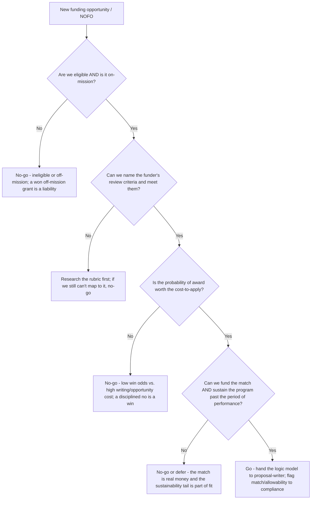
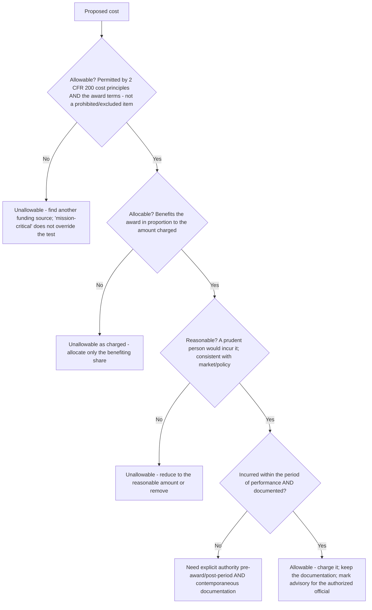

# Public-Sector Grants — Decision Trees

_Decision trees + a dated grant-lifecycle / authority map. Authority rows are `[verify-at-build]` — re-check against the current 2 CFR, the award terms, and the NOFO before quoting any threshold, deadline, or rate. Last reviewed: 2026-06-08._

Traverse before committing to pursue an opportunity, before classifying a sub-award relationship, and before charging a cost to a federal award.

## Decision Tree: Go or no-go on this opportunity?

A grant is justified by mission fit and a plausible win + sustainability — not by the dollar amount on offer.

_Fund the mission, don't chase the money. Name the cost-to-apply, the probability of award, the strings (match/reporting), and the sustainability tail before writing a word._

## Decision Tree: Is this cost allowable on a federal award?

Every federal dollar passes the three-part test — allowable, allocable, AND reasonable — or it doesn't go on the grant.

_Allowable, allocable, reasonable — all three, every cost. Decide allowability at the budget stage, not after the award. The determination is advisory; the authorized official signs._

## Reference: sub-recipient vs. contractor

The classification drives the entire monitoring and audit obligation; get it right at the sub-award.

- **Sub-recipient** — carries out part of the program, makes programmatic decisions, is measured against the program's objectives, must comply with the federal requirements. You owe **sub-recipient monitoring** (risk assessment → sub-award terms → ongoing monitoring → single-audit follow-up) and the sub-recipient's finding becomes yours.
- **Contractor (vendor)** — provides goods/services within normal business operations, to many purchasers, in a competitive market; not subject to the program's compliance requirements. You owe **procurement** compliance, not sub-recipient monitoring.
- Substance over form: the agreement's label doesn't decide it — the relationship does. When mixed, make a case-by-case judgment and document it.

---

## Grant-lifecycle / authority map (2026, `[verify-at-build]`)

| Stage | What happens | Key system / authority |
|---|---|---|
| Find | Search opportunities; read the NOFO/RFP; confirm eligibility | Grants.gov (federal opportunity search & apply); agency program pages `[verify-at-build]` |
| Register | Active registration required before applying for / receiving federal funds | SAM.gov registration + Unique Entity ID (UEI) `[verify-at-build]` |
| Propose | Logic model, narrative mapped to review criteria, SMART objectives, budget + budget narrative | The NOFO review/scoring criteria are the rubric `[verify-at-build]` |
| Award | Notice of Award; accept the terms & conditions; period of performance set | 2 CFR 200 + agency-specific terms; the award document `[verify-at-build]` |
| Manage | Charge only allowable/allocable/reasonable costs; apply the indirect rate; monitor sub-recipients | 2 CFR 200 Subpart E (Cost Principles); de-minimis indirect rate option `[verify-at-build]` |
| Report | Federal Financial Report (FFR) + program performance reports; draw down to need | FFR (SF-425) cadence; cash-management (draw-to-need) rules `[verify-at-build]` |
| Close & audit | Final reports, liquidation, closeout; Single Audit if over the threshold | 2 CFR 200 Subpart F (Audit Requirements); the single-audit threshold + the SEFA `[verify-at-build]` |

_Authority reference: 2 CFR Part 200 (Uniform Administrative Requirements, Cost Principles, and Audit Requirements) — Subpart E is the cost principles (allowable/allocable/reasonable + selected items of cost); Subpart F is the audit requirements (the Single Audit, the SEFA, major-program determination). The single-audit threshold, the de-minimis indirect-cost rate, and all reporting deadlines change — re-verify every threshold/rate/deadline against the current 2 CFR and the specific award terms before quoting it to a recipient. Nothing here is legal, financial, or audit advice; the org's authorized official and auditor own the binding determination._
