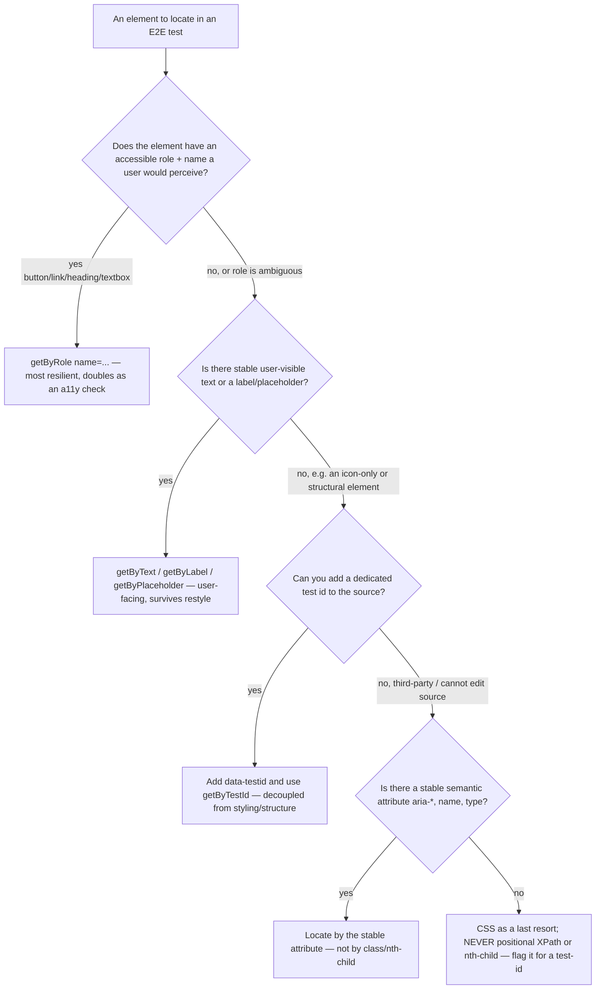
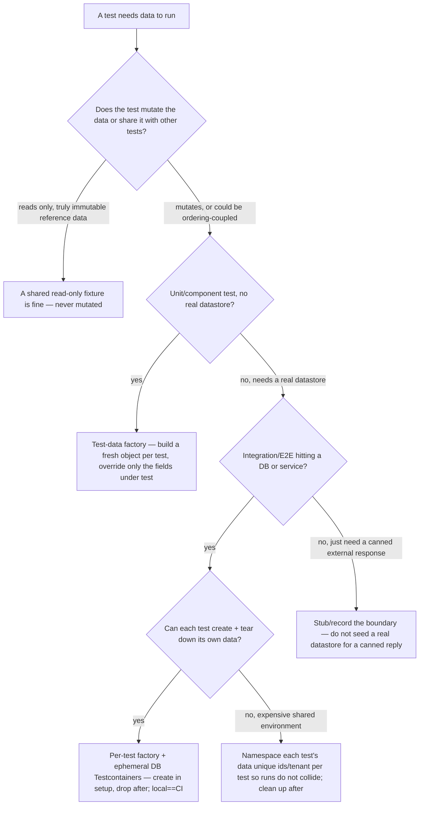

# QA & Test Automation — Selector & Test-Data Decision Trees

_Complements the test-level / flake-triage / double-selection trees in [`qa-test-automation-decision-trees.md`](qa-test-automation-decision-trees.md). These two cover the **authoring-time** choices that decide whether an E2E test is brittle and whether a test is isolated. Traverse before writing the locator or wiring the test's data. Last reviewed: 2026-06-05._

## Decision Tree: Which selector for this E2E element?

**When this applies:** writing or repairing a Playwright/Cypress/Selenium locator. The selector choice is the single biggest driver of E2E brittleness — a CSS/XPath locator coupled to DOM structure breaks on every restyle, while a user-facing locator survives refactors.

**Last verified:** 2026-06-05 against the Playwright locators guidance (prefer user-facing / role / test-id locators over CSS/XPath) and Testing-Library's "query priority" philosophy.

**Priority order (most → least resilient):** role+name → label/text/placeholder → `data-testid` → stable semantic attribute → CSS (last resort). Positional XPath (`//div[3]/span[2]`) and structural CSS (`.row > div:nth-child(4)`) are the **brittleness signature** — they couple the test to DOM layout, so any restyle or markup tweak breaks them, and they protect nothing a user would notice.

**Rationale per leaf:**
- *getByRole* — what the user (and a screen reader) perceives; survives CSS and structure changes; a role+name query that fails is often a real accessibility regression too.
- *getByText / getByLabel* — user-facing strings change far less often than markup, and changing them is usually a *real* behavior change worth a test failure.
- *data-testid* — the deliberate escape hatch when no good semantic handle exists; **page objects own the test ids** so a UI change updates one place, not 40 tests.
- *semantic attribute* — for third-party markup you can't add an id to, lean on `aria-*`/`name`/`type` before class names.
- *CSS last resort* — acceptable only when nothing better exists; treat it as debt and file a test-id request.

**Tradeoffs summary:**

| Locator | Brittleness | Doubles as a11y check | Needs source edit | Use when |
|---|---|---|---|---|
| Role + name | Lowest | Yes | No | Default — element has a perceivable role |
| Text / label / placeholder | Low | Partially | No | Stable user-visible text exists |
| `data-testid` | Low | No | Yes | No good semantic handle; you own the source |
| Semantic attribute | Medium | Partially | No | Third-party markup, stable `aria-*`/`name` |
| CSS / class | High | No | No | Last resort — flag as debt |
| Positional XPath / nth-child | Highest | No | No | **Never** — the brittleness anti-pattern |

## Decision Tree: Which test-data strategy for this test?

**When this applies:** deciding how a unit/integration/E2E test gets the data it operates on. The wrong choice produces order-dependent flakes (shared mutable fixtures), slow suites (full DB seeds per test), or false confidence (hand-maintained fixtures that drift from the schema).

**Last verified:** 2026-06-05 against test-data-management practice (factories over shared fixtures; ephemeral/Testcontainers for integration; per-test isolation as the flake-prevention principle).

**Rationale per leaf:**
- *Shared read-only fixture* — acceptable **only** if genuinely never mutated; the moment one test writes to it, you have an order-dependent flake (see the flake-triage tree's "shared mutable data" branch).
- *Test-data factory* — the default for unit/component tests: a factory builds a complete valid object and the test overrides only the fields it cares about, so the test states its intent and isn't coupled to unrelated fields. **Factories over fixtures** — a fixture file is a hand-maintained snapshot that silently drifts from the schema.
- *Per-test factory + ephemeral DB* — integration/E2E against a real datastore should create their own data in setup and tear it down, on a containerized ephemeral DB so local and CI are identical.
- *Namespace per test* — when teardown isn't possible on a shared environment, give each test unique ids/tenant so parallel runs can't collide (the prerequisite that lets the suite be sharded).
- *Stub the boundary* — don't stand up and seed a real datastore just to get a canned third-party response; stub it.

**Tradeoffs summary:**

| Strategy | Speed | Isolation / flake-safety | Fidelity | Use when |
|---|---|---|---|---|
| Shared read-only fixture | Fastest | Safe **only** if never mutated | Static | Immutable reference data |
| Test-data factory | Fast | High — fresh per test | Schema-aligned if built from the model | Unit/component, no real store |
| Per-test factory + ephemeral DB | Medium (container startup) | Highest | Real datastore behavior | Integration/E2E, can teardown |
| Namespaced data on shared env | Medium | High if ids truly unique | Real shared environment | Can't teardown; must parallelize |
| Stub/record boundary | Fastest | High | Canned (no real behavior) | Third-party canned response |

_Isolate test data: the root cause of most "passes alone, fails in the suite" flakes is shared mutable state. A per-test factory is the cheapest insurance, and it's the prerequisite that makes parallelization/sharding safe._
