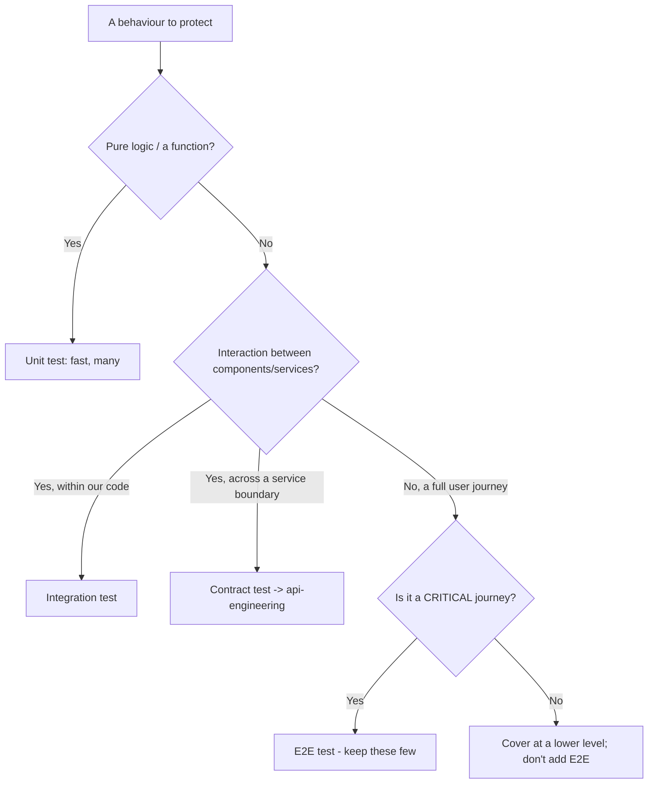
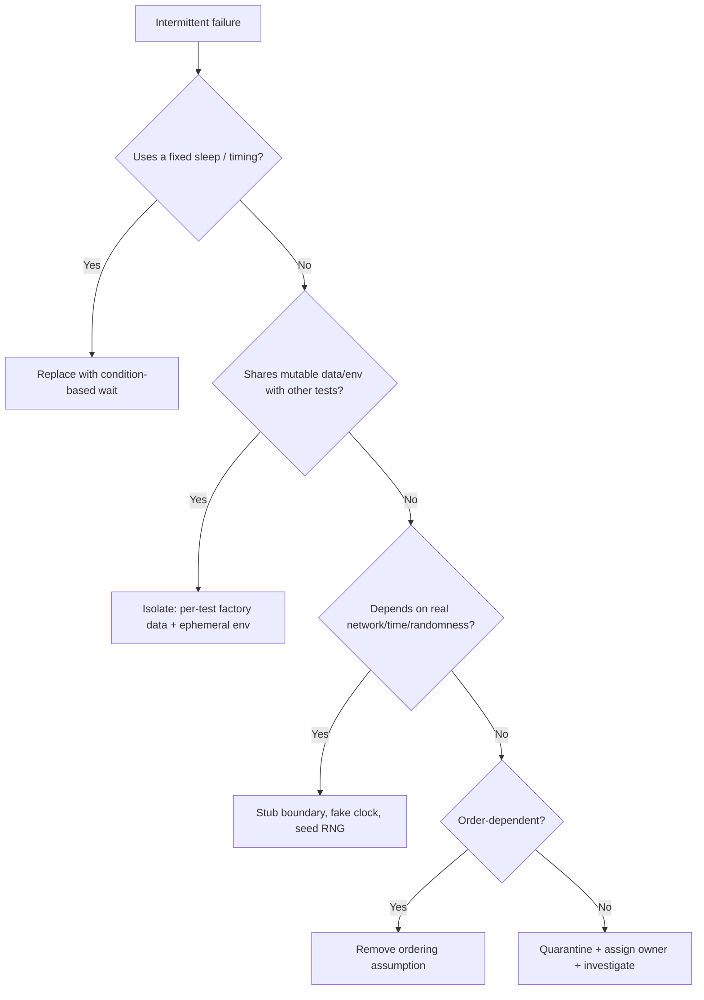
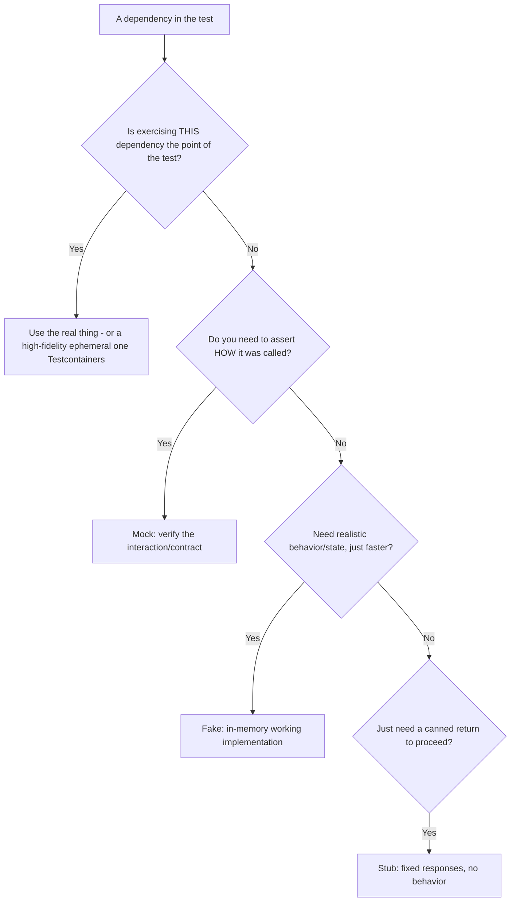
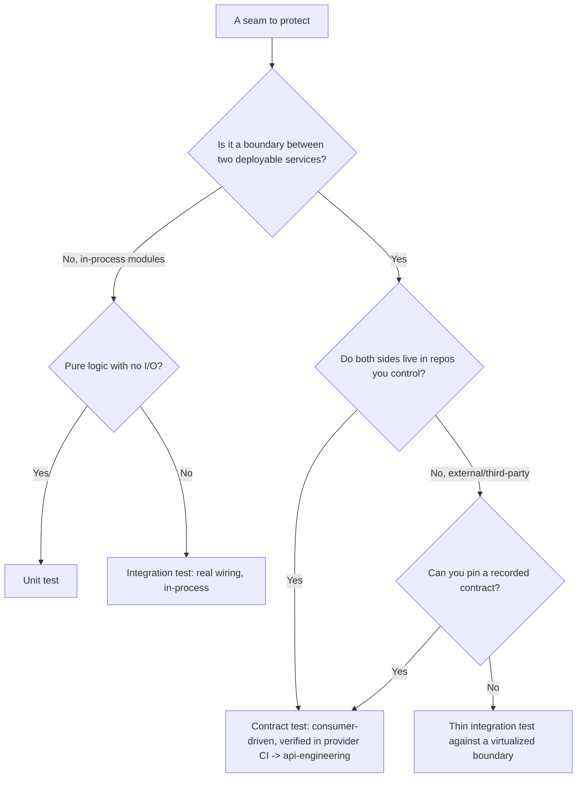
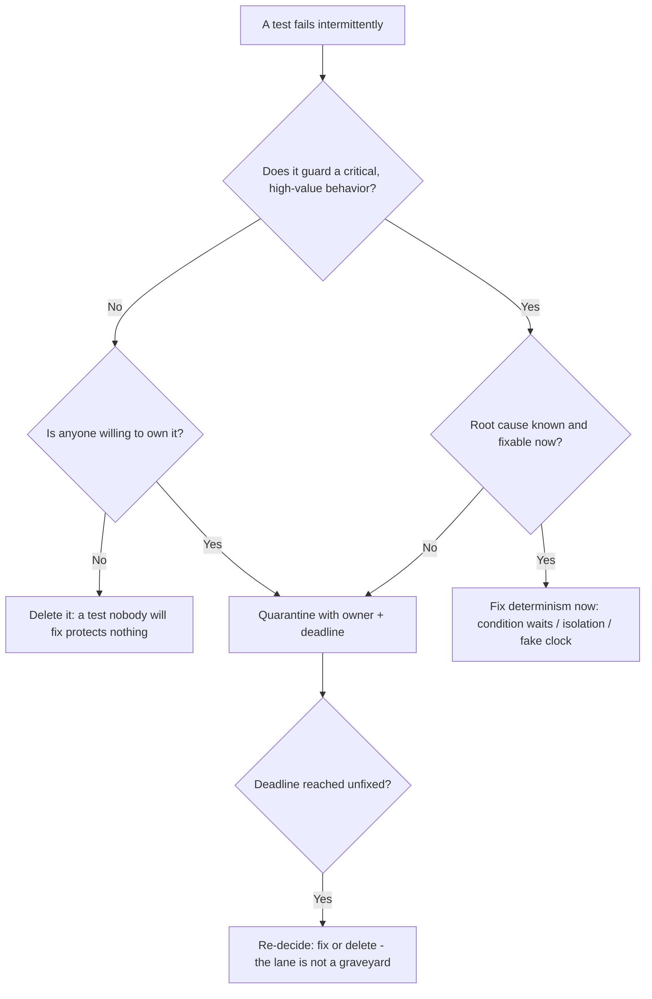

# QA & Test Automation — Decision Trees

_Decision trees + a dated capability map. Capability rows are `[verify-at-build]` — re-check against the vendor before quoting. Last reviewed: 2026-06-04._

Traverse before choosing a test level or chasing a flake.

## Decision Tree: Which test level for this defect?

Push the assertion to the cheapest level that can catch the defect.

_If you reach for E2E for a logic bug, you have an ice-cream-cone problem._

## Decision Tree: A test is flaky — triage

A flaky test is broken. Fix determinism or quarantine; never normalize re-running.

## Decision Tree: Mock, stub, fake, or real dependency?

Match the test double to what you're actually verifying — the wrong double is either a brittle test or a false pass.

_Over-mocking tests your mocks, not your code. Mock at the boundary you own; prefer a fake or real dep over a wall of stubs._

## Decision Tree: Unit, integration, or contract for a seam?

A boundary between components or services needs the cheapest test that actually protects the agreement across it.

_Don't spin up both services for what a contract test catches faster. Push each assertion to the cheapest level that protects the agreement._

## Decision Tree: Quarantine, fix, or delete a flaky test?

A flaky test is broken; decide its fate by its value, not by inertia.

_Quarantine restores signal; it is not a verdict. At the deadline a test gets fixed or deleted with a reason — never left to rot._

## Capability map (dated — verify at build)

| Capability | 2026 state `[verify-at-build]` | Notes |
|---|---|---|
| Playwright | GA, broad adoption | Auto-wait, trace viewer, parallelism built-in |
| Cypress | GA | Component + E2E; watch for app-domain limits |
| Mutation testing (Stryker/PIT/mutmut) | mature per-language | Measures test quality, not just coverage |
| Service virtualization / WireMock | mature | Stub third-party boundaries for determinism |
| Testcontainers | GA | Ephemeral containerized deps; local==CI |
| Coverage gating in CI | standard | Use as a floor; pair with mutation on critical paths |
