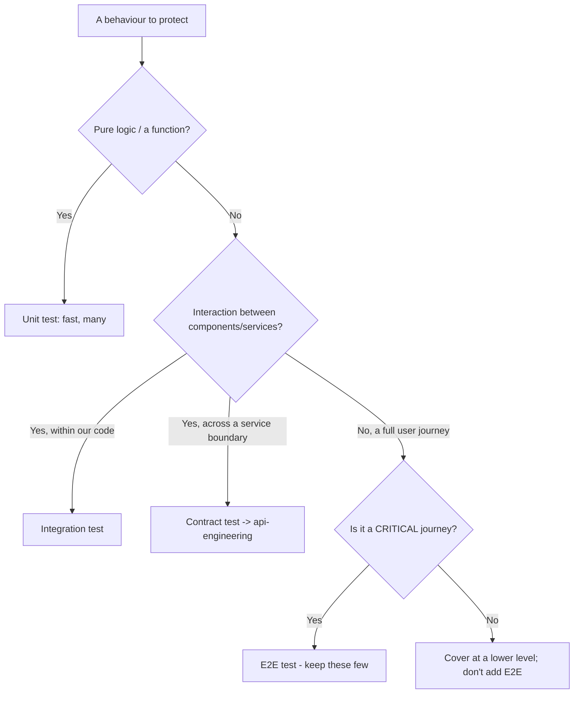
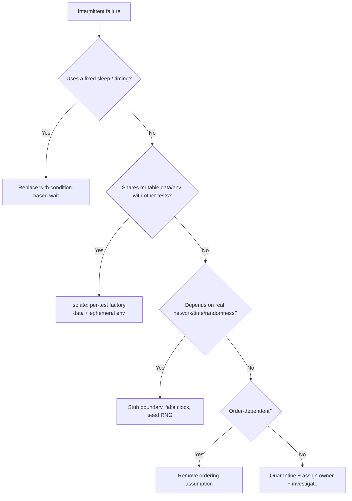
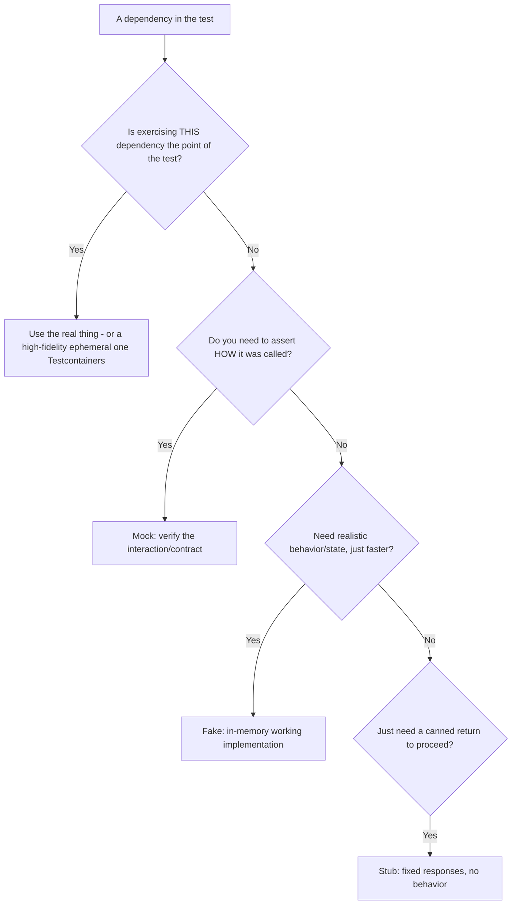
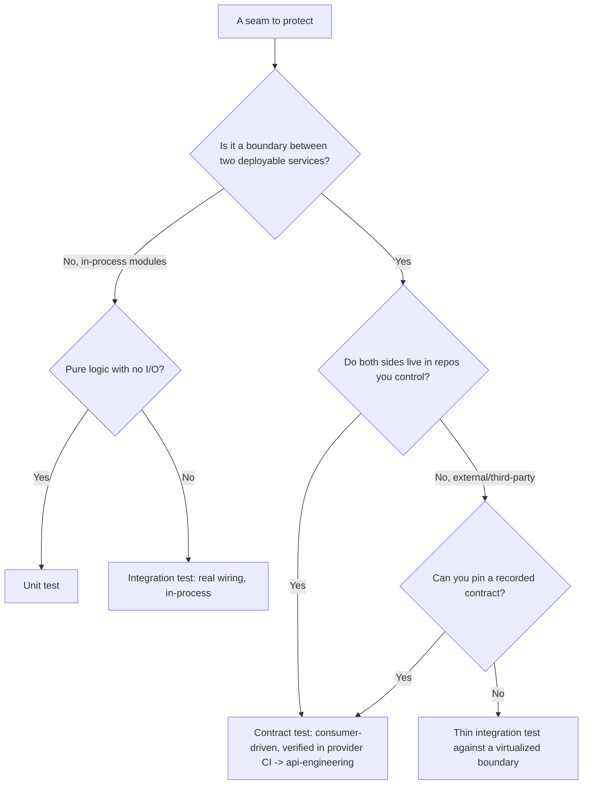
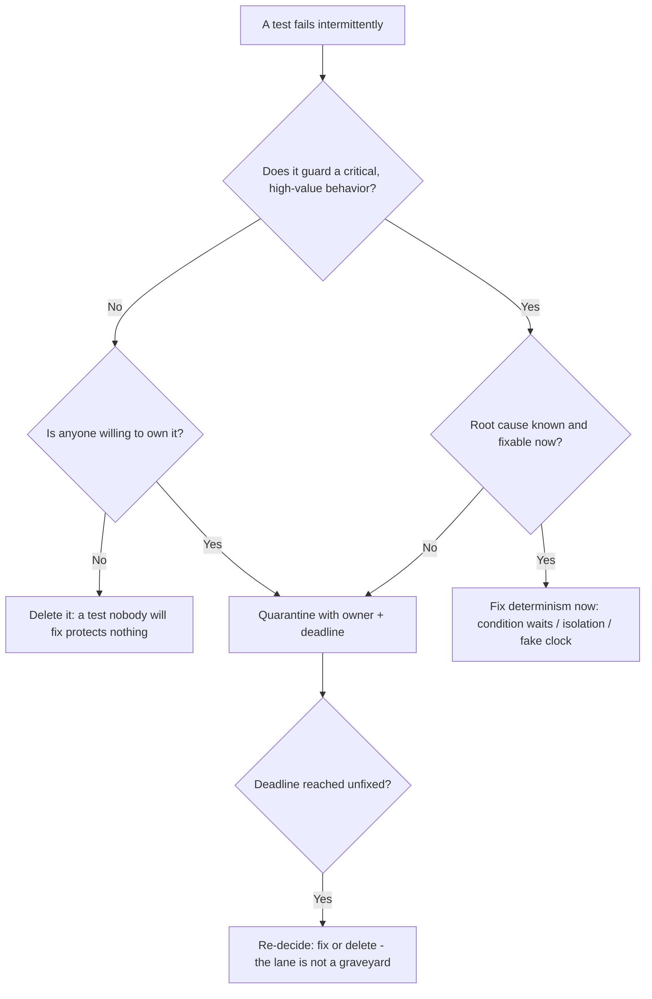
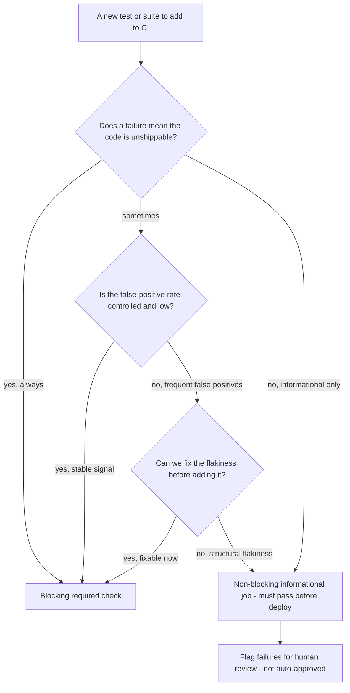
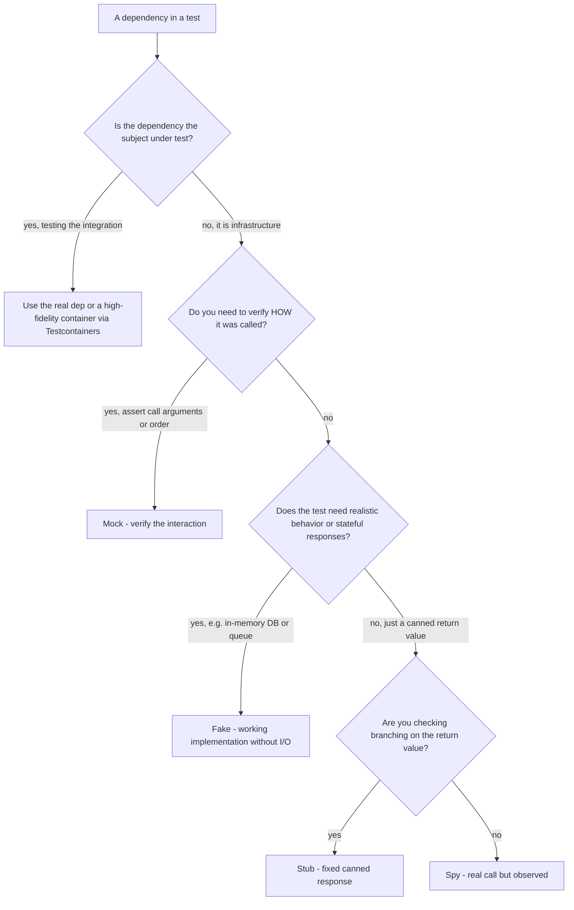
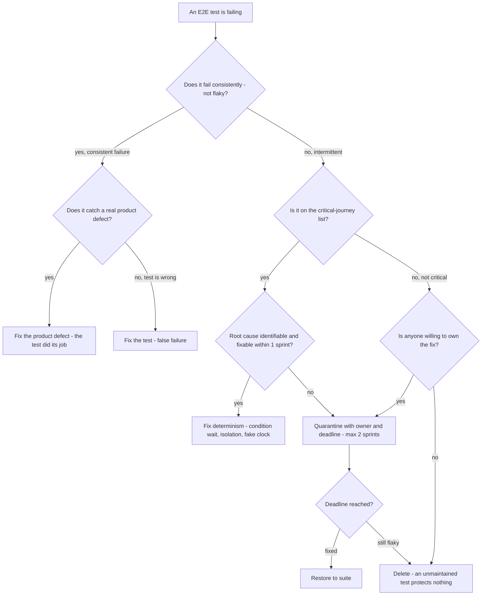

# QA & Test Automation — Decision Trees

_Decision trees + a dated capability map. Capability rows are `[verify-at-build]` — re-check against the vendor before quoting. Last reviewed: 2026-06-04._

Traverse before choosing a test level or chasing a flake.

## Decision Tree: Which test level for this defect?

Push the assertion to the cheapest level that can catch the defect.

_If you reach for E2E for a logic bug, you have an ice-cream-cone problem._

## Decision Tree: A test is flaky — triage

A flaky test is broken. Fix determinism or quarantine; never normalize re-running.

## Decision Tree: Mock, stub, fake, or real dependency?

Match the test double to what you're actually verifying — the wrong double is either a brittle test or a false pass.

_Over-mocking tests your mocks, not your code. Mock at the boundary you own; prefer a fake or real dep over a wall of stubs._

## Decision Tree: Unit, integration, or contract for a seam?

A boundary between components or services needs the cheapest test that actually protects the agreement across it.

_Don't spin up both services for what a contract test catches faster. Push each assertion to the cheapest level that protects the agreement._

## Decision Tree: Quarantine, fix, or delete a flaky test?

A flaky test is broken; decide its fate by its value, not by inertia.

_Quarantine restores signal; it is not a verdict. At the deadline a test gets fixed or deleted with a reason — never left to rot._

## Capability map (dated — verify at build)

| Capability | 2026 state `[verify-at-build]` | Notes |
|---|---|---|
| Playwright | GA, broad adoption | Auto-wait, trace viewer, parallelism built-in |
| Cypress | GA | Component + E2E; watch for app-domain limits |
| Mutation testing (Stryker/PIT/mutmut) | mature per-language | Measures test quality, not just coverage |
| Service virtualization / WireMock | mature | Stub third-party boundaries for determinism |
| Testcontainers | GA | Ephemeral containerized deps; local==CI |
| Coverage gating in CI | standard | Use as a floor; pair with mutation on critical paths |

## Decision Tree: Should this test be in the blocking merge gate?

**When this applies:** adding a new test type (visual, performance, accessibility, load) or a new test suite and deciding whether it should block the PR merge or run as a non-blocking informational job.

**Last verified:** 2026-06-05 against CI/CD best practices and Playwright/GitHub Actions documentation.

**Rationale per leaf:**
- *Blocking required check* — tests that reliably signal unshippable code belong in the gate; false positives destroy trust.
- *Non-blocking informational* — tests that often false-positive (visual diffs, performance on shared runners) should inform, not block; they are reviewed, not ignored.

**Tradeoffs summary:**

| Method | Cost / time | Blast radius | Approval gate? | Use when |
|---|---|---|---|---|
| Blocking | High if flaky | Blocks all PRs | Auto - CI | Functional, stable, critical |
| Non-blocking | No PR block | Reviewed per PR | Human review | Visual, perf, or structurally flaky |

## Decision Tree: Test double selection — mock, stub, spy, or real dependency?

**When this applies:** writing a unit or integration test that has a dependency on an external system, database, time, or another module. Choosing the wrong test double produces brittle tests or false passes.

**Last verified:** 2026-06-05 against Gerard Meszaros "xUnit Test Patterns" and Playwright/Jest test double patterns.

**Rationale per leaf:**
- *Real / Testcontainers* — when the integration itself is the point; a mock of the DB is not a test of the DB interaction.
- *Mock* — when you need to assert the dependency was called correctly (e.g., the right API method was called with the right args).
- *Fake* — when you need stateful behavior (insert, query, delete working together) without I/O cost.
- *Stub* — when you just need a predictable return value to exercise a branch.
- *Spy* — when you want to observe calls on a real implementation without replacing it.

**Tradeoffs summary:**

| Method | Cost / time | Blast radius | Approval gate? | Use when |
|---|---|---|---|---|
| Real dep / Testcontainers | Slow startup | High - tests real integration | None | Integration point is the subject |
| Fake | Fast, stateful | Low - in-process | None | Need stateful behavior without I/O |
| Mock | Fast | Low | None | Must verify interaction contract |
| Stub | Fastest | Lowest | None | Just need a canned return value |

## Decision Tree: E2E test failure — fix, quarantine, or delete?

**When this applies:** an E2E test is failing in CI and the team must decide the immediate response.

**Last verified:** 2026-06-05 against qa-test-automation plugin house opinions and general flaky-test management practice.

**Rationale per leaf:**
- *Fix the product defect* — the test passed its purpose; celebrate and fix the product.
- *Fix the test* — false failures erode suite trust; fix immediately.
- *Fix determinism* — a fixable flaky critical test gets a real fix, not a quarantine.
- *Quarantine with owner* — a flaky critical test that can't be immediately fixed stays visible and owned, not silently ignored.
- *Delete* — an unowned, non-critical flaky test is better gone than ignored; it trains engineers to dismiss red CI.

**Tradeoffs summary:**

| Method | Cost / time | Blast radius | Approval gate? | Use when |
|---|---|---|---|---|
| Fix product | Product work | Removes real defect | Yes - code review | Consistent failure on correct test |
| Fix test | Test work | Restores signal | Test review | False failure |
| Fix determinism | Sprint capacity | Restores critical signal | Test review | Flaky critical journey |
| Quarantine | Low - tracked | Reduces noise | Owner + deadline | Flaky, owner assigned |
| Delete | Minimal | Removes dead signal | PR review | No owner, non-critical |
