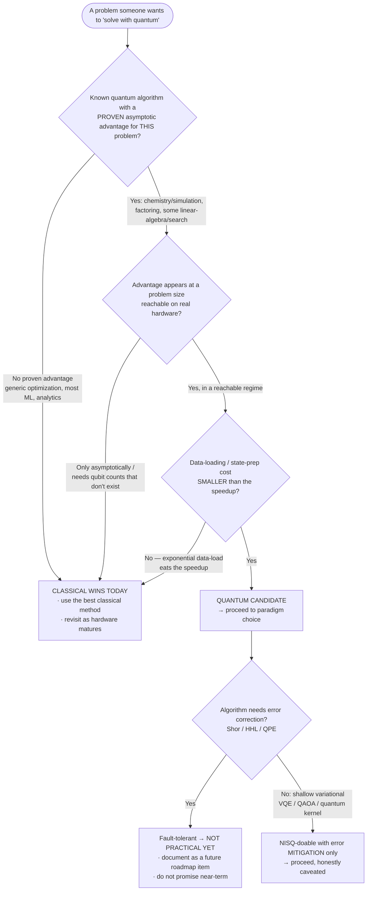
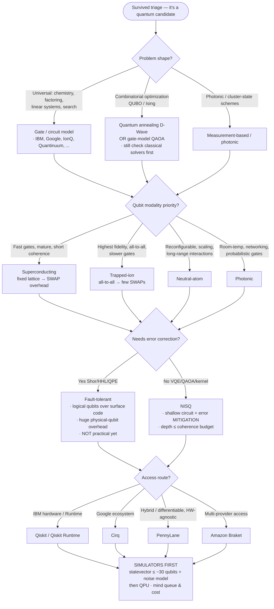

# Knowledge — Quantum-computing decision tree

> **Last reviewed:** 2026-07-14 · **Confidence:** High on the durable framings (the classical-vs-quantum triage gate, gate-model vs annealing, the qubit-modality trade-off axes, NISQ vs fault-tolerant, error mitigation vs correction, simulators-vs-QPU); **the field moves monthly — every specific qubit count, fidelity, coherence time, error-correction-threshold figure, and SDK/provider offering carries a retrieval date + [verify-at-use] and MUST be re-verified before any commitment.**
> The most important quantum-computing question is **"is this even a quantum problem?"** — and for most business asks the honest answer is *"classical wins today."* This is the decision tree the `quantum-solutions-architect` traverses **before** naming a paradigm, modality, or SDK, plus the trade-off tables and the seams to adjacent plugins.

The team's discipline: **triage first (name the classical baseline and gate hard on proven-advantage + size-in-regime + affordable state-prep), name the quantum approach only if it survives, and date every volatile hardware/SDK claim.** Post-quantum *cryptography* — the defensive migration to quantum-resistant algorithms — is **not** this plugin's job; it leaves this layer for `security-engineering` / `cybersecurity-grc`.

---

## Decision Tree 1: the classical-vs-quantum triage gate (traverse this FIRST)

Gate hard. The default exit is **"classical wins today."**

**The three killer questions (all must be yes to leave the gate):** proven advantage? · size in the advantage regime? · state-prep cheaper than the speedup? Any "no" → **classical wins today**, and that is the correct, valuable outcome — most enterprise asks end here.

---

## Decision Tree 2: paradigm, modality, NISQ-vs-FT, and access (only for surviving candidates)

---

## Trade-off table — computing paradigm

| Paradigm | Sweet spot | Watch out for |
|---|---|---|
| **Gate / circuit model** | Universal algorithms — chemistry (VQE), factoring (Shor), search (Grover), linear systems (HHL), QAOA | The general-purpose target; NISQ depth limits everything today |
| **Quantum annealing** (D-Wave) | Combinatorial optimization framed as QUBO/Ising | Not universal; classical solvers (SA, parallel tempering, Gurobi) usually still win — benchmark honestly |
| **Measurement-based / photonic** | Cluster-state schemes, photonic architectures, networking | Younger tooling; probabilistic gate success; specialized |

## Trade-off table — qubit modality (axes are durable; the numbers are volatile)

| Modality | Buys you | Costs you | Examples _(verify-at-use)_ |
|---|---|---|---|
| **Superconducting** | Fast gates, mature stack, large chips | Short coherence; fixed-lattice connectivity → SWAP overhead; cryogenic | IBM, Google, Rigetti _(2026-07-14, verify-at-use)_ |
| **Trapped-ion** | High gate fidelity, **all-to-all** connectivity (few SWAPs) | Slower gates; scaling the trap is hard | IonQ, Quantinuum _(2026-07-14, verify-at-use)_ |
| **Neutral-atom** | Reconfigurable geometry, scaling to many atoms, long-range interactions | Younger; gate-speed/fidelity trade-offs | QuEra, Pasqal _(2026-07-14, verify-at-use)_ |
| **Photonic** | Room-temperature, networking-native, low decoherence | Probabilistic entangling gates; resource overhead | PsiQuantum, Xanadu _(2026-07-14, verify-at-use)_ |

> **Volatile:** every qubit count, gate fidelity, coherence time, and vendor claim above is a **2026-07-14 snapshot**. Treat the *axes* (fidelity vs connectivity vs speed vs scale) as durable and the *numbers/vendor positioning* as verify-at-use — re-check with `ravenclaude-core/deep-researcher` before any commitment.

## Trade-off table — NISQ vs fault-tolerant

| Regime | What runs | Reality |
|---|---|---|
| **NISQ** (today) | Shallow variational — VQE, QAOA, quantum kernels; error **mitigation** only | Noisy; no error correction; depth capped by coherence; a **defensible advantage over the best classical method is largely unproven** |
| **Fault-tolerant** (future) | Shor, HHL, QPE, deep algorithms with proven exponential advantage | Needs **logical** qubits built from many **physical** qubits over the **surface code**; the physical-qubit overhead is enormous and the **error-correction threshold** must be beaten first — **not practical yet** |

## Trade-off table — error mitigation vs error correction

| | Error **mitigation** (NISQ, now) | Error **correction** (fault-tolerant, future) |
|---|---|---|
| **What it does** | Reduces *bias in an estimate* post-hoc | *Fixes errors during* the computation via redundancy |
| **Techniques** | ZNE, PEC, measurement-error mitigation, dynamical decoupling | Surface code, logical qubits, syndrome measurement |
| **Cost** | More shots / higher variance | Massive physical-qubit overhead per logical qubit |
| **Scales to deep circuits?** | **No** — breaks down past a depth threshold | **Yes** — the whole point, once above threshold |

## Trade-off table — simulator vs QPU

| Target | Sweet spot | Watch out for |
|---|---|---|
| **Statevector simulator** | Exact results, free bug-catching, up to ~30ish qubits | Memory doubles per qubit — no exponential-size runs |
| **Noise-model simulator** | Preview real-device behavior before spending QPU time | Only as good as the noise model; still classical cost |
| **QPU** (real hardware) | The actual quantum run; the only source of true device results | Queue latency, per-shot cost, calibration drift — **prove it on a simulator first** |

---

## Seams (this plugin BUILDS quantum algorithms — these are elsewhere)

- **Post-quantum cryptography migration** → `security-engineering` / `cybersecurity-grc` — the *defensive* switch to quantum-resistant algorithms (lattice-based, etc.) because a future quantum computer could break RSA/ECC. That is a **security** discipline, **not** building quantum algorithms — the single most important seam to get right.
- **Classical machine learning / MLOps** → `ml-engineering` (if the workload is actually classical ML, triage sends it here).
- **Control electronics, cryogenics, the physical qubit-control board** → `hardware-electronics-engineering` (this plugin owns the *algorithm*, not the fridge or the control stack).
- **Large-scale classical simulation of quantum systems / HPC** → `performance-engineering` (tensor-network / statevector simulation at cluster scale).
- **Verifying any volatile hardware/SDK claim** → `ravenclaude-core/deep-researcher`.

---

## Provenance

- Durable framings (the classical-vs-quantum triage gate and its three killer questions, gate-model vs annealing vs measurement-based, the qubit-modality trade-off *axes*, NISQ vs fault-tolerant, logical-vs-physical qubits and the surface-code/threshold framing, error mitigation vs correction, simulators-first) are consensus practice across the quantum-computing literature, reviewed 2026-07-14 — **High confidence**.
- All specific qubit counts, fidelities, coherence times, threshold figures, vendor positioning, and SDK/provider offerings are a **2026-07-14 snapshot and volatile** — they carry retrieval dates and **[verify-at-use]** throughout, and must be re-verified before quoting. _(Retrieved 2026-07-14.)_
