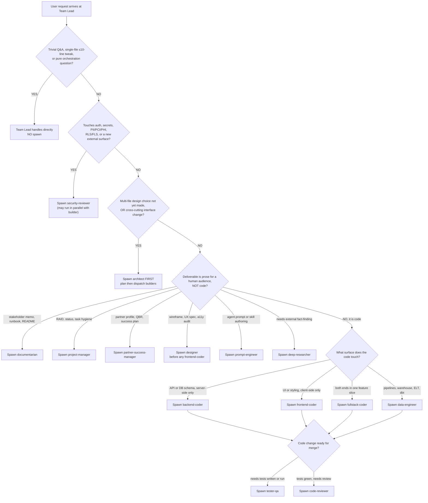

# Agent routing — which specialist the Team Lead spawns for a given request

> **Last reviewed:** 2026-05-22. **Refresh trigger:** when (a) a new specialist is added to or removed from `plugins/ravenclaude-core/agents/`, (b) a domain plugin starts overlapping a core agent's territory (the `prompt-engineer` adjudicates), or (c) a pattern of wrong-first-pick spawns is flagged during retrospective.

This file is written for **the Team Lead** — the top-level Claude Code session that orchestrates specialists. It is **not** for the specialists themselves (they receive a focused task from the Team Lead and do not re-route work). The decision tree below is the proactive companion to the Capability Grounding Protocol's reactive alternate-methods rule: the tree prevents picking the wrong specialist on first try; CGP catches what the tree missed.

The roster the tree branches across is the 14 agents under `plugins/ravenclaude-core/agents/`. Domain plugins (e.g. `power-platform`, `data-platform`) layer specialists on top — when a domain plugin is installed and its CLAUDE.md routing table matches the request more specifically than this tree, **the domain routing wins**. Use this tree when the request is domain-neutral or the active domain plugin defers.

---

## Decision Tree: Team Lead — which specialist to spawn

**When this applies:** a user request has just arrived at the Team Lead session, and the Team Lead is choosing whether to handle it directly or delegate to one specialist (or a sequence). **Traverse top-to-bottom before spawning — do NOT keyword-match the request to an agent name.**

**Last verified:** 2026-05-22 against the 14-agent roster shipped in `ravenclaude-core` v0.13.0.

**Rationale per leaf:**

- _DIRECT (no spawn)_ — spawning a specialist costs tokens, latency, and a context-handoff. A trivial Q&A or a 5-line one-file edit is cheaper for the Team Lead to handle in-session.
- _security-reviewer_ — security gates everything else; if the request touches an auth/secret/PII surface, security review runs in parallel with (or before) the build, never after merge.
- _architect_ — when the design isn't settled, a builder spawning without a plan produces rework. Architect costs one extra hop but saves N coder iterations.
- _documentarian_ — stakeholder-facing prose. Polish, structure, no jargon. NOT for code comments.
- _project-manager_ — RAID / status / task list. Internal hygiene, not stakeholder narrative.
- _partner-success-manager_ — partner profiles, success plans, QBRs, health scores. Distinct from project-manager (which tracks the _work_); PSM tracks the _relationship_.
- _designer_ — UX / wireframe / a11y. Always before frontend-coder on a new UI surface; the spec is the handoff.
- _prompt-engineer_ — when the deliverable IS an agent file, skill file, or routing rule (this tree was prompt-engineering work).
- _deep-researcher_ — when the answer requires verifying external facts (vendor pricing, regulation dates, framework attribution) the Team Lead can't confidently provide.
- _frontend-coder / backend-coder / fullstack-coder_ — split by surface. Default to fullstack when a single feature slice touches both ends; only split into FE+BE when the work genuinely parallelizes.
- _data-engineer_ — pipelines, warehouses, ELT, dbt models, data-quality. NOT application schema (that's architect → backend-coder); NOT Power BI semantic models (that's `power-platform/power-bi-engineer`).
- _tester-qa_ — after the build, before review. Writes / runs the suite, proves the change behaves.
- _code-reviewer_ — after tests are green. Reviewing a diff with no tests is reviewing the wrong thing.

**Tradeoffs summary:**

| Agent                     | Spawn cost (tokens / latency) | When to spawn                                                       | Blocks merge?                            |
| ------------------------- | ----------------------------- | ------------------------------------------------------------------- | ---------------------------------------- |
| (none — Team Lead direct) | 0                             | Trivial Q&A or ≤10-line single-file tweak                           | No                                       |
| security-reviewer         | Medium                        | Auth / secrets / PII / RLS / new external surface                   | YES — must clear before merge            |
| architect                 | Medium                        | Multi-file design not yet settled; cross-cutting interface change   | No (advisory) but unblocks builders      |
| documentarian             | Low-Medium                    | Stakeholder prose, memos, runbooks, READMEs                         | No                                       |
| project-manager           | Low                           | RAID / status / task hygiene; weekly cadence; risk emerges          | No                                       |
| partner-success-manager   | Low-Medium                    | Partner profile / QBR prep / health-score dip / 30-day silence      | No                                       |
| designer                  | Medium                        | Wireframe / UX flow / a11y audit before any UI build                | No (gates frontend-coder start)          |
| prompt-engineer           | Medium                        | Authoring or revising an agent / skill / routing rule               | No                                       |
| deep-researcher           | High (browsing + verification)| External fact-finding the Team Lead can't confidently answer        | No (advisory)                            |
| frontend-coder            | Medium                        | UI / client-only changes                                            | No                                       |
| backend-coder             | Medium                        | API / DB / server-only changes                                      | No                                       |
| fullstack-coder           | Medium-High                   | One feature slice spans both ends, doesn't parallelize cleanly      | No                                       |
| data-engineer             | Medium                        | Pipelines / warehouse / ELT / dbt / query perf / lineage            | No                                       |
| tester-qa                 | Medium                        | Code change exists, suite needs writing or running                  | YES — must clear before code-reviewer    |
| code-reviewer             | Medium                        | Tests are green, diff is ready for human-quality review             | YES — final pre-merge gate               |

If the request matches multiple branches, the **earliest-blocking gate wins**: a UI feature that also touches auth spawns `security-reviewer` first (Q2 catches it before Q5), even though Q5 would otherwise route to `frontend-coder`.

---

## Common wrong-first-picks (the failure modes this tree prevents)

1. **Spawning `architect` for a 5-line fix.** If the change is single-file, the interface is unchanged, and the test suite is going to catch the regression — the Team Lead writes the fix directly. Architect is for _design_ work, not for ratification of trivial edits.
2. **Spawning `frontend-coder` when the work is fullstack.** A "fix this button" request often turns out to need a new API endpoint. Default to `fullstack-coder` when the feature slice genuinely spans both ends; only split into FE+BE when the work parallelizes.
3. **Spawning `code-reviewer` before `tester-qa` has run.** Code-reviewer reviewing a diff with no green tests is reviewing the wrong artifact. Run tests first; the reviewer then sees what behavior is actually proven.
4. **Spawning `deep-researcher` for a question the user can answer.** Before deep-researcher (the most expensive spawn — it browses, verifies, cites), check: does the user already know the answer in their head? A 30-second clarifying question to the user beats a 3-minute research dispatch.
5. **Spawning `documentarian` for a RAID-log update.** Documentarian is for _stakeholder_ prose. Internal PM hygiene (RAID, status, tasks) goes to `project-manager`. The two are not interchangeable.
6. **Spawning `frontend-coder` before `designer`.** New UI surfaces start with a wireframe + a11y spec; frontend-coder executes the spec. Skipping designer produces UIs that get re-done.
7. **Forgetting `security-reviewer` on auth-adjacent work.** Q2 in the tree is a hard gate precisely because "this PR happens to touch auth" is the most-skipped routing decision in practice — security-reviewer is mandatory whenever auth, secrets, PII, RLS/FLS, or a new external surface is in scope, regardless of how small the change looks.

---

## When the Team Lead handles it directly (no spawn)

Spawn-skip is the right call when ALL of these are true:

- The change is a single file, ≤10 lines, no new interface
- No security surface is touched (no auth, no secrets, no PII, no new external endpoint)
- The user is present and can answer clarifying questions in-line
- No stakeholder prose, RAID entry, or external research is required
- The test suite is already in place and will catch regressions

If any of those is false, route through the tree. The cheapest specialist spawn is still cheaper than the rework from a missed gate.

---

## Composition with the Capability Grounding Protocol

This tree is the **proactive** half of the dispatch discipline: pick the right specialist on the first attempt. The Capability Grounding Protocol (see `plugins/ravenclaude-core/CLAUDE.md` §"Capability Grounding Protocol") is the **reactive** half: when a chosen specialist comes back blocked, enumerate alternative specialists / approaches and try the next-easiest before reporting the request unanswerable.

Composition rule: **tree first, CGP second.** If the tree routes to `backend-coder` and `backend-coder` returns blocked because the change actually needs a schema redesign, the Team Lead does not re-traverse the tree from scratch — it applies CGP's alternate-methods enumeration (re-summon `architect` for a re-plan; or `data-engineer` if the schema is warehouse-shaped; or back to the user if the scope expanded beyond this PR). The tree's job is the _first_ spawn; CGP's job is _every spawn after a failure_.
