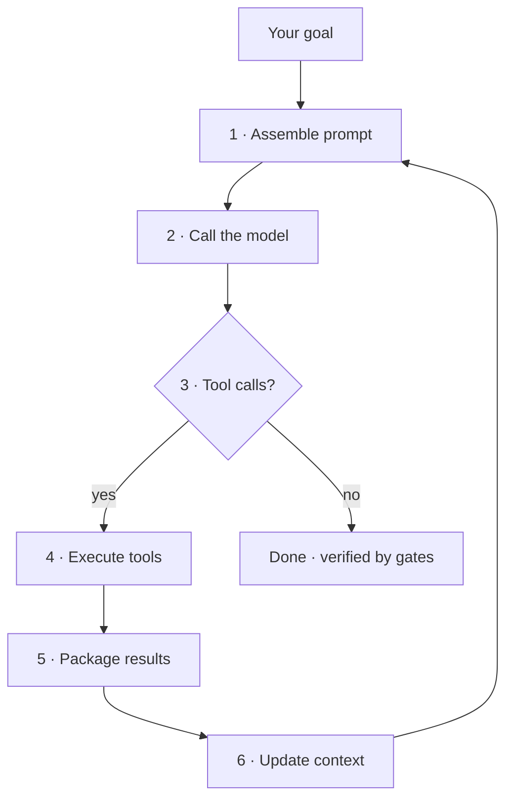
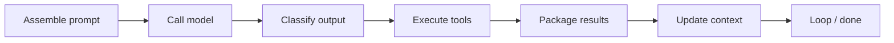
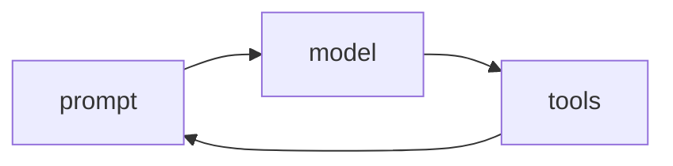

A language model on its own is **stateless**: it forgets what it did three steps ago, a failed tool call would otherwise vanish silently, and its context window fills with noise. An **agent** is a model plus the software that fixes all that — the **harness**. As the saying goes, *"if you're not the model, you're the harness."*

The harness drives one **turn** as a loop, and every agentic tool — Claude Code, the Agent SDK, your own script — runs some version of it:

1. **Assemble the prompt** — system prompt + tool schemas + project memory (`CLAUDE.md` / `AGENTS.md`) + the conversation so far + your message.
2. **Call the model.**
3. **Classify the output** — did it ask to use a tool, or just answer? Plain text with no tool call ends the turn.
4. **Execute the requested tools** — and this is where permission gates, hooks, or a review panel can deny, edit, or wave the call through.
5. **Package the results** as the next message — crucially, an *error* comes back as a result the model can read and self-correct from, not a crash.
6. **Update context** (compacting when it fills) and loop back to step 1.

The same loop scales up: a lead agent can **dispatch a subagent** for a slice of work and fold its short summary back in at step 5. A guiding principle the better harnesses inherit: **treat memory as a hint and verify against real state before acting** — which is why a careful agent doesn't stop at "looks done," it stops when a verification step says it's done.

RavenClaude is one such harness layer: it rides on Claude Code's loop and adds orchestration, a review tribunal at step 4, and verification gates at the end — but the loop itself is how *any* agent works by default.

<!-- step: Assemble the prompt: system prompt + tool schemas + CLAUDE.md/AGENTS.md memory + history + your message. -->

<!-- step: Call the model. A lead agent may dispatch a focused subagent for this slice of work. -->

<!-- step: Classify the output: tool calls → execute and loop; plain text with no tool call → the turn ends. -->

<!-- step: Execute tools — a permission layer, hook, or review panel can ALLOW / EDIT / DENY each call before it runs. -->

<!-- step: Package results as observations. Errors return as results so the model can self-correct, not crash. -->

<!-- step: Update context; compact when it fills. A dispatched subagent returns a short summary, not its raw output. -->

<!-- step: Loop until done — then a verification step confirms "done" really means done before the turn ends. -->

<!-- mini -->

