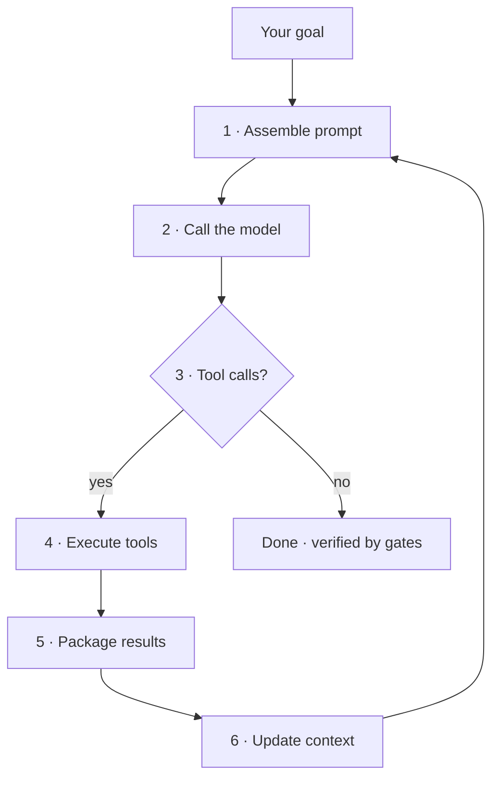
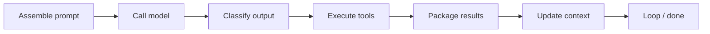
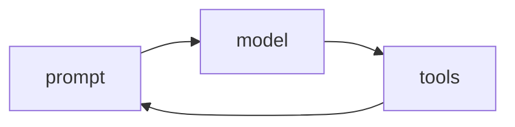

An LLM on its own is stateless — it forgets what it did three steps ago, tool calls fail silently, and the context window fills with noise. The **harness** is the software wrapping the model that fixes this: the orchestration loop, tools, memory, context management, guardrails, and verification. As the saying goes, *"if you're not the model, you're the harness."*

RavenClaude **is** a harness layer. It rides on Claude Code's (and Copilot CLI's) loop and adds the machinery: orchestrator-worker dispatch (the **Team Lead**), the **Structured Output Protocol** for parseable handoffs, memory in `CLAUDE.md`/`AGENTS.md` + run artifacts, the **Thing** tribunal as the guardrail, and `audit-gates.sh` + the definition-of-done gate as verification. The step-by-step view below walks one turn through that loop — press **Play** to watch each stage, or step through with the arrows.

A guiding principle the harness inherits: treat memory as a *hint* and verify against real state before acting. That's why a turn doesn't end at "looks done" — it ends when the verification gates say it's done.

<!-- step: Assemble the prompt: system prompt + tool schemas + CLAUDE.md/AGENTS.md memory + history + your message. -->

<!-- step: Call the model. RavenClaude's Team Lead may dispatch a focused specialist for this slice. -->

<!-- step: Classify the output: tool calls → execute and loop; plain text with no tool call → the turn ends. -->

<!-- step: Execute tools — the Thing tribunal gates each risky call (ALLOW / EDIT / DENY) before it runs. -->

<!-- step: Package results as observations. Errors return as results so the model can self-correct, not crash. -->

<!-- step: Update context; compact when it fills. Dispatched specialists return ~1–2k-token summaries, not raw output. -->

<!-- step: Loop until done — then verification gates (audit-gates.sh, the DoD gate) confirm "done" really means done. -->

<!-- mini -->

