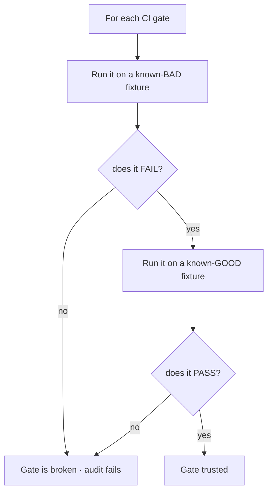
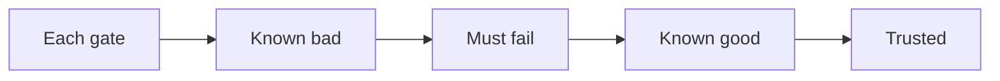
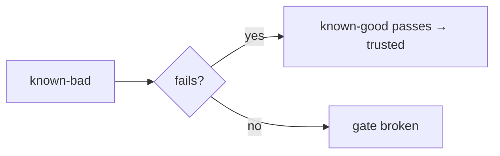

A CI gate that never fails is worse than no gate — it gives false confidence. So RavenClaude runs a **meta-test**: `scripts/audit-gates.sh` proves, for each gate, that it **fails on a known-bad fixture AND passes on a known-good one**. If a gate can't be made to fail on input it's supposed to reject, the gate is broken and the audit says so.

This is required reading before adding or changing any CI step — a new gate ships with its fail/pass fixtures, not just its happy path. And **a skip is not a pass**: when a gate can't run locally (e.g. the actionlint gate needs a Docker daemon), it **loudly** skips ("THIS IS NOT A PASS"), and in CI an unrunnable gate is a hard failure, never a silent skip.

<!-- step: For each CI gate... -->

<!-- step: Run it on a known-BAD fixture. -->

<!-- step: Does it FAIL? If not, the gate is broken and the audit fails. -->

<!-- step: Run it on a known-GOOD fixture — does it PASS? -->

<!-- step: Both hold and the gate is trusted. And a skip is NOT a pass (it skips loudly). -->

<!-- mini -->

