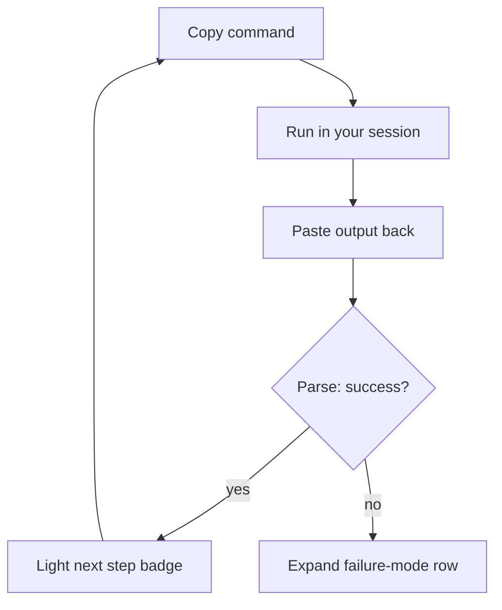

**Bifröst** is the dashboard tab (`#/bifrost`) that walks you through installing a marketplace plugin into a Claude Code project. It's a guided **4-step copy-paste wizard**: (1) `/plugin marketplace add`, (2) `/plugin install <name>@ravenclaude`, (3) `/reload-plugins`, (4) `/init-agent-ready --check`. Each step has a copy-button for the command, a "what I see now" paste box, a Verify button, and a status badge that moves from grey to green / amber / red.

The load-bearing design constraint is that the wizard **never executes a slash command** — it's a wizard, not an orchestrator. You run each command in your own Claude Code session and paste the output back; the wizard's JavaScript only *parses* that pasted output against a per-step success/failure pattern to light the next step's badge, or to auto-expand the matching row of the **"If the bridge is down…"** failure-mode accordion (one diagnosis and next step per step). This keeps the consumer in control of what actually runs in their session.

Because it only parses pasted text, the wizard is **fully client-side** — no server endpoint, no network fetch — so it behaves identically on a static GitHub Pages host and on the served dashboard. It's distinct from the Install & Update tab, which wires RavenClaude into GitHub Copilot CLI for a different audience; Bifröst is specifically the Claude-Code-plugin-into-a-project path.

<!-- mini -->

