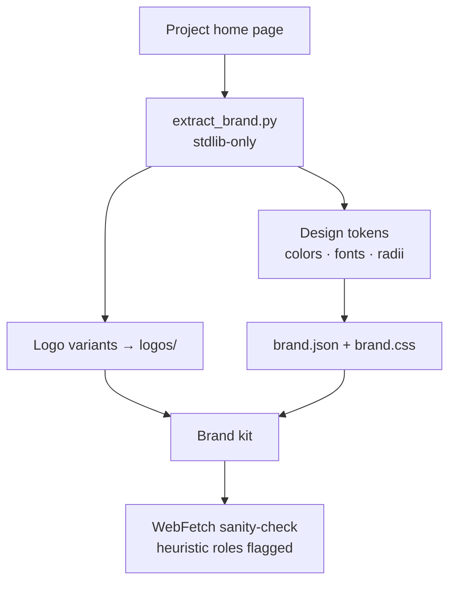
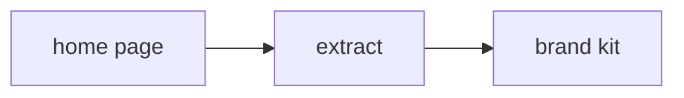

**Brand extraction** is the skill that answers "point at a project's website and make my generated reports match their brand." Given a home-page URL, it harvests **every logo variant** (favicon, apple-touch-icon, mask-icon, `og:image` / `twitter:image`, header and footer `` logos, inline header `<svg>`, and light/dark `<picture>` variants) **and** the brand "schema" — design tokens: ranked colors with guessed roles, fonts with heading/body roles read from the heading selectors, a border-radius scale, and every color-valued CSS custom property. It emits a ready-to-apply kit: downloaded `logos/`, a schema-validated `brand.json`, a `brand.css` of `--brand-*` custom properties, a wired `report-template.html`, and a `brand-summary.md`.

It lives in `ravenclaude-core` because brand extraction works for *any* project's brand — it's domain-neutral, so by the house rule it stays in core rather than a vertical plugin. The engine is **stdlib-only Python** (no third-party installs, matching the no-new-deps discipline), and every network operation is **fail-safe**: a failed fetch or parse is recorded in `confidence_notes`, never a crash. On a bare page it returns zero logos/colors/fonts with honest notes; on a rich page it downloads all the variants it finds.

The honesty discipline is the point. The role labels — which color is "primary," which font is "heading" — are **heuristic best-guesses**, marked as such per-item and in `confidence_notes`. The skill routes you to **WebFetch** (with the repo's webfetch-hardening sanitizer, honoring the web-access allow/deny list) as the reasoning layer to sanity-check the primary logo and color pick, and to fall back to when static extraction is defeated by CSS-in-JS or runtime-loaded assets. The script reports *what it actually found* and flags what it couldn't, instead of fabricating a confident palette.

<!-- mini -->

