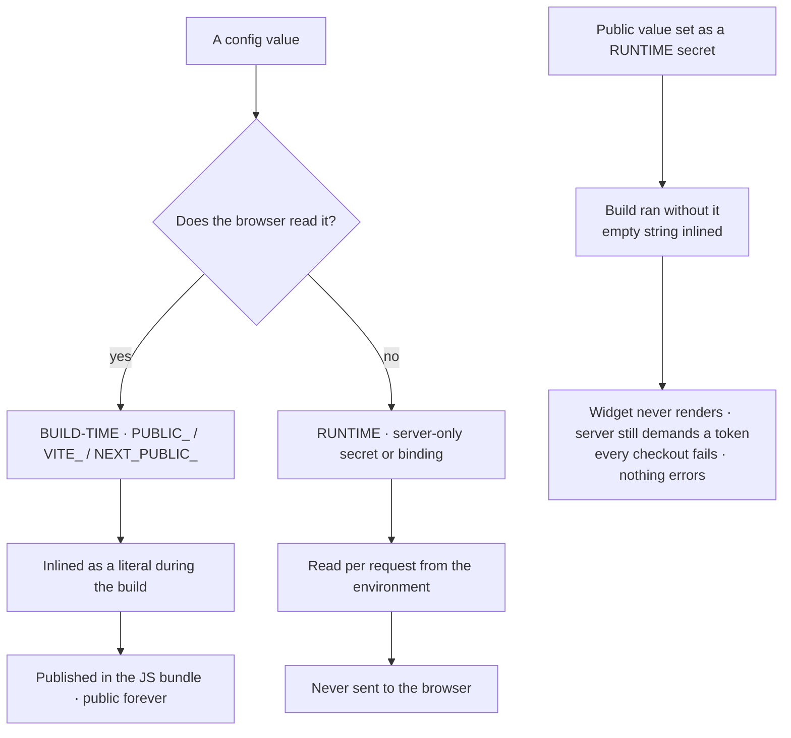
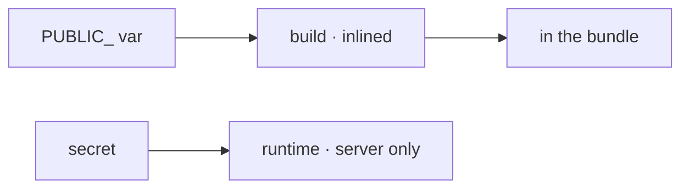

Every configuration value you set lands in one of two places, and they are not interchangeable:

- **Build-time config** is *text substitution during the build*. The bundler finds `import.meta.env.PUBLIC_X` in your source and replaces it with a literal string. After that there is no variable — there is a string sitting in a `.js` file on a CDN.
- **Runtime config** is *read while the request is being served*. Server code asks the environment for a value each time. Nothing is baked; change it and redeploy, and the next request sees the new value.

Vite states the mechanism directly: variables prefixed `VITE_` "will be exposed in client-side source code after Vite bundling", and are "statically replaced at build time to make tree-shaking effective." Astro renames the prefix to `PUBLIC_` and inherits the same behaviour — "only environment variables prefixed with `PUBLIC_` are available in client-side code". Next.js uses `NEXT_PUBLIC_` and spells out the consequence better than anyone: *"After being built, your app will no longer respond to changes to these environment variables… all `NEXT_PUBLIC_` variables will be frozen with the value evaluated at build time."*

**So a `PUBLIC_` variable set as a runtime secret is not "set late." It is not set at all.** The build ran without it, substituted an empty string, and shipped that. Your platform's secret store now holds a value that nothing will ever read, and the dashboard shows it present — which is why this survives review.

**The failure it actually caused.** A Cloudflare Turnstile **sitekey** was set as a runtime secret. The sitekey is a client-side value by design — it goes in the markup as `data-sitekey` for the widget to render. With it inlined as empty, the widget never rendered, so the browser produced no token. The server half was configured correctly and kept doing its job: it demanded a token and rejected the request without one. Result: **every checkout failed with a captcha error**, on a build that compiled clean, deployed green, and logged nothing unusual. Both halves were individually "working." The split between them was the bug.

**The test for telling which kind a variable is — two questions, in order.**

1. **Does the browser need to read it?** If yes, it must be build-time (or fetched from an API at runtime — but then it is *that endpoint's* runtime config, not the bundle's). If no, keep it runtime and server-only.
2. **Would you be relaxed about it appearing in View Source?** Build-time public values are published — Vite says it outright: `VITE_*` variables "should *not* contain sensitive information such as API keys… bundled into your source code at build time." If the honest answer is "no," it cannot be a public variable, and the design needs a server endpoint instead of a prefix.

The mechanical confirmation takes ten seconds: **build, then grep the output bundle for the value.** Present in `dist/` ⇒ build-time, and public forever. Absent ⇒ it never reached the client, whatever the dashboard says. Do this once per public variable before you argue with the platform.

**Two corollaries worth internalising.**

- **Changing a build-time value requires a rebuild, not a restart.** The same trap as a Cloudflare Pages binding, where the docs say "Redeploy your project for the binding to take effect" — except here even a redeploy of the *same artifact* is not enough; the bundle must be built again with the value present.
- **Public/secret pairs must live on opposite sides.** A sitekey/secret-key pair, a publishable/secret API key pair — the public half is build-time and shipped, the secret half is runtime and server-only. Putting both in the same place is wrong in one direction or the other every time.

<!-- mini -->

