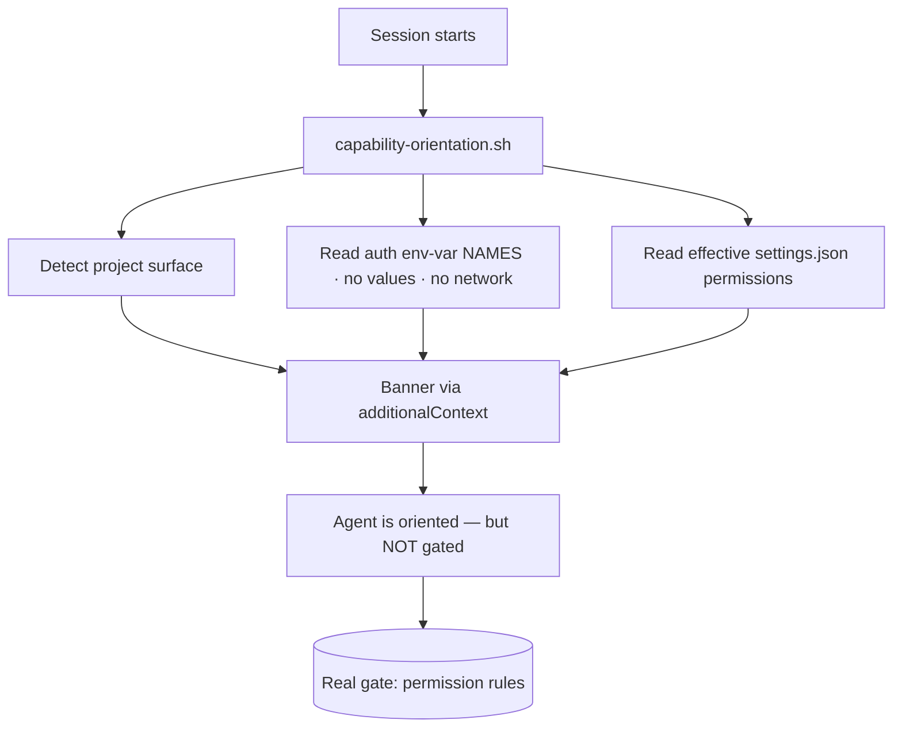
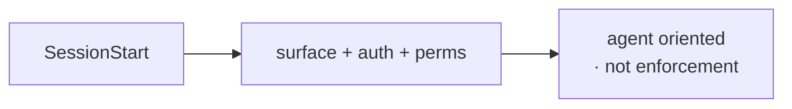

The `capability-orientation.sh` SessionStart hook assembles a **capability banner** and injects it via `additionalContext` every session. It states the project's detected external surface, the auth it holds (env-var **names/presence only — never values; no network calls**), the effective `.claude/settings.json` permissions, and a presence/staleness summary of `environment-context.md`.

Why it exists: the behavioral instruction "read the posture at session start" is prose the model often skips. The hook makes the summary impossible to miss. Crucially, it is a **salience boost, not enforcement** — the real gate is the permission rules; the banner just stops the agent acting as if it has no access (the "did you try X?" round-trip on actions it's already authorized for). The banner is a *pointer*; `environment-context.md` stays the authoritative source for per-environment detail.

<!-- mini -->

