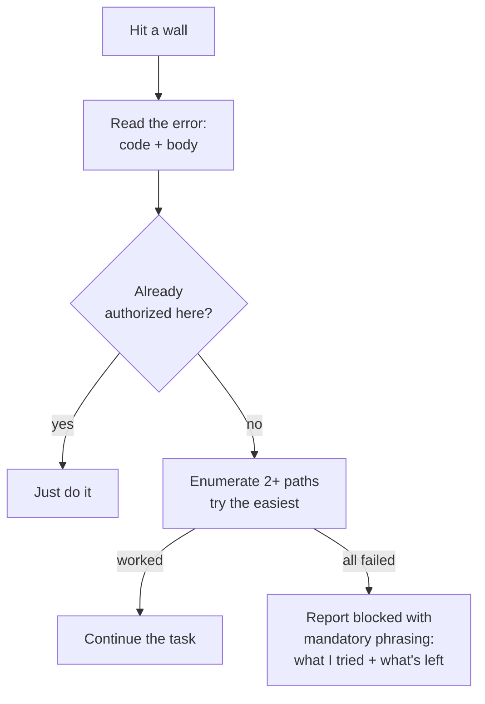
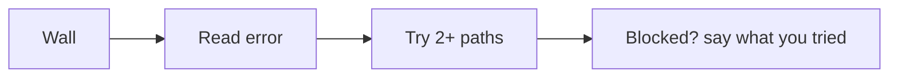

Every RavenClaude agent inherits one promise: **it will not tell you "I can't" when it actually can.** That sounds obvious, but the most common — and costliest — agent mistake is the *false negative*: hitting one wall and reporting "this is impossible" or "can you authorize me?" when a second path was sitting right there. The Capability Grounding Protocol (CGP) is the floor that stops this. It says a wrong route is **never** proof a capability is absent — a `command not found`, a `403`, or a tool whose menu hasn't loaded yet is evidence about **one** way of doing the thing, not about the thing itself.

When an agent hits a wall, CGP makes it do four cheap things before the word "blocked" leaves its mouth. **First, read the actual error** — the status code *and* the message body, not just the headline — because the reason picks the fix (an expired token means "log in and retry the same way"; a missing permission means "use a path that already has it"). **Second, check what it's already allowed to do** — many sessions carry an environment-context note saying "you're pre-authorized for X here," so the agent should just do X instead of asking. **Third, enumerate at least two other paths and try the easiest one** (a different API, a lower-level tool, a manual step with automation around it). Only after those does it report — and when it genuinely is blocked, it must use the **mandatory phrasing**: "After trying A (outcome), B (outcome), I'm blocked on [specific reason]; the remaining options are [X, Y]." That report tells you exactly what's left so you never have to ask "did you try…?"

CGP also guards the *correction* moment. If you push back on a claim, the agent must **verify before it yields** — it can't just cave to be agreeable (that's how a confident-but-wrong answer survives the one moment that should catch it), and it can't dig in either. It re-checks, names the specific error if it was wrong, and adopts your correction once. CGP is the first leg of the agent-honesty triad — paired with [Claim Grounding](#/learn/claim-grounding) (don't *over*-claim certainty) and [Last-Mile Completion](#/learn/last-mile-completion) (finish everything you *can* do).

<!-- mini -->

