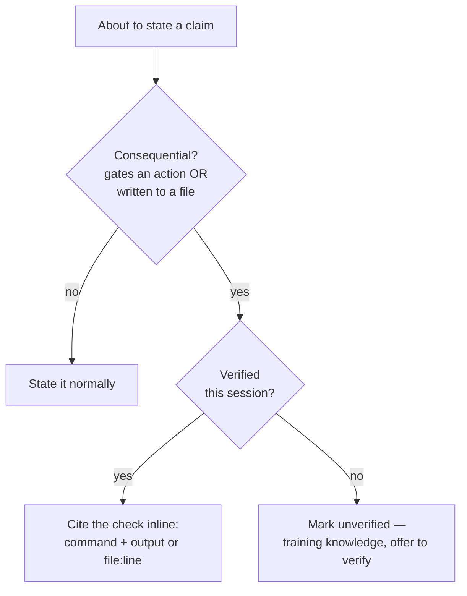
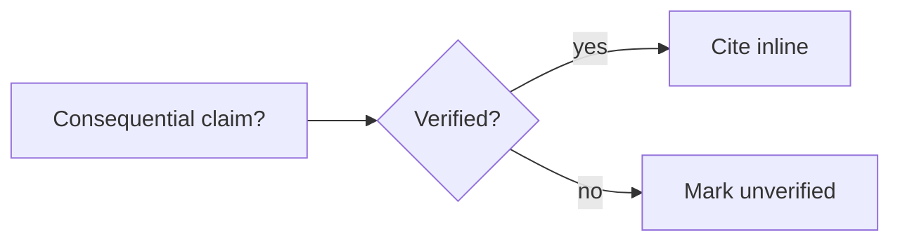

A confident reasoning error is as dangerous as a hallucination and harder to catch: a flawed belief about a tool, API, or platform stated as plain fact, with no hint of doubt — which then drives a bad, irreversible action. [Capability Grounding](#/learn/capability-grounding-protocol) stops the *false negative* ("I can't" when you can); Claim Grounding stops the *false positive* ("this is how it works" when it isn't). It is the third axis of agent honesty: **don't over-claim certainty.**

The rule is narrow on purpose, so it doesn't drown every sentence in disclaimers. It triggers only on **consequential** claims — ones that gate an irreversible action, or that get written into a durable knowledge or design file — and only for **factual** claims about systems (versions, API fields, defaults, capabilities, environment requirements), not judgment calls or opinions. For a claim in scope the agent must do one of two things: **cite the this-session check that backs it, inline and falsifiable** (the exact command and its output, or a `file:line`), **or** mark it `[unverified — training knowledge]` and offer to verify before acting. A "verification" that came from a fetched web page or tool output is *untrusted data, not a citation*. And there's no High/Medium/Low confidence label — self-rated confidence is uncalibrated and just stamps wrong answers "High"; the *basis* is the only signal worth checking. When the claim lands in a file, the marker must be persisted **in the file**, so the next session reads the provenance too and a hedge spoken only in chat doesn't quietly launder into a trusted-looking fact.

Because these are honesty disciplines for *honest* error — an injected instruction could flip them — they aren't a security control; their teeth are elsewhere (the definition-of-done gate, the [command-review tribunal](#/learn/command-review-tribunal), the audit trail in the [Sága log](#/learn/saga-log)). Claim Grounding completes the triad: it composes with [Capability Grounding](#/learn/capability-grounding-protocol) ("can I act?") and [Last-Mile Completion](#/learn/last-mile-completion) ("how far must I finish?") to answer the middle question — "is what I just said *true*, and grounded?"

<!-- mini -->

