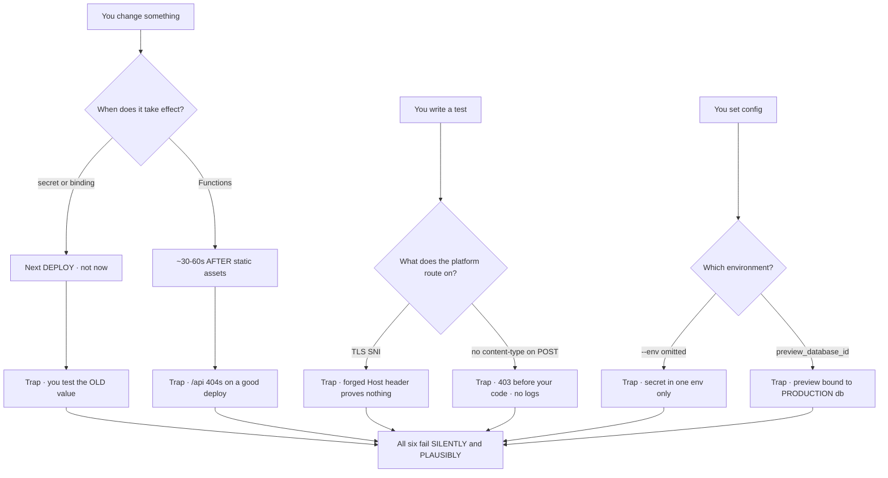
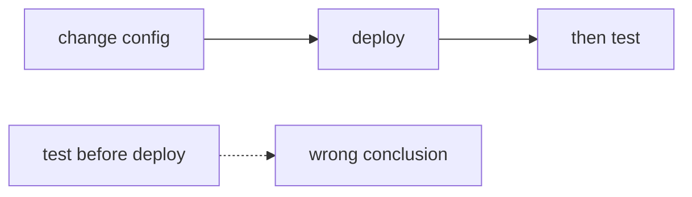

Each of these was paid for with real debugging time on a live Cloudflare Pages project. None of them throws. That is the point — read the last section before you decide these are trivia.

**1 — Secrets and D1 bindings attach at DEPLOY time.** Setting a secret or adding a binding changes nothing about what is currently running. Cloudflare says it plainly, once per binding type: *"Redeploy your project for the binding to take effect."* So the loop that feels obvious — set the secret, hit the endpoint, still broken, set it again — is testing the **old** value every time, and you will conclude the secret is wrong when it was right on the first try. Set it, **deploy**, then test.

**2 — Functions propagate after static assets.** On a fresh deploy the pages render perfectly while every `/api/*` route still 404s, for roughly 30–60 seconds. You will spend that window convinced you broke routing. Deploy, wait, *then* diagnose — a 404 inside the propagation window is not evidence of anything. `[unverified — field-observed; the Pages known-issues page documents no propagation lag, so treat the exact window as an observation, not a contract]`

**3 — Cloudflare routes by TLS SNI, so a forged `Host:` header proves nothing.** Certificate and zone selection happen during the TLS handshake, on the SNI hostname: *"Certificates and settings that match the SNI hostname exactly take precedence"*, and *"If no SNI is presented, Cloudflare uses certificate based on the IP address."* The HTTP `Host` header arrives **after** that choice is already made. This invalidates a whole category of test people write — `curl -H "Host: my-app.example.com" https://some-other-host/` does not put you on that zone's Worker, it puts you on whatever zone the SNI selected, holding a header nobody routed on. If you want to test a hostname, resolve to it or use `--resolve`; do not fake the header.

**4 — Pages rejects a POST with no `content-type` before your Function runs.** It comes back as its own 403, treated as a cross-site form submission — and because the rejection is upstream of your code, **your handler's logs show nothing at all**. That silence reads exactly like "my route isn't wired up," which is the wrong hunt. Always send an explicit `content-type` on POST, including from `fetch`, scripts and health checks. `[unverified — field-observed; not documented in the Pages known-issues page]`

**5 — `--env preview` on `wrangler pages secret put` is undocumented but load-bearing.** The Pages command reference lists only `[KEY]` and `--project-name` for `pages secret put`; `--env` is a *global* Wrangler flag, and omitting it means Wrangler "uses the top-level configuration." Pages, meanwhile, has exactly two environments — *"`production` and `preview` are the only two options available via `[env.<ENVIRONMENT>]`."* Net effect: the secret lands in one environment and you assume both. Preview then runs with a missing or stale value while production is fine, and the difference is invisible until a preview deploy behaves nothing like the branch it came from. Set it once per environment, explicitly.

**6 — `preview_database_id` does not bind a preview deployment.** It is a *local development* key — D1's docs describe it as "a user-defined ID for your local test database." It is not how a deployed Pages preview picks a database, and nothing errors when you use it that way; the preview simply keeps whatever it had, which is usually **production**. That is a preview branch writing to the real database while everyone believes it is isolated. The documented Pages shape is an explicit environment override:

```toml
[[env.preview.d1_databases]]
binding = "DB"
database_name = "my-app-preview"
database_id = "<PREVIEW_DATABASE_ID>"
```

**The unifying lesson, which is the actually portable part.** Every one of these fails **silently and plausibly**: no exception, no warning, and a symptom that points confidently at something else — a wrong secret, a broken route, an unwired handler, an isolated preview. That is why they cost a day rather than a minute. The defence is not memorising six Cloudflare facts; it is the habit of asking, before you start bisecting: *what would this look like if my mental model of when config attaches were wrong?* Deploy before you test a secret. Wait before you diagnose a 404. Don't trust a header the platform didn't route on. Don't trust a preview you never proved was pointed somewhere else.



<!-- mini -->

