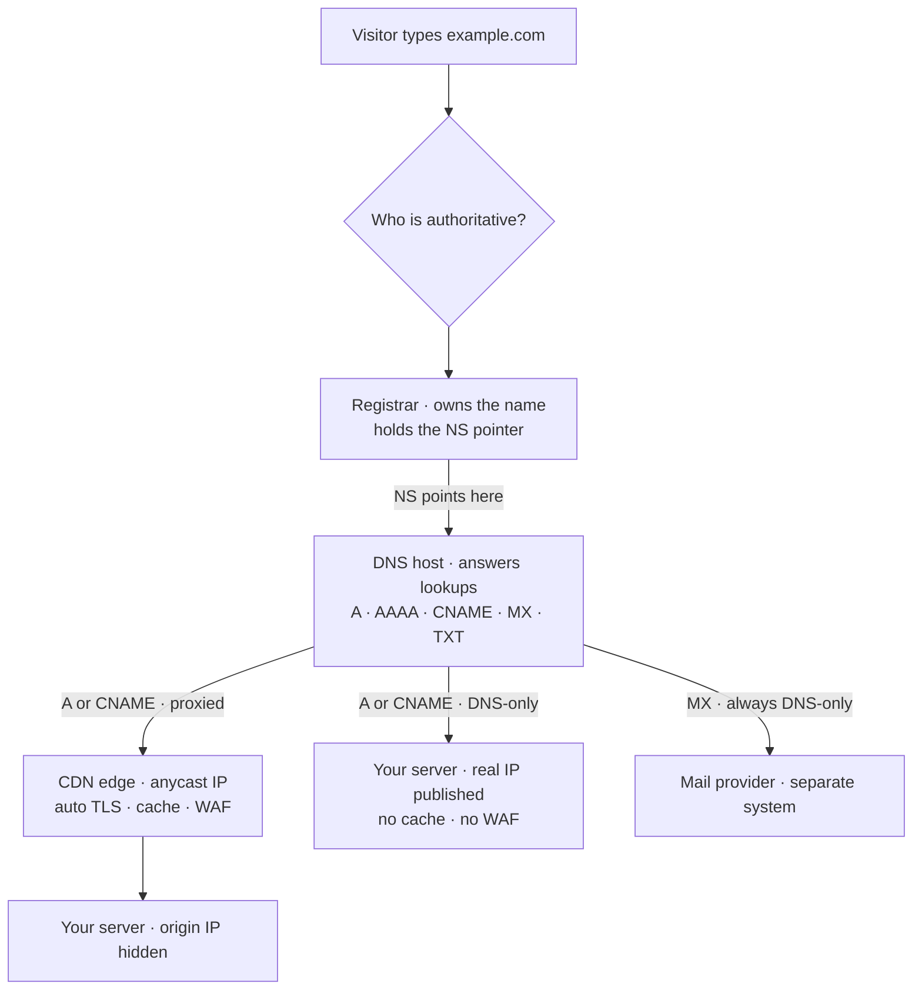
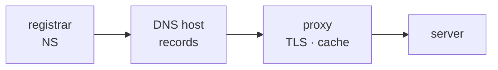

You own a domain and you want it to point somewhere new — a new host, a new site, a new mail provider — without breaking the other two. The whole question is **who do I change, and where**. It is only hard because three separate jobs are usually sold by one company, so people merge them into a single mental "my domain."

**Three roles. Learn to say which one you mean.**

- **Registrar** — who you rent the *name* from (GoDaddy, Namecheap, Cloudflare Registrar). It holds exactly one thing that matters day to day: the list of **nameservers**. Nothing about your site's content lives here.
- **DNS host** — the service that *answers the questions*: "what IP is example.com?", "where does its mail go?". Your records live here. Cloudflare's own setup guide draws the line: the registrar is where you "registered and own your domain"; the DNS provider is "the service managing your DNS records."
- **CDN / proxy** — a network that sits *in front of* your server: terminates TLS, caches, filters. Entirely optional. Cloudflare can be all three at once, which is exactly why the three get merged.

**Nameservers are the switch at the top.** An `NS` record "indicate[s] which server should be used for authoritative DNS." You set it **at the registrar**, and it decides which company gets asked everything else. Change it and every record moves at once. Cloudflare tells you to "wait up to 24 hours while your registrar updates your nameservers" — that lag is why the nameserver change is the one you plan, and the record change is the one you do casually.

**The four records you will actually touch**, all at the DNS host:

- **A / AAAA** — "map a domain name to one or multiple IPv4 or IPv6 address(es)." The literal "the site lives at this machine" record.
- **CNAME** — "map[s] a domain name to another (canonical) domain name." Use it when your host gives you a hostname (`my-app.pages.dev`) instead of an IP.
- **MX** — "required to deliver email to a mail server." **Email is a separate system from the website.** Moving your site does not touch MX; deleting MX by accident is how a site move takes the mail down with it.
- **TXT** — "let you enter text into the DNS system." Domain-ownership proofs and email authentication (SPF / DKIM / DMARC) live here.

**Proxied vs DNS-only is a real fork, not a display setting.** Proxied means "Cloudflare sits between your visitors and your server — optimizing, caching, and protecting traffic along the way": visitors resolve to Cloudflare's anycast IPs, never your origin. DNS-only records "respond with your server's actual IP address and do not route HTTP/HTTPS traffic through its network." Only address-resolving records qualify — "Other record types (such as MX or TXT) are always DNS-only." The part that bites: DDoS protection, caching, and "WAF rules, caching, and redirect rules" apply **only to proxied traffic**. A record you flipped to DNS-only while debugging is a record with no cache, no WAF, and your origin IP published.

**SSL is automatic, and it is a property of the edge.** Cloudflare "issues — and renews — free, unshared, publicly trusted SSL certificates to all domains added to and activated on Cloudflare." On a full setup that covers the root domain and first-level subdomains; deeper names need more certificate. Because the edge presents it, the automatic certificate is for **proxied** hostnames — turn the proxy off and you are back to whatever certificate your origin holds.

**Caching defaults surprise people in one specific direction.** "The Cloudflare CDN does not cache HTML or JSON by default." It caches by file extension — CSS, JS, images, fonts, PDFs. So your *assets* are cached at the edge and your *pages* are not, unless you asked. Cloudflare skips caching when `Cache-Control` is `private`, `no-store`, `no-cache`, or `max-age=0`, and caches when it is `public` with `max-age` greater than 0. Practical consequence: "I deployed and still see the old page" is usually your **browser**, not the CDN.

**So: who do I change, and where.**

| What you want | Where you do it |
| --- | --- |
| Move to a different DNS host | `NS` — at the **registrar** |
| Point the site at a new server or host | `A` / `AAAA` / `CNAME` — at the **DNS host** |
| Move email | `MX` — at the DNS host; unrelated to the website |
| Turn the CDN on or off for one hostname | proxy status on that record — at the DNS host |
| Prove ownership to a third party | `TXT` — at the DNS host |
| Move to a different registrar | transfer — at the **registrar**; records are unaffected if the nameservers do not change |

The sentence worth keeping: **the registrar decides who answers, the DNS host answers, and the proxy decides what happens after the answer.** Most "move my site" work is one row of A/CNAME edits at the DNS host — people reach for the nameservers, and the 24-hour clock, when they never needed to.

<!-- mini -->

