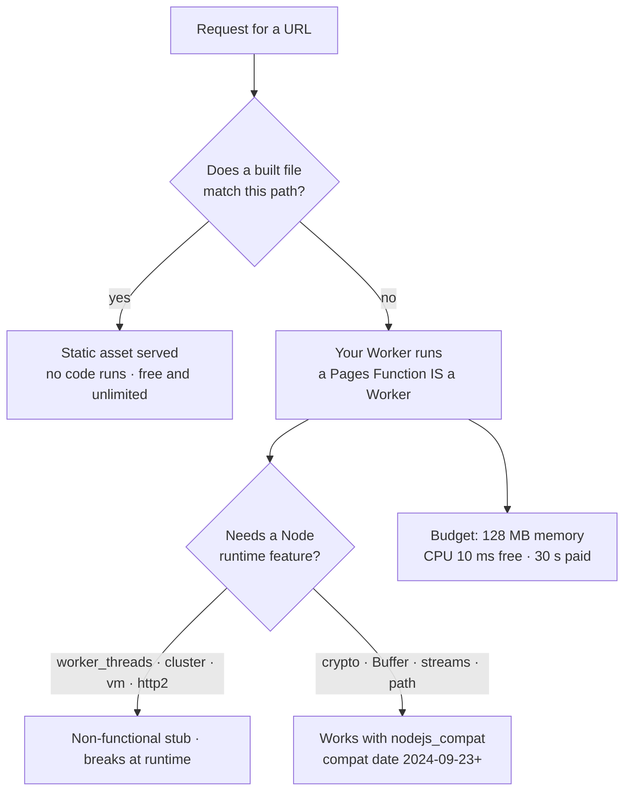
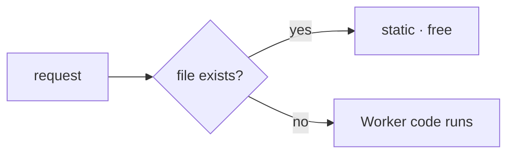

**The question to answer first: does anything have to _run_ when a visitor asks for this URL?**

- **No** — the HTML, CSS, JS and images were built ahead of time. They are **static assets**. Cloudflare serves them straight off its network, and per the docs: _"If a requested URL matches a file in the static assets directory, that file will be served — without invoking Worker code."_ Those requests cost nothing: _"Requests to static assets are free and unlimited."_
- **Yes** — a session must be checked, a database read, an API called, a page rendered from live data. That is a **Worker**: your code, executed once per request, before a response exists.

**Pages and Workers are not two different runtimes.** A **Pages Function _is_ a Worker** — the docs define Functions as "executing code on the Cloudflare network with Cloudflare Workers." And Workers serve static assets natively: `wrangler` uploads your build output and "deploys both your Worker code and your static assets in a single operation." So one Workers project can be the entire site — the static files _and_ the handful of routes that need code.

**Which one, then?** Cloudflare's own migration guide does **not** deprecate Pages, and it does not tell you to move. It publishes a feature split, and that split is the real decision:

| Only on Workers | Only on Pages |
| --- | --- |
| Durable Objects, Cron Triggers, Queue consumers, Email Workers | File-based routing with no framework adapter |
| Workers Logs, Logpush, Tail Workers, source maps | Early Hints (a workaround exists on Workers) |
| Gradual deployments, remote development, the Vite plugin | Custom domains outside your Cloudflare zones |
| Non-root routes, rate limiting, image resizing | Serving assets on a path without a workaround |

Practical read: **start on Workers unless you specifically want Pages' file-based routing or need a custom domain on a zone you don't run.** Everything a growing app reaches for later — a durable coordination object, a cron job, a queue consumer, real logs — is on the Workers side of that table.

**What "edge" actually means.** Not a metaphor: your code is deployed to _"a growing global network of thousands of machines distributed across hundreds of locations,"_ and _"each of these machines hosts an instance of the Workers runtime."_ A request is handled by whichever machine took the connection. The consequence people miss: your **compute** is everywhere, but your **data** usually isn't — a Worker in Sydney hitting a database in Virginia is still a trip to Virginia.

**Cold starts.** Workers don't run a container per tenant; they run V8 **isolates**, and paying the runtime's startup cost once per machine _"eliminates the cold starts of the virtual machine model."_ An isolate _"can start around a hundred times faster than a Node process on a container or virtual machine."_ Stop designing around warm-up — there is nothing to keep warm.

**Workers is not Node, and this is what breaks your libraries.** There is no Node runtime underneath. You opt into Node APIs with the `nodejs_compat` compatibility flag and a compatibility date of **2024-09-23 or later**; with it, much of the standard library really works — `node:crypto`, `Buffer`, streams, `path`, `http`/`https`, `net`, `AsyncLocalStorage`, `zlib`. What still breaks:

- **Non-functional stubs** — `node:worker_threads`, `node:cluster`, `node:vm`, `node:http2` import fine and then do nothing. A library that reaches for them fails at runtime, not at build time.
- **Anything assuming a long-lived process** — a background thread, an in-process job queue, a connection pool that outlives the request, a native addon.
- **No flag, no Node.** Without `nodejs_compat` set, `node:` imports don't resolve at all.

**The limits that actually bite.** **CPU time**, not wall-clock, is the ceiling: 10 ms per request on Free, 30 s by default on Paid (raisable to 5 min). Waiting on a database or an API isn't CPU time, and an HTTP request has "no limit" on duration while the client stays connected. Memory is **128 MB** per isolate. A script is capped at **3 MB** compressed on Free, **10 MB** on Paid — which is what a bundled headless-CMS SDK runs into.

<!-- mini -->

