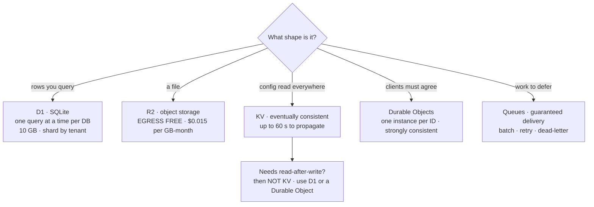
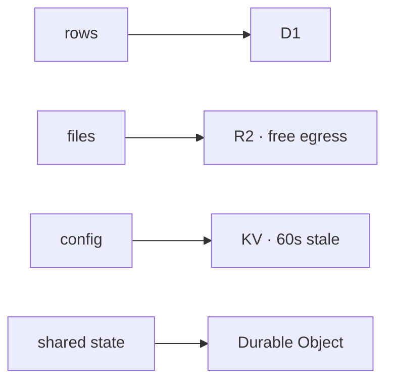

Five stores, and the choice is almost never close once you name the shape of the data. Ask the question in the left column; the answer picks the product.

| What you have | Store | The fact that decides it |
| --- | --- | --- |
| Rows you want to query and join | **D1** | SQLite semantics; 10 GB per database (Paid), 500 MB (Free) |
| Files: uploads, images, backups, exports | **R2** | **Egress is free** — the whole reason to leave S3 |
| Read-mostly config, flags, cached responses | **KV** | Writes can take **60 s or more** to show up elsewhere |
| Many clients that must agree on one state | **Durable Objects** | One active instance per ID handles every request for it |
| Work that shouldn't happen in the request | **Queues** | Guaranteed delivery, batching, retries, dead-letter queue |

### D1 — rows you query

_"D1 is Cloudflare's managed, serverless database with SQLite's SQL semantics."_ Real SQL, real joins, real constraints, queried from a Worker binding or over HTTP. Limits worth knowing before you design: **10 GB per database** on Workers Paid (500 MB Free), **1 TB total** per account (5 GB Free), **50,000 databases** (10 on Free), 30-second query duration, 2 MB max row.

The load-bearing one is not a size: _"Each individual D1 database is inherently single-threaded, and processes queries one at a time."_ That is why there is no published rows-per-second figure — throughput is just one over your query duration. A slow query doesn't only hurt its own caller; it holds up everything behind it. The intended answer to a write-heavy workload is **more databases**, not a bigger one — Cloudflare specifically notes you can "create thousands of databases at no extra cost for isolation," so a per-tenant or per-shard database is the sanctioned pattern.

### R2 — files, and the egress story

Object storage, S3-API-compatible, and the differentiator is one line: **"Egress (data transfer to Internet)" is "Free."** No per-GB bandwidth bill for serving what you stored. That single fact is what makes user-uploaded media, public downloads, dataset hosting and video segments viable at a price S3 can't match, and it is the reason to migrate even when nothing else about R2 is better for you.

You pay for storage and operations instead: **$0.015/GB-month** standard ($0.01 for Infrequent Access), **Class A $4.50/million** (writes and lists — `PutObject`, `ListObjects`, `CopyObject`, multipart), **Class B $0.36/million** (reads — `GetObject`, `HeadObject`). Deletes are free. The free tier is 10 GB-month plus 1M Class A and 10M Class B operations per month. The practical shape: **writes cost 12× what reads cost**, so batch uploads and stop listing a bucket on every page load.

### KV — fast reads, and the trap

KV _"achieves high performance by being eventually-consistent."_ A write is usually visible immediately where you made it, but _"changes may take up to 60 seconds or more to be visible in other global network locations."_ Reads are additionally cached with a `cacheTtl` defaulting to 60 seconds, and negative lookups are cached too — so a key you just created can keep reading as missing.

**Never put anything needing read-after-write in KV.** Not a user's just-saved profile, not a session that a redirect immediately reads, not a counter, not a lock. Cloudflare says it plainly: KV is wrong for workloads needing _"atomic operations or where values must be read and written in a single transaction,"_ and wrong for write-heavy keys updated _"tens or hundreds of times per second."_ It is right for feature flags, routing tables, config, and cached API responses — things written rarely and read everywhere.

### Durable Objects — one place where truth lives

_"Each Durable Object has a globally-unique name, which allows you to send requests to a specific object from anywhere in the world"_ and — the property everything else rests on — _"each Durable Object has one active instance at any particular time. All requests sent to that Durable Object are handled by that same instance."_ That is the coordination primitive: give a chat room, a document, a game match, or a rate-limit bucket its own ID and every client converges on one authority instead of racing.

Its storage is _"durable, transactional, and strongly consistent"_ (up to 10 GB per object), and the SQLite storage backend exposes both SQL and key-value APIs. The mistake to avoid: in-memory variables are a cache, not state — _"because in-memory state is not preserved across eviction or hibernation, persist anything important to storage."_

### Queues — take it out of the request path

_"Send and receive messages with guaranteed delivery,"_ with batching, delays, retries and a dead-letter queue for repeated failures. Reach for it when the user shouldn't wait: send the email, resize the image, sync the CRM, rebuild the index. No egress charges. Free plan gets 10,000 operations/day; Paid is $0.40/million with 1M included, where **an operation is each 64 KB written, read, or deleted** — so a 200 KB message is four operations on each hop, not one.

<!-- mini -->

