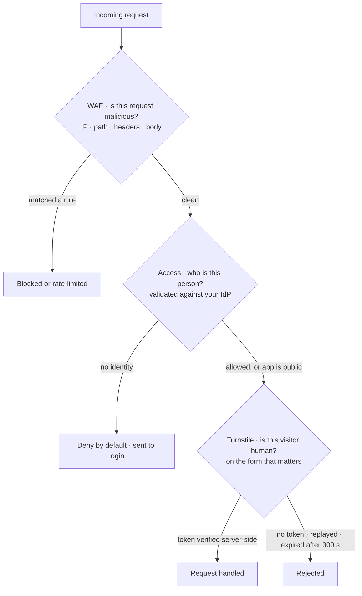
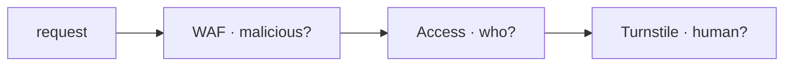

These three get confused constantly, and the confusion is expensive: people put a CAPTCHA in front of an admin panel that needed a login, or expect a firewall rule to stop credential stuffing from a real browser. Each answers a **different question**, and each has a different unit it judges.

| Product | The question it answers | What it judges |
| --- | --- | --- |
| **Access** (Cloudflare One / Zero Trust) | *Who are you, and are you allowed in?* | A **person**, against an identity provider |
| **Turnstile** | *Is this visitor a human?* | A **visitor** on a page, at one moment |
| **WAF** | *Is this request trying to hurt me?* | A single **HTTP request** |

### Access — identity in front of a whole application

_"Cloudflare Access determines who can reach your application by applying the Access policies you configure."_ Unauthenticated visitors are stopped before the app is reached at all — **"Access is deny by default."** You are not writing auth code; you are putting a policy-enforced door in front of an existing app (self-hosted, SaaS, or non-HTTP).

A policy is four parts: an **action** (Allow, Block, Bypass, or Service Auth), **rule types** that combine criteria, **selectors** — the attribute being checked, such as email domain, country, or device posture — and the **values** to match. Identity is validated against an IdP: the canonical example is allowing anyone _"with an `@example.com` email address, as validated against an IdP."_ Note the docs' own warning: Cloudflare _"does not recommend using Bypass to grant direct permanent access to your internal applications."_

Use it for the staging site, the admin panel, the internal dashboard, the metrics endpoint. Do **not** reach for Turnstile there — a bot check does not know who someone is.

### Turnstile — proving a visitor is a human, without a CAPTCHA

_"Cloudflare's smart CAPTCHA alternative."_ It runs _"a series of small non-interactive JavaScript challenges to gather signals about the visitor or browser environment"_ instead of making people label traffic lights, and it is a drop-in replacement for reCAPTCHA and hCaptcha. Critically, **your site does not have to be on Cloudflare**: _"Turnstile can be embedded into any website without sending traffic through Cloudflare."_

Two keys, and mixing them up is the classic failure:

- **Sitekey — public.** _"Public key used to invoke the Turnstile widget on your site."_ It ships in your HTML. That is fine and by design.
- **Secret key — private.** _"Private key used for server-side token validation,"_ with the docs' own rule: _"Never expose secret keys in client-side code."_

**The widget alone proves nothing.** A rendered widget just hands the browser a token; anyone can POST your form without one. The check is the server-side call to `POST https://challenges.cloudflare.com/turnstile/v0/siteverify` with `secret` and `response`, and acting on `success`. Two properties shape your code: the token is **valid for 300 seconds (5 minutes)**, and it is **single-use** — _"a replayed token will be rejected."_ So verify once, at submit, on the server, and never cache or re-check a token.

**Hostname behaviour catches people out.** A hostname you add covers itself *and everything under it*: _"the widget will work on that exact hostname and all of its subdomains."_ But you cannot express that with a glob — _"wildcard characters (such as `*`) are not supported in the hostname field."_ So add `example.com` and `app.example.com` and `staging.example.com` are already covered; typing `*.example.com` is not a pattern, it is a broken hostname.

### WAF — blocking malicious requests

The WAF _"checks incoming web and API requests and filters undesired traffic based on sets of rules called rulesets,"_ matching on request properties such as _"IP address, URL path, headers, and body content."_ Three rule families do the work: **Custom rules** you write, **Managed Rules** Cloudflare maintains and updates for zero-days, and **Rate limiting rules** that cap requests matching an expression.

Plan matters here, so check before you design around it: Free gets custom rules, **one** rate limiting rule, IP access rules and sampled security events. **Managed Rules require Pro or above**; advanced rate limiting and account-level configuration are Enterprise.

### They stack — and the order is the point

A request can pass the WAF (it isn't a SQL injection), fail Turnstile (it's a scripted signup), and never reach Access (nobody logged in). Putting Turnstile on a login form does not authenticate anyone; putting Access on a public marketing site locks out your customers; a WAF rule cannot tell a legitimate user from a stolen password. Pick by the question you actually have.

<!-- mini -->

