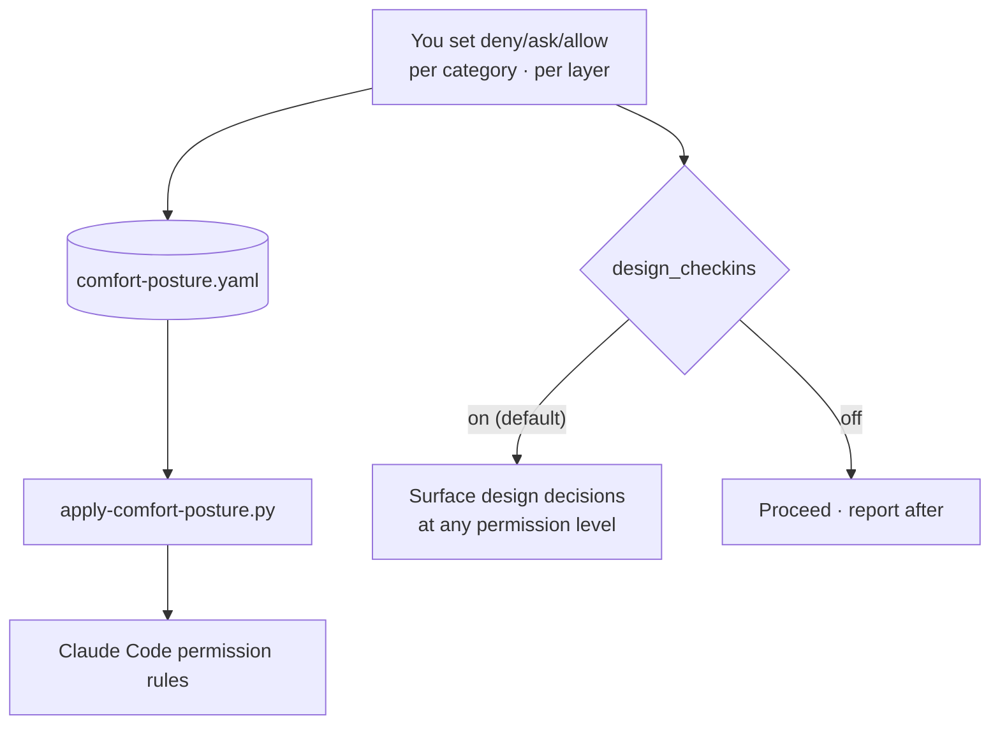
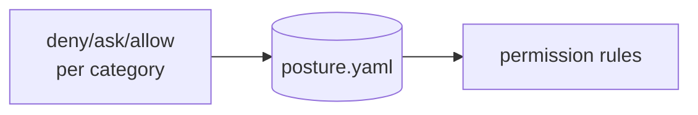

**Comfort posture** is RavenClaude's friendly front-end over the raw permission model. Instead of hand-editing `settings.json`, you set a level — **deny / ask / allow** — per *category* of action (file reads, code execution, remote mutations, …) and per *layer* (user / local / project). The dashboard's Settings tab serializes that to `.ravenclaude/comfort-posture.yaml`, and `apply-comfort-posture.py` translates it into the actual Claude Code permission rules — so the layer-precedence rules still govern what finally wins.

The load-bearing subtlety: **permission level ≠ design judgment.** Setting a category to `allow` only removes the click-to-approve on tool calls — it does **not** tell Claude to stop surfacing architectural decisions. That behavior is a *separate* flag, `design_checkins` (on by default), so relaxing permissions to move faster never silently mutes design check-ins. The two are deliberately decoupled.

<!-- mini -->

