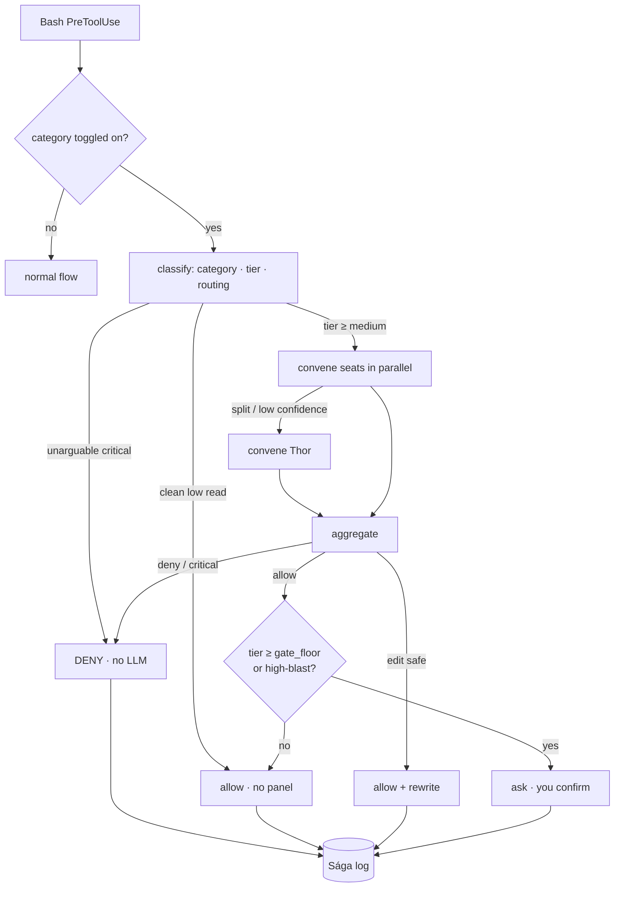
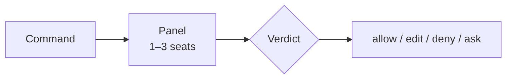

**Command review** — codename *the Thing* — is an opt-in panel of reviewer agents that adjudicates shell commands instead of stopping to ask you. It sits **on top of** comfort-posture: posture sets the policy (allow/ask/deny per category); the tribunal is the adjudicator you switch on for a category so a verdict lands in seconds.

Routing is **tiered**. Every command resolves to `low → medium → high → extreme` (its category base tier, bumped by a deterministic high/critical concern). A clean `low` read runs **no panel at all** (zero cost); seat count and the confidence bar escalate with the tier. Up to three seats run in parallel — **Forseti** (security), **Mímir** (code), **Heimdall** (injection) — with **Thor** (architect) convened only on a split.

The **`gate_floor`** knob (default `high`) is the lowest tier whose *confident ALLOW* is surfaced to you as an `ask`. DENY still blocks and EDIT still rewrites autonomously, so the tribunal pre-filters the dangerous and the fixable before either reaches you. Two hard overrides ignore the knob: **reads are never surfaced**, and **irreversible high-blast allows always are**. An abstaining panel always fails **closed**. It can never relax the `security_deny` floor.

<!-- mini -->

