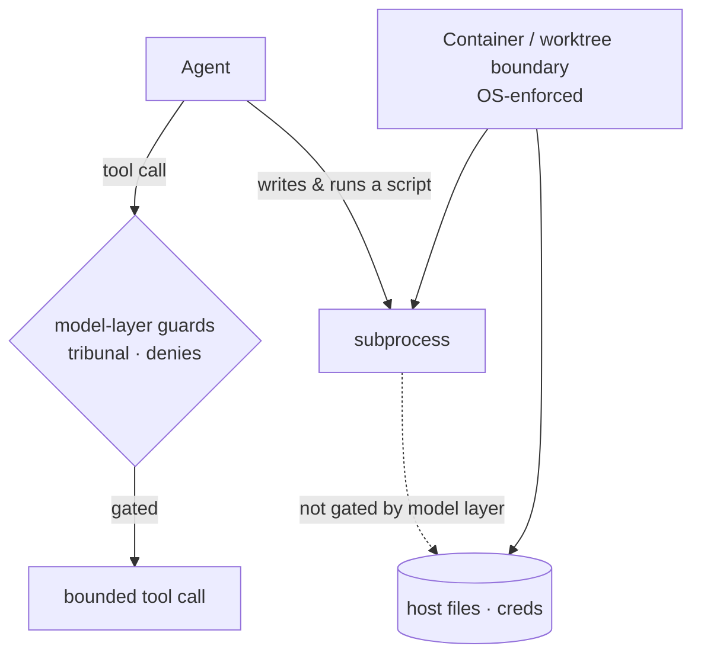
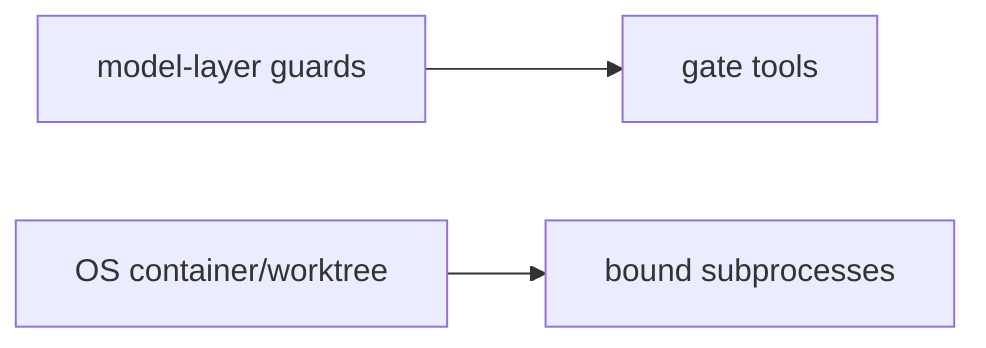

Every other guardrail in this cluster — the runaway brake, the definition-of-done gate, the task-scope gate, and command review itself — is a **model-layer** guard: it gates the *agent's own tools*. That leaves one gap none of them can close. A `deny` on `Read(~/.ssh/**)` stops the agent's `Read` tool, but it does **not** stop a script the agent writes and then runs — the subprocess inherits the shell's access, not the agent's permission rules. Only the **operating system** can hold that line, because the OS enforces it whether or not the command was correctly labeled, mislabeled, or flipped by an injection.

That is **containment posture**: the boundary lives *below* the model. The sanctioned, model-agnostic containment is **the devcontainer this marketplace scaffolds plus a git worktree** for risky or parallel runs. The container is the real, OS-enforced blast radius, and it behaves identically under Claude Code, GitHub Copilot CLI, or any other host — that portability is exactly why it's the recommended posture. On top of it, the balanced comfort-posture seed adds **tool-layer denies** for host credential stores outside the repo (`~/.ssh`, `~/.aws`, `~/.config/gcloud`, `~/.azure`, `~/.kube/config`, `~/.docker/config.json`) so the agent's own Read tool also refuses them — but those are tool-layer, *not* OS isolation, so they don't close the subprocess gap on their own.

The honest caveat completes the picture. Claude Code *can* add an OS sandbox (Seatbelt/bubblewrap, `denyRead`/`denyWrite`) that genuinely contains subprocesses — but there's no evidence Copilot CLI honors it, so under Copilot the container/worktree is the containment, **not** the sandbox. RavenClaude deliberately does not write a Claude-only sandbox config and present it as portable. The takeaway for working safely: when a run is risky, put it inside a container or a worktree so the *floor* of what it can touch is set by the OS, and treat the model-layer guards as the layers above that floor — they reduce mistakes, but the container is what survives one.

<!-- mini -->

