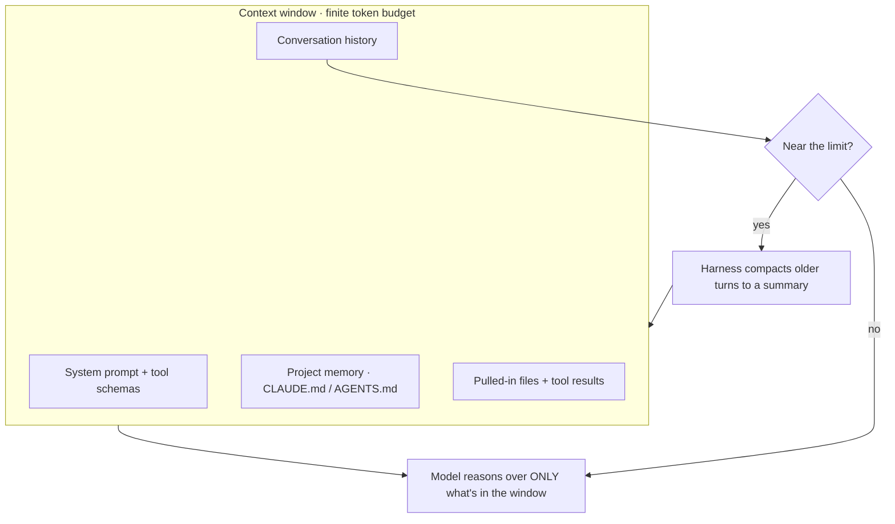
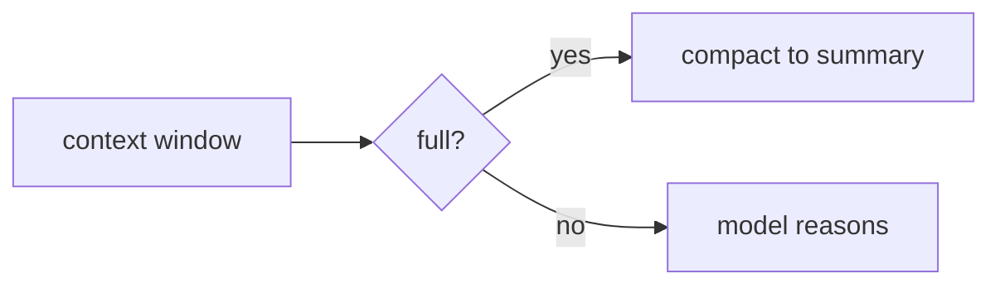

A model has **no memory between turns.** Everything it "knows" while answering is whatever text sits in its **context window** right now: the system prompt, the tool schemas, the project instructions (`CLAUDE.md` / `AGENTS.md`), the conversation so far, and the contents of any file or tool result that's been pulled in. Nothing outside that window exists to the model — if it isn't in context, the model can't see it, no matter how relevant.

The window is **finite** (measured in tokens — roughly ¾ of a word each). Two consequences follow:

- **It fills up.** Long sessions, big files, and chatty tool output all consume the budget. As it fills, the *effective* room for reasoning shrinks, and far-back details get crowded out — the model can genuinely "forget" what happened early in a long session.
- **When it's nearly full, the harness compacts.** Claude Code summarizes the older part of the conversation into a compact recap and continues with that plus the recent turns. The work isn't lost, but it's now a *summary* — which is why durable facts belong in `CLAUDE.md` or committed files, not just in chat.

The practical model: treat context like a **desk, not a filing cabinet.** Things on the desk are usable now; everything else has to be fetched back on (a tool call, a file read) before the model can use it — and fetching it costs space. Good agent design keeps the desk clear: focused tool results, subagents that return short summaries instead of raw dumps, and important state written somewhere persistent.

This is also why a **SessionStart** context injection (the orientation banner) is deliberately kept small — it rides in *every* session's window, so it's a recurring tax on the budget.

