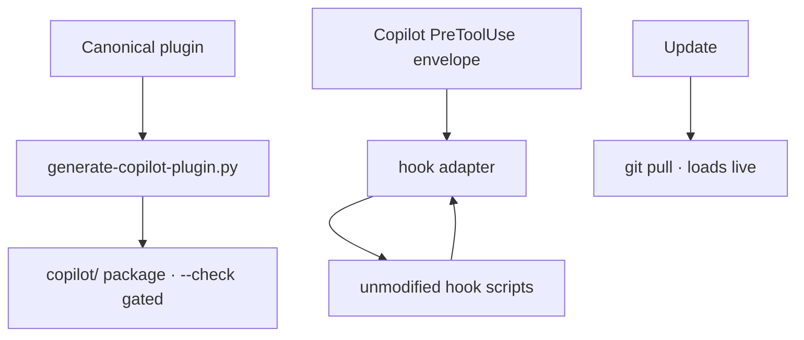
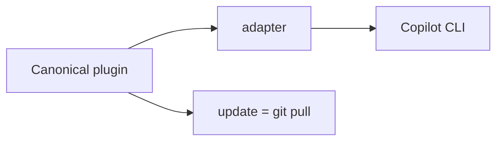

Copilot CLI is itself a plugin host with the same lifecycle events (SessionStart / PreToolUse / …), Agent Skills, AGENTS.md, and MCP — so most of the plugin ports. Three pieces make it work: `generate-copilot-plugin.py` **projects** the canonical plugin into a Copilot package (generated, never hand-maintained, `--check`-gated like the dashboard); a **hook adapter** translates the I/O envelopes so the *unmodified* hook scripts run under Copilot (mapping its `toolName`/`toolArgs` ⇄ Claude's `tool_name`/`tool_input`, and the verdict shapes); and **enforcement hooks ship repo-level** in `.github/hooks/` because a Copilot bug stops plugin-level `preToolUse` hooks from firing.

The design pillar is **frictionless updates**: instead of Copilot's re-install-to-update flow, the plugin loads **live** via `copilot --plugin-dir copilot/`, so an update is just **`git pull`** (`ravenclaude update`). No re-install, ever.

<!-- mini -->

