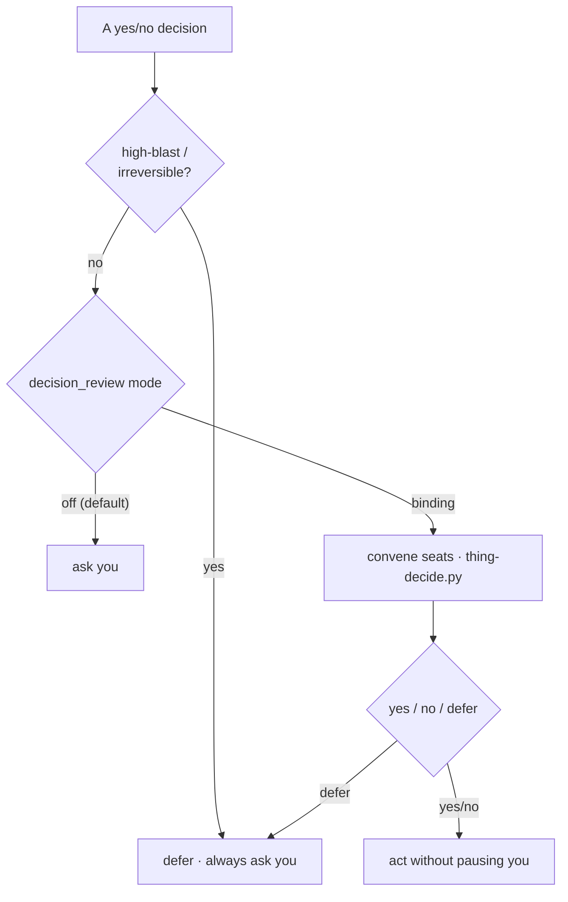
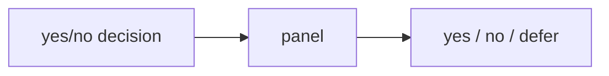

The command-review tribunal adjudicates *shell commands*; the **decision-review** tribunal adjudicates *yes/no decisions* — the kind an agent would otherwise interrupt you with. The `decision-review` skill convenes the same seats on a yes/no question (engine: `thing-decide.py`) and returns **`yes` / `no` / `defer`**. A binding yes/no is acted on without pausing you; a `defer` asks you. The panel defers genuine preferences, low-confidence or split calls, and anything high-blast.

Two guardrails: **high-blast / irreversible decisions never auto-resolve** — force-push, deletes, prod actions, the `security_deny` family always `defer` to you, regardless of mode. And the mode knob `decision_review: off | advisory | binding` is **off by default**, so nothing is auto-decided unless you opt in. (The seats run via `claude -p`; without it the panel abstains and fails safe to `defer`.) After each PR, a retrospective routes the PR's decisions through the same panel and logs the verdicts.

<!-- mini -->

