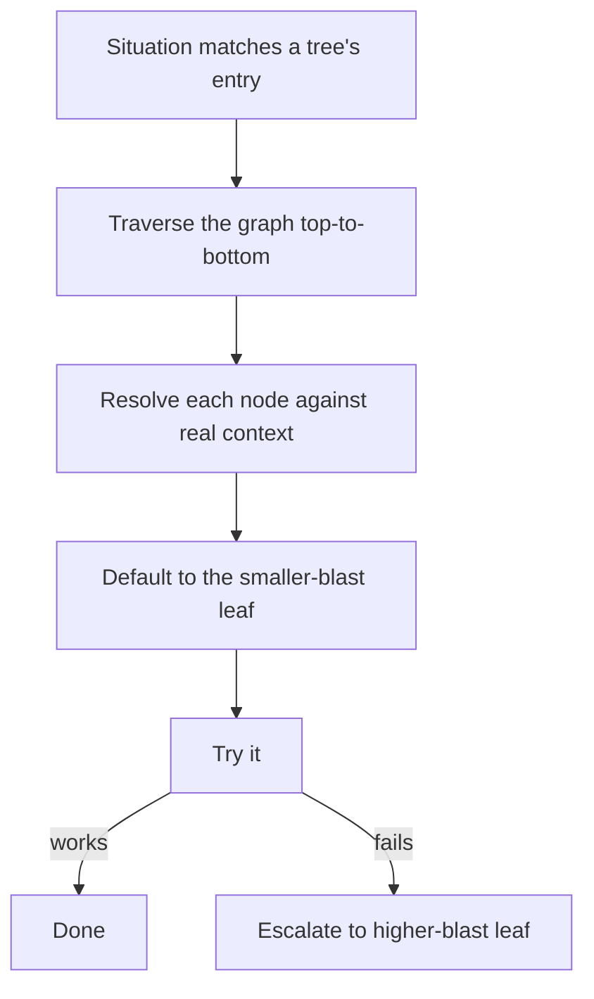
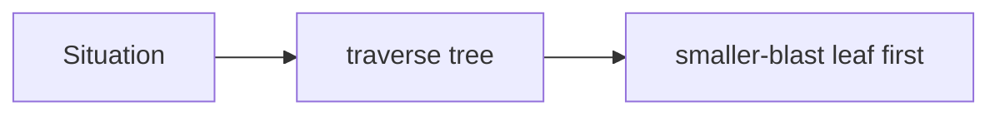

When a knowledge file contains a `## Decision Tree: <Domain>` section, the agent must **traverse the Mermaid graph top-to-bottom before selecting a method** — resolving each condition node against the user's actual context (not keyword-matching the request), defaulting to the **leaf with the smaller blast radius**, and escalating to a higher-blast leaf only after the smaller one demonstrably fails.

This closes the **wrong-branch-from-the-start** failure mode (the agent picks the wrong method on the first try because the branches weren't visible). It composes with alternate-methods enumeration (which handles "method failed, try the next") and the environment-context check (which handles "I'm already authorized"). Every diagram-bearing knowledge file carries a mandatory **`last-verified` date**, and the Researcher's sweep flags any tree older than 90 days — the same discipline these Learn concepts follow.

<!-- mini -->

