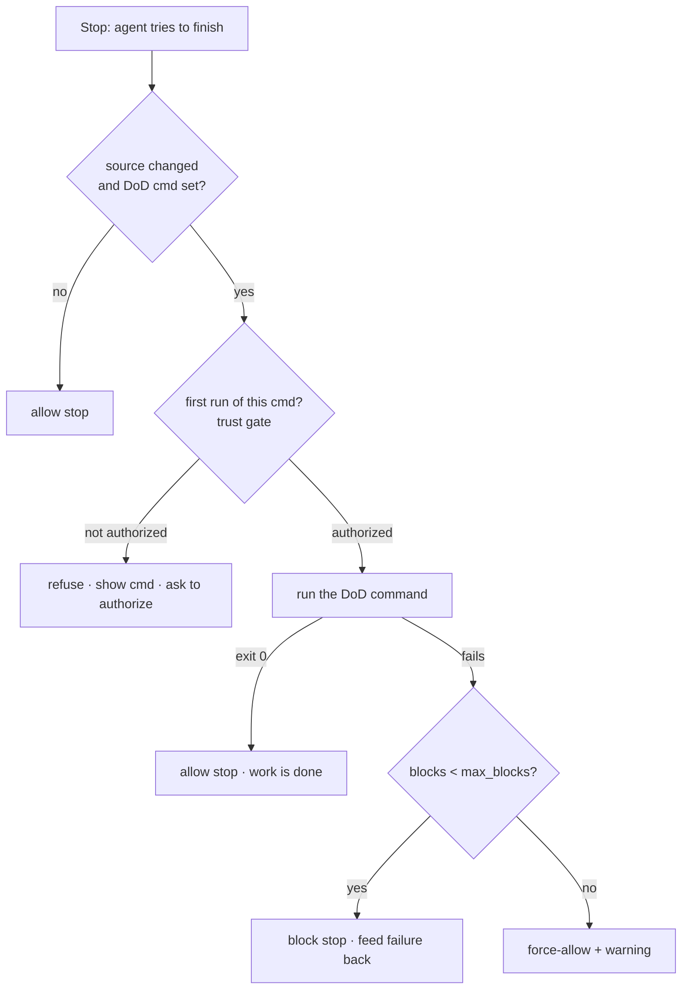
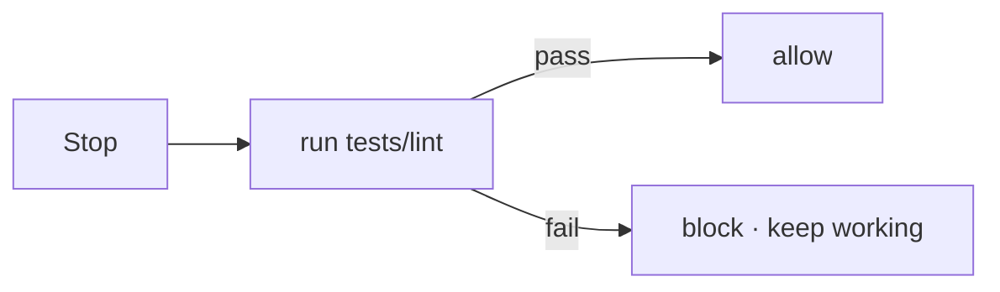

The **definition-of-done gate** closes the gap that command review can't see: it gates work **correctness**, not command safety. The Thing tribunal asks "is this command dangerous?"; this gate asks "is the work actually finished, or does it just *look* finished?" It is a `Stop` hook — it fires when the agent tries to end its turn — and if a `definition_of_done.cmd` is configured in `.ravenclaude/comfort-posture.yaml`, it runs that command (your tests, build, lint) and **blocks the stop until the command exits zero**. That turns "looks done" into "is done" without the human having to be the verification loop.

The gate is **scoped and self-limiting** so it never becomes an obstacle. It only fires when *source files actually changed* this session (it inspects `git status --porcelain` for code extensions), so a docs-only or read-only session ends cleanly. When the command fails, the gate feeds the tail of the failing output back to the agent so it can fix the problem and try again. To guarantee it can't deadlock, it blocks at most **`max_blocks`** (default 8) consecutive times, then **force-allows** the stop with a warning — Claude Code force-overrides Stop after 8 anyway, but Copilot CLI gives no such guarantee, so the cap is built in. With no `definition_of_done.cmd` set, the gate is inert and the advisory `remind-tests.sh` nudge handles the reminder instead.

One safety detail: the configured command is shell-executed, and it comes from a YAML field a malicious pull request could edit. So before the *first* run per session for a given command value, the gate refuses to execute and surfaces the literal command plus a one-line `touch` step to authorize it (or set `definition_of_done.trusted: true` to skip the prompt permanently). Rotating the command or starting a new session re-triggers the check. Like the other guardrails it is **opt-in and deterministic** — the verdict is just a command's exit code, no model in the loop — so it ports unchanged to Copilot through the adapter's `stop` mode.

<!-- mini -->

