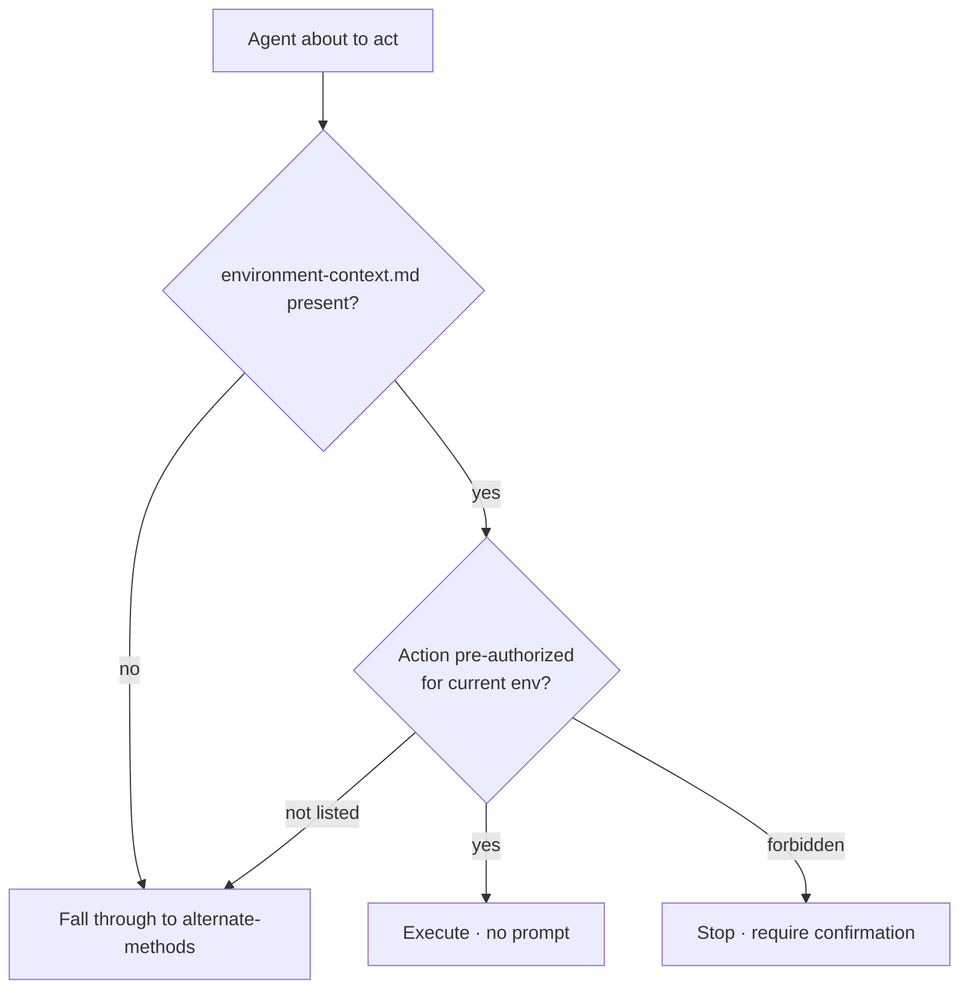
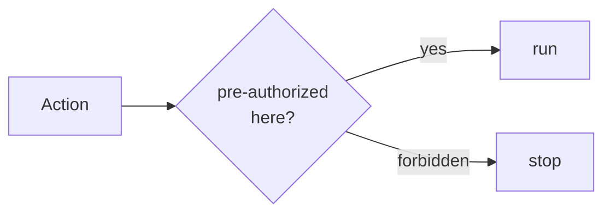

`.ravenclaude/environment-context.md` (at the **consumer's** project root, optional) records each environment (DEV / TEST / PROD / named), its role, its **pre-authorized action categories**, and a **forbidden** list. The Capability Grounding Protocol does a **pre-action check** against it: if the current environment pre-authorizes the action category, the agent **executes without asking** (no "did you try X?" round-trip); if the action is forbidden, it **stops** for explicit confirmation regardless of role; if the file is silent, it falls through to alternate-methods enumeration.

When the file is absent, the agent offers the **environment-discovery** skill instead of asking you to fill in a template by hand — it probes installed CLIs read-only, decodes any acquired JWTs, and drafts the file for you to save/edit/skip. Discovery never runs without confirmation, is read-only by contract, and **never writes credentials** (those live in env vars / Key Vault; the file holds posture, not secrets).

<!-- mini -->

