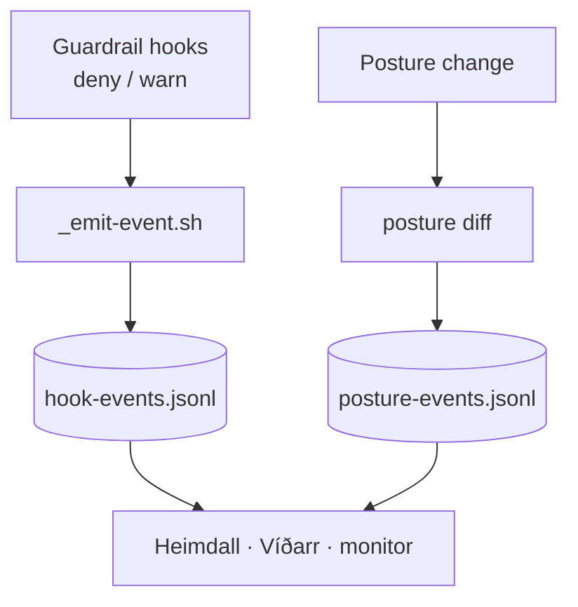

Guardrail verdicts and posture changes used to vanish — they went to stderr or stdout and were gone the moment the turn ended. The **event substrate** fixes that with two **append-only JSONL logs** (one JSON object per line) that record what happened so a panel can read it *after the fact*. It is deliberately built **first**, as the shared emission convention, so every reader downstream consumes one format instead of each inventing its own.

The **hook-event log** (`hook-events.jsonl`, written per session under `.ravenclaude/runs/<session>/`) gets one line per **deny or warn verdict** from the shared sourced helper `_emit-event.sh`. Three hooks emit into it: the layout/scope hook (`enforce-layout.sh`), the destructive-command guard (`guard-destructive.sh`), and the recursive-spawn guard (`guard-recursive-spawn.sh`). The pure formatter is intentionally **not** wired — it has no verdict, so emitting per format would just flood the log. The **posture-event log** (`posture-events.jsonl`) gets one line per posture change from the comfort-posture translator, recording the added/removed permission rules as a diff. An identical reapply writes nothing, so the session-start reapply never floods it.

Both logs are **fail-safe and additive**: a telemetry write can never break the guardrail or posture apply that produced it. They are git-ignored (per-consumer). This is the read-side foundation the four observability tabs sit on — Heimdall reads the hook half, Víðarr interleaves both, Norns reads the scenario stream, and the push monitor tails the hook log live.

