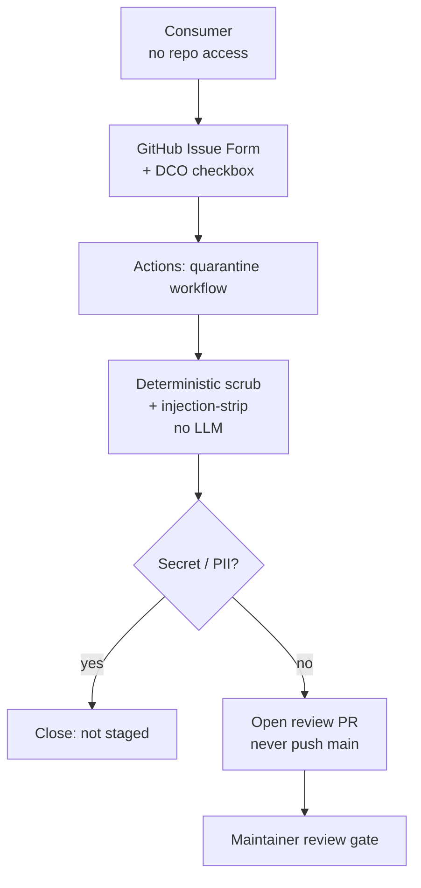
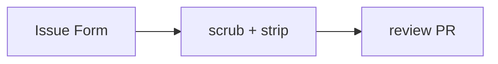

`/wrap` assumes a contributor can place a file in the repo — which closes out every external consumer **without push access**, the measured bottleneck on real-engagement contributions. The external-contribution intake closes that gap at the repo edge. A consumer files a typed **GitHub Issue Form** (title, plugin dropdown, product, problem/resolution textareas, a scope guess, and a required DCO checkbox attesting the work is theirs with no client-identifying information). Labeling the issue fires the **quarantine workflow**, which turns the submission into a reviewable file without ever giving the consumer write access to the repo.

The workflow is **security-sensitive** because it processes untrusted input inside GitHub Actions, so it holds a few hard invariants. The issue title and body are **untrusted data** — they never get interpolated into a shell `run:` line; they reach the processor only via environment variables, and only the trusted issue *number* is interpolated elsewhere. The processor (`process-scenario-submission.py`) is **deterministic and model-free** — pure regex reusing the marketplace's secret patterns and injection-strip patterns — so **no LLM ever processes the untrusted content** at intake. A secret or PII shape closes the issue "not staged" with no file written; otherwise the body is injection-stripped, capped, and normalized into a staged file under `docs/staging/incoming/external/`.

Two more rules govern the output. **PR-not-push (R-PR):** the workflow **opens a pull request**, never commits to `main` — branch protection rejects bot pushes, and every staged file arrives as a human-reviewable PR that drains through the existing maintainer review (the second, LLM-backed human gate, downstream of the regex clean). A **spam cap** closes new submissions with "queue full" once too many external submissions are already open. The result: anyone can contribute a field note safely, and nothing untrusted reaches a canonical location without two gates in between.

<!-- mini -->

