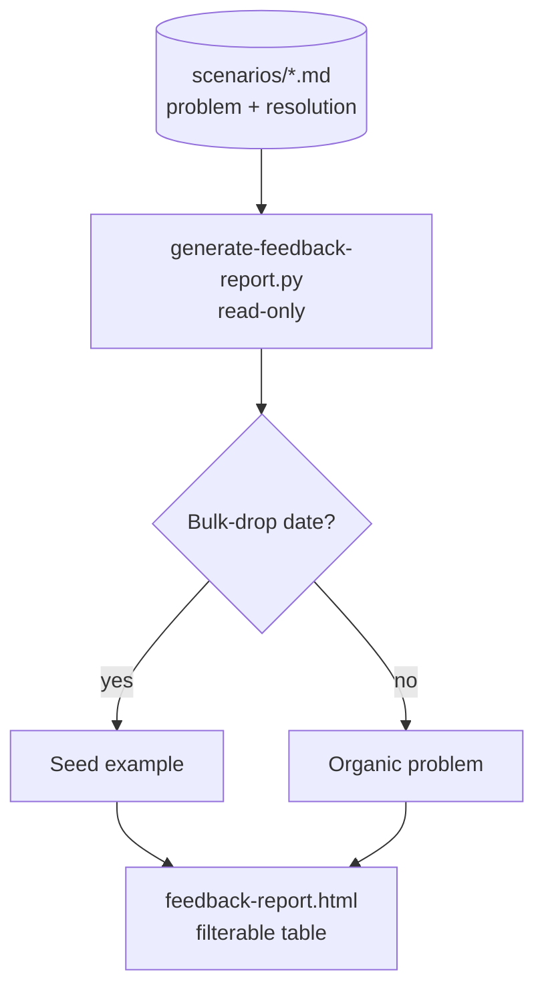
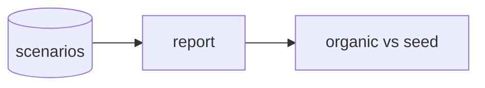

The **Problems & Resolutions** view (`feedback-report.html`) answers a plain question: *"What problems are people hitting, and how are they resolving them?"* The scenario corpus already holds exactly that — each scenario file is a problem → context → tried → resolution field note. This generator **reads** the corpus and writes nothing back, emitting one self-contained, offline HTML page: a filterable table with one row per scenario (problem, resolution, plugin, scope, date) plus a top summary of KPIs and a per-plugin breakdown.

The load-bearing feature is the **organic-vs-seed** distinction. Most of the corpus is a bulk *seed* drop — synthetic starter scenarios authored en masse over a couple of days — while only a handful are *organic* contributions from real engagements. The seed inflates the raw count and hides the genuine user problems, so the view classifies each scenario by whether its contribution date is a **bulk-drop date** (an unusually large number of scenarios sharing one date, detected dynamically from the data). Everything else is organic. This is deterministic and self-adjusting: when real organic contributions accumulate on ordinary days, they're never mis-tagged as seed. An **Origin** filter (All / Organic / Seed) lets you collapse the table down to just the real-engagement problems.

The report is built with the same discipline as the rest of the dashboard surface: no CDN, inline CSS/JS, server-side-rendered table with client-side filter/search/sort, shared design tokens, and a derived (not wall-clock) "as of" date so the file is byte-stable between runs. By privacy construction it renders **only** fields that already ship in the committed scenario files — it adds no environment, tenant, auth, or role data.

<!-- mini -->

