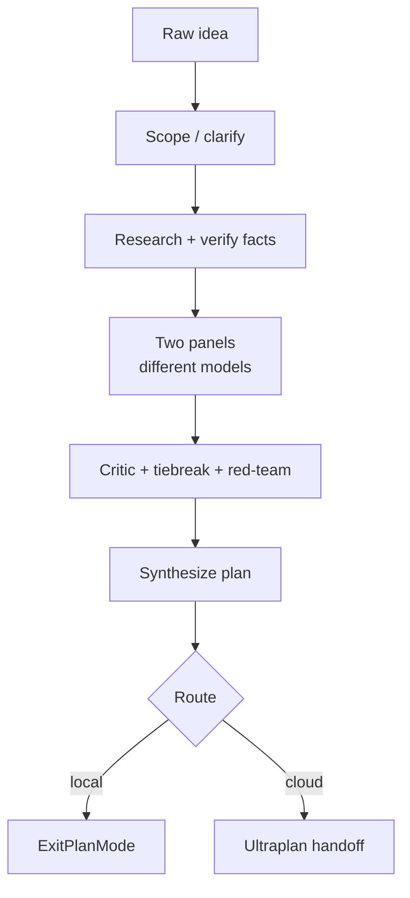

**FORGE** is RavenClaude's gated planning pipeline — what `/forge` runs. It formalizes the pattern the maintainer runs by hand: *clarify → research + verify → two divergent panels on different models → critic → gap-analysis → per-conflict expert tiebreak → red-team → synthesize → route → exit.* Each gate is **fail-closed** (no advance without an explicit pass or a recorded waiver) and emits a typed artifact into the run directory, so the whole plan-building process is auditable after the fact.

The pipeline scales with **depth** rather than running a fixed set of gates: `micro` runs only scope + synthesize + route, `quick` (the default) adds research and the two panels, `standard` adds the critic, tiebreak, and red-team, and `deep` removes the conflict cap and adds checkpoint/resume. Two ideas make FORGE more than a copy of Claude Code's dynamic-workflows deep-plan loop: it runs the two review panels on **different models** (cross-model divergence catches blind spots a same-model critic shares), and it adds a **fact-verification gate** that blocks on any load-bearing claim about anything outside the repo unless it carries a this-session source or an explicit `[unverified]` marker. A correlated-error **critic** then hunts for places the two panels *agree on something wrong* — the failure a disagreement-keyed gap-analysis structurally can't see.

The final gate routes the plan **deterministically** (no model judgment): a script decides whether to execute locally or hand off to Ultraplan in the cloud, and whether the plan lands on `main` or via a draft PR. FORGE raises the floor on plan quality and shifts the odds against a confidently-wrong plan — it does **not** guarantee correctness; the critic, red-team, and tiebreak reduce, not eliminate, the residual risk.

<!-- mini -->

