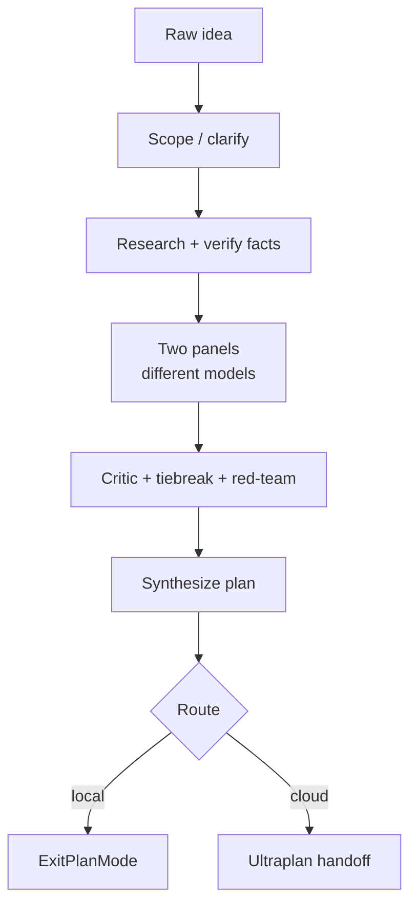

**FORGE** is RavenClaude's gated planning pipeline — what `/forge` runs. Raw idea → clarify → research/verify → divergent panels → critic/tiebreak/red-team (depth-scaled) → synthesize → deterministic route/exit. Gates are **fail-closed**; artifacts land in the run dir.

**Depth ladder (summary):** `micro` → scope + synthesize + route · `quick` (default) + research + panels · `standard` + critic/tiebreak/red-team · `deep` uncapped conflict + checkpoint/resume.

**Two differentiators:** cross-model panels (catches same-model blind spots) and a fact-verification gate (load-bearing outside-repo claims need a this-session source or `[unverified]`).

⛔ **This card is thin on purpose (0.323.12).** Gate scripts, waivers, receipt shape, and worktree rules live exclusively in [`skills/forge-pipeline/SKILL.md`](../../skills/forge-pipeline/SKILL.md). `/forge` stays a thin command entry. FORGE raises plan-quality odds — it does **not** guarantee correctness.

```mermaid
flowchart TD
  I[Raw idea] --> G0[Scope / clarify]
  G0 --> G1[Research + verify facts]
  G1 --> P[Two panels<br/>different models]
  P --> C[Critic + tiebreak + red-team]
  C --> S[Synthesize plan]
  S --> R{Route}
  R -- local --> EX[ExitPlanMode]
  R -- cloud --> UP[Ultraplan handoff]
  class G0,G1,P,C,S,R,EX,UP built
```

<!-- mini -->

```mermaid-mini
flowchart LR
  I[Idea] --> G[Gated review] --> R[Routed plan]
  class G,R built
```
