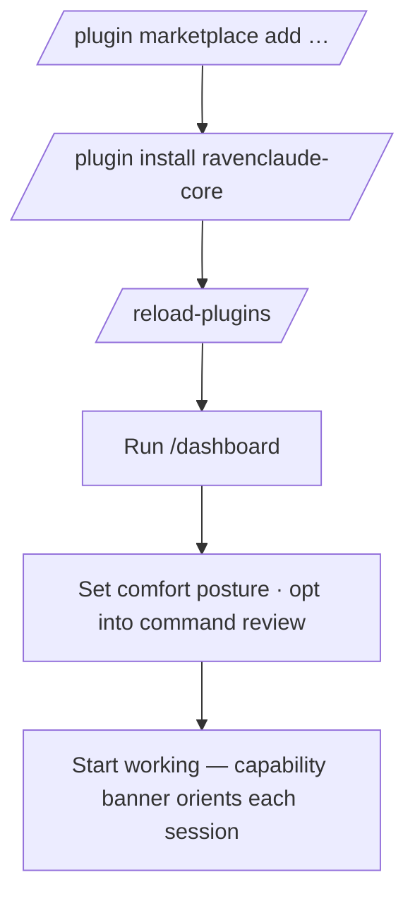

RavenClaude is a Claude Code **plugin marketplace**. To use the core plugin: add the marketplace, install the plugin, reload. `jq` and `python3` are required for the CI workflows and the layout-enforcement hook (both ship in the devcontainer).

```text
/plugin marketplace add mcorbett51090/RavenClaude
/plugin install ravenclaude-core@ravenclaude
/reload-plugins
```

After install, run **`/dashboard`** to launch the comfort-posture editor (point-and-click permission rules + command-review toggles, with one-click Save & apply). Domain plugins (`power-platform`, `finance`, …) build on core, so install it first. Running under **GitHub Copilot CLI** instead? Use `bash scripts/ravenclaude install` — and from then on, updating is just `git pull`.



<!-- mini -->

