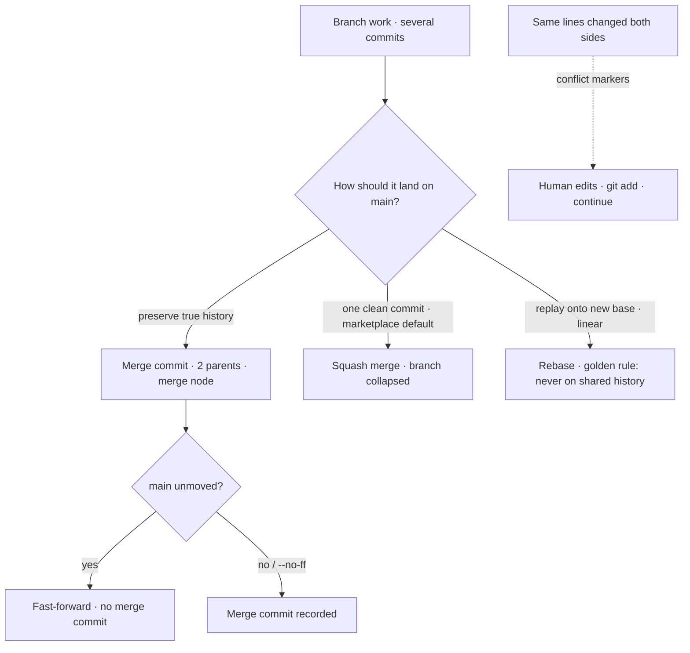
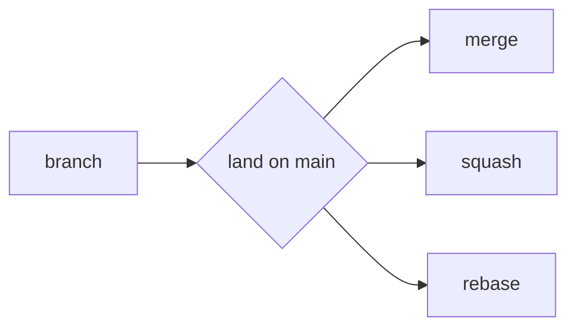

Once work on a branch is done, it has to **land on `main`**. There are three ways to do that, and they differ in what history they leave behind.

**1. A merge commit** — `git merge`. Git creates a brand-new **merge commit** with *two* parents (the tip of main and the tip of your branch), tying the two timelines together. Every original commit on your branch is preserved exactly as it was, and the merge node records that a branch happened here. This keeps **true history** — you can see precisely what was developed in parallel — at the cost of a busier, non-linear graph.

**2. A squash merge** — all the commits on your branch are **collapsed into a single new commit** on main. The branch's intermediate commits do *not* come across; main gets one clean commit representing the whole feature. This gives a **clean, linear history** (one commit per feature/PR, easy to read and to revert as a unit) and loses the step-by-step intermediate commits. **This is the marketplace's default for PRs** (see AGENTS.md PR conventions) — main reads as one tidy commit per merged PR.

**3. A rebase** — `git rebase`. Instead of merging, git **replays your branch's commits one at a time onto a new base** (usually the current tip of main), rewriting them as if you'd started from there. The result is a **linear history** with your individual commits preserved but no merge node. The **golden rule of rebasing: never rebase shared/pushed history.** Rebasing rewrites commit identities, so rebasing commits that others have already pulled forces everyone else into a painful divergence — rebase only your own local, un-shared work.

**Fast-forward vs no-ff.** When main hasn't moved since you branched, a merge can simply **fast-forward** — slide main's pointer up to your branch's tip, creating *no* merge commit (the history is already linear). `--no-ff` forces a merge commit even when a fast-forward was possible, so the merge is explicitly recorded as a distinct event. Squash and rebase both produce linear results by construction.

**Conflict resolution (vocabulary level).** A **conflict** happens when two branches changed the *same* lines of the *same* file in incompatible ways — git can't decide which wins, so it stops and marks the spot with `<<<<<<<` / `=======` / `>>>>>>>` markers. You edit the file to the correct combined result, remove the markers, `git add` it to mark it resolved, and continue the merge or rebase. Conflicts are normal, not errors; they're git asking a human to make the call it can't.

