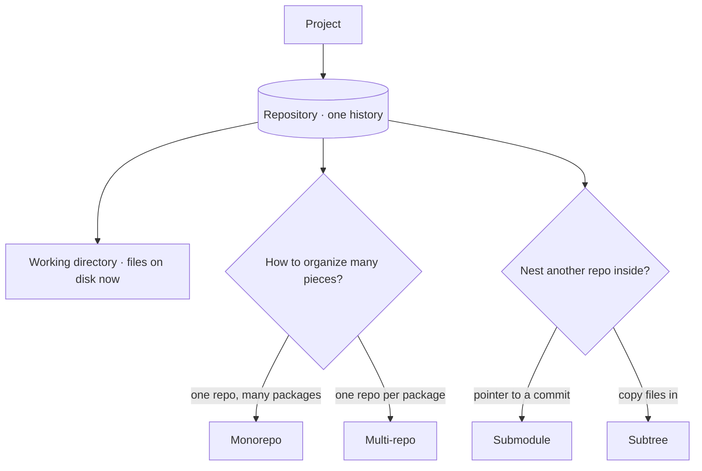
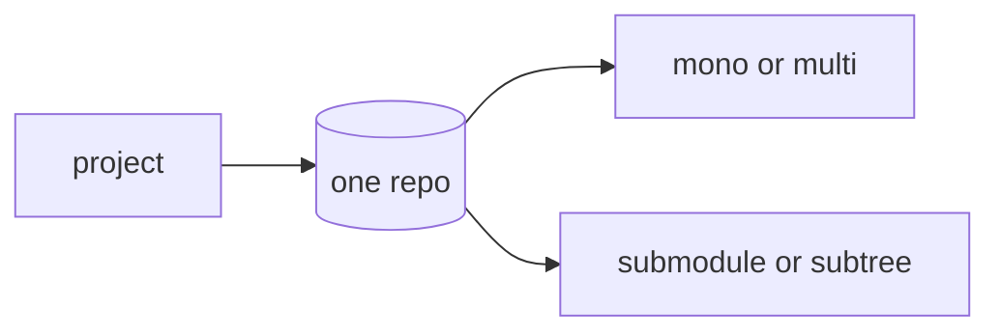

In source control, a **project** maps to a **repository (repo)**: one repo is one self-contained history of one body of work. Everything that belongs together — its code, its commits, its branches, its tags — lives in that one repo, and the repo is the unit you clone, push, and open a pull request against.

**The working directory vs the repo** is the first distinction to keep straight. The **working directory** is the set of files you see and edit on disk right now. The **repo** is the full history *behind* those files — every past snapshot, every branch, stored in a hidden `.git/` folder. The working directory is one point in time; the repo is the time-machine that can move it to any other point. (A worktree, in the companion concept, is a *second* working directory backed by the *same* repo.)

**Monorepo vs multi-repo** is the big organizational choice once you have more than one thing to manage:

- A **monorepo** is **one repository holding many packages / apps / libraries** side by side. One clone gets you everything; a single commit can change two packages atomically; refactoring across boundaries is easy. The cost is a larger repo and tooling that has to understand "which part changed." This very marketplace is a monorepo — many plugins under one `plugins/` tree, one history.
- **Multi-repo** is **one repository per package**, each with its own history and release cadence. Each piece stays small and independently versioned, but a change that spans two repos now needs two commits, two PRs, and a coordination step. You reach for multi-repo when the pieces have genuinely independent lifecycles and owners.

**Submodules vs subtrees** are the two ways to **nest one repo inside another** — to pull an external repo in as a sub-directory of yours:

- A **submodule** records a *pointer* to a specific commit of the other repo. Your repo stores only "use repo X at commit Y"; the actual files are fetched separately (`git submodule update`). It keeps the two histories cleanly separate and the parent repo small, at the price of an extra step everyone cloning must remember. Fits when the nested repo is a genuinely external dependency you only consume.
- A **subtree** *copies* the other repo's files (and optionally its history) directly into your repo. There's nothing extra to fetch — a plain clone has everything — but your repo carries the contents, and pushing changes back upstream is more involved. Fits when you want a vendored copy that "just works" for everyone who clones, with no submodule ceremony.

