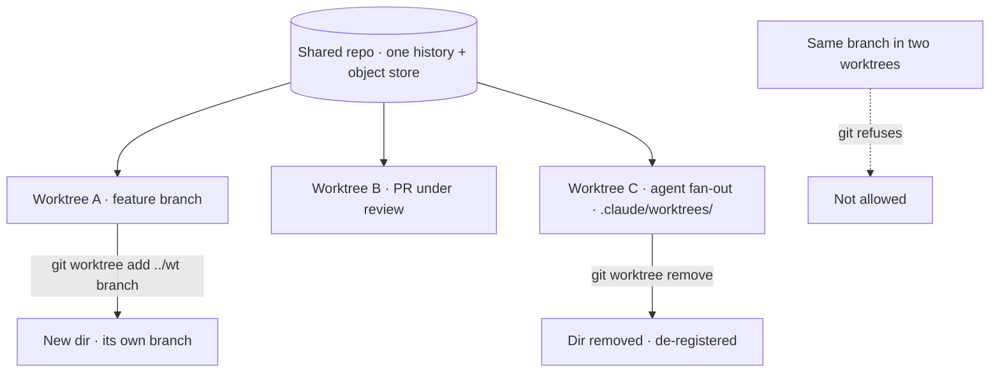
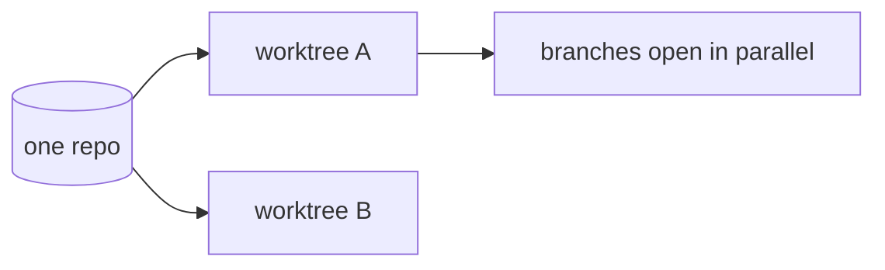

A normal clone has **one** working directory: one set of files on disk, one branch checked out at a time. To switch branches you either commit or **stash** your in-progress changes, swap, and swap back later. That serializes you — you can only look at one branch's files at once.

A **worktree** removes that limit. It is a **second (or third, or Nth) checked-out working directory backed by the same underlying repository** — the same commit history, the same object store, the same remotes — but with a *different* branch checked out in each directory. You get multiple branches live on disk simultaneously, with no stashing and no second clone (a clone would duplicate the whole history; a worktree shares it).

The core command is:

```
git worktree add ../wt-foo branch-name
```

That creates a new directory `../wt-foo` with `branch-name` checked out, leaving your current directory exactly as it was. `git worktree list` shows every worktree the repo has; `git worktree remove ../wt-foo` tears one down when you're done.

**When worktrees earn their keep:**

- **Parallel work** — a long build or test run is churning in one branch's directory while you keep coding in another's.
- **Reviewing a PR without losing your place** — check out the PR branch in a fresh worktree, run and read it, then `remove` it — your own feature branch's directory never moved.
- **Agent fan-out** — this marketplace uses `.claude/worktrees/` to give parallel agents their own isolated working directories so they don't collide on the same files. The project's name for this worktree traversal is **Sleipnir** (Odin's eight-legged horse — the one mount that crosses realm boundaries safely); in dispatch prose you'll see "I'll send Sleipnir to that branch" rather than the raw `git worktree` call.

**The gotcha to remember:** the **same branch cannot be checked out in two worktrees at once.** Git refuses, because two directories editing one branch would race each other's commits. Each worktree needs its own distinct branch (or a detached HEAD). When you're finished, `git worktree remove` cleans up the directory and de-registers it — don't just `rm -rf` the folder, or the repo keeps a stale registration (recoverable with `git worktree prune`).




