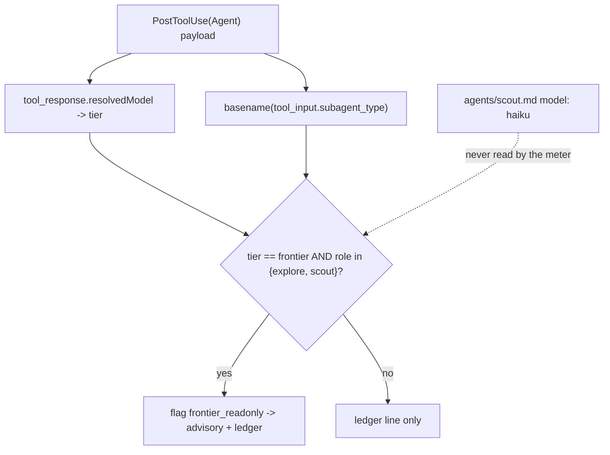

## What a reader would have assumed instead

The meter reads the dispatched agent's `model:` frontmatter, so a `scout` (pinned `haiku`) can
never trip `frontier_readonly` — the frontmatter is the tier, and the gate on `model:` in
`check-frontmatter.py` is what makes the flag unnecessary for shipped agents.

## The discriminator

control: with `resolvedModel` held at `claude-opus-4-8` across three self-test payloads, `Explore`
and `ravenclaude-core:scout` both returned `SIGNAL frontier_readonly` while `architect` returned
`OK` — the role was the only input that changed between the flagged and the unflagged runs.
Measured 2026-09-14: the flag is computed from the `PostToolUse(Agent)` payload alone —
`tool_response.resolvedModel` classified to a tier, crossed with the basename of
`tool_input.subagent_type` against `READ_ONLY_TYPES = {explore, scout}` — and the agent file is
never opened, so a per-invocation `model` override that puts a scout on opus is caught while a
judgment role on opus is deliberately not.

## Why it matters

The `model:` frontmatter gate closes one door (a shipped agent cannot silently inherit the
session's model), but Claude Code resolves the model **per invocation first** — the Team Lead's
`model` parameter, then the frontmatter, then `CLAUDE_CODE_SUBAGENT_MODEL`. A meter that trusted
the frontmatter would report every scout as haiku forever. Reading `resolvedModel` is what lets
the ledger's `tier` column be the tier the worker actually billed at, and what lets the built-in
`Explore` (which has no frontmatter and since v2.1.198 inherits the main model) be flagged at all.

Falsifier: an `architect` dispatch on an opus id emitting `frontier_readonly`, or a `scout`
dispatch on an opus id staying silent.

Probe: `plugins/ravenclaude-core/scripts/handoff-tax-meter.py --self-test` (exit 1 on any failed
check; the three role-crossed payloads are named `Explore on opus`, `plugin-scoped scout on opus`,
`architect on opus`).

