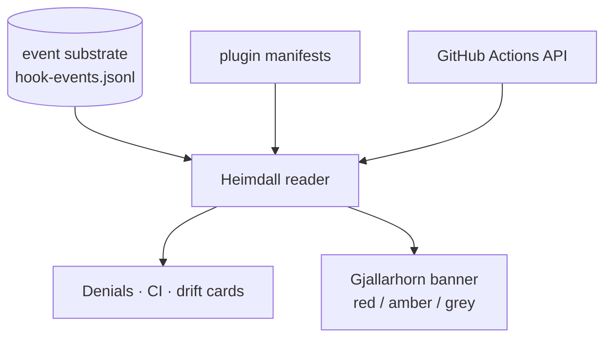

**Heimdall** is the watchman at the rainbow bridge — and the dashboard's perimeter-alarm tab answers his question in one glance: *what tripped, when, and why?* It is the **first reader** of the event substrate, and it is a **read-only mirror** — it writes nothing, to no log; it surfaces only what the hooks and manifests already emitted.

Four cards. **Recent hook denials** reads the session hook-event logs (last 30 days) over a served `/__heimdall` endpoint, groups by hook, and tier-classifies each event. **Recent CI runs** fetches the GitHub Actions API client-side, with three honest states (rows when public, rate-limited on `403`, "needs a token" on a private `404`) — the empty state never masquerades as "CI green." **Plugin version drift** compares each plugin's manifest version to the catalog, inlined at build time so it works on a static host too. And the **Gjallarhorn banner** is the horn itself: a tiered alarm derived from the hook-event tiers — **red** for an irrecoverable deny (force-push, `rm -rf`, publish), **amber** for any other deny (layout/scope), **grey** for a warn — with screen-reader urgency matched to the tier. It hides entirely when every source is clean.

Because the denial card needs file-system access, it is **served-mode only**; on a static host it shows an honest "open the served dashboard" prompt rather than a fake all-clear. Heimdall answers the operational "what just tripped?"; its sibling Víðarr answers the audit "how did my posture change over time?"

