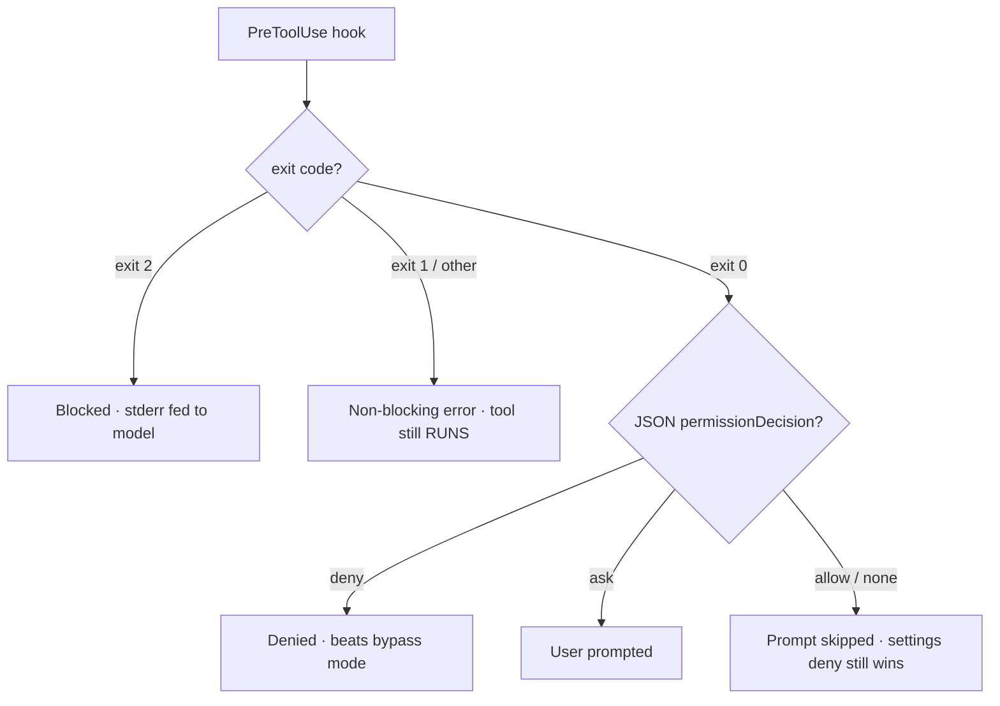
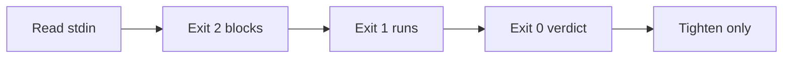
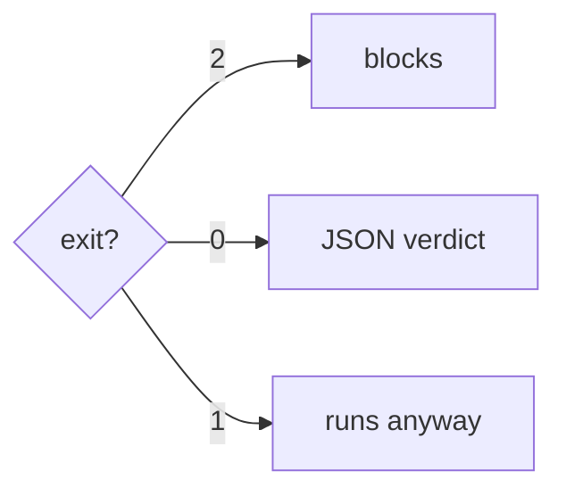

A `PreToolUse` hook reads the pending tool call as JSON on stdin and decides its fate. **Exit codes are the load-bearing, easy-to-get-wrong detail:** only **exit 2** blocks (and the hook's stderr is fed back to the model); **exit 0** allows; and **exit 1 or any other code is a *non-blocking* error — the tool still runs.** The trap is that `exit 1` is the conventional Unix "failure", so a policy hook that fails with `exit 1` *looks* like it blocked but doesn't.

For richer control, a hook can instead print a `hookSpecificOutput.permissionDecision` JSON on **exit 0**: `allow`, `deny`, `ask`, or `defer` (headless-only). When several hooks and rules apply, priority is **`deny` > `defer` > `ask` > `allow`**.

Two asymmetries make this safe: a hook **`deny` beats permission-mode bypass** (it blocks even under `bypassPermissions`), but a hook **`allow` does NOT override a settings `deny`** — hooks can *tighten* but never *loosen*. Note hooks **fail open**: on timeout or crash the tool proceeds, so a hook that must fail closed has to emit its own `deny` before its deadline.

<!-- step: A PreToolUse hook reads the pending tool call as JSON on stdin. -->

<!-- step: Exit 2 blocks the call — and the hook's stderr is fed back to the model. -->

<!-- step: Exit 1 (or any other code) is a non-blocking error: the tool still RUNS. The trap. -->

<!-- step: Exit 0 with a permissionDecision JSON: allow / deny / ask (priority deny > defer > ask > allow). -->

<!-- step: Hooks only tighten: a deny beats bypass mode, but an allow can't override a settings deny. -->

<!-- mini -->

