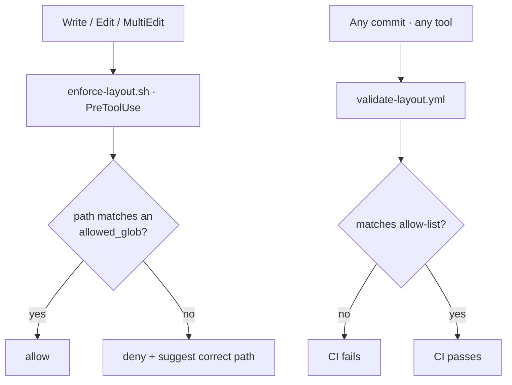
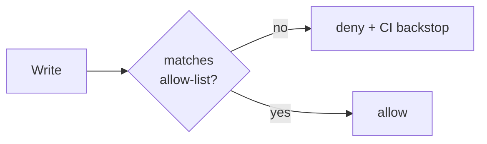

`hooks/enforce-layout.sh` runs `PreToolUse` on `Write|Edit|MultiEdit`: it reads `.repo-layout.json`, matches the target path against `allowed_globs`, and **denies an off-pattern write with a suggested correct location**. If the manifest is absent it silently allows everything — so consumers who install the plugin without a layout manifest aren't surprised.

Why a hook **and** CI: Claude Code issue #23478 confirms that path-scoped rule files (`paths:` frontmatter) load only on **Read**, not on **Write** — they cannot prevent off-pattern file *creation*. So the in-loop hook gives fast feedback during a session (Claude only), and `.github/workflows/validate-layout.yml` is the **cross-tool backstop** that catches direct human commits, Cursor/Codex/Aider edits, and any case where the hook didn't fire.

<!-- mini -->

