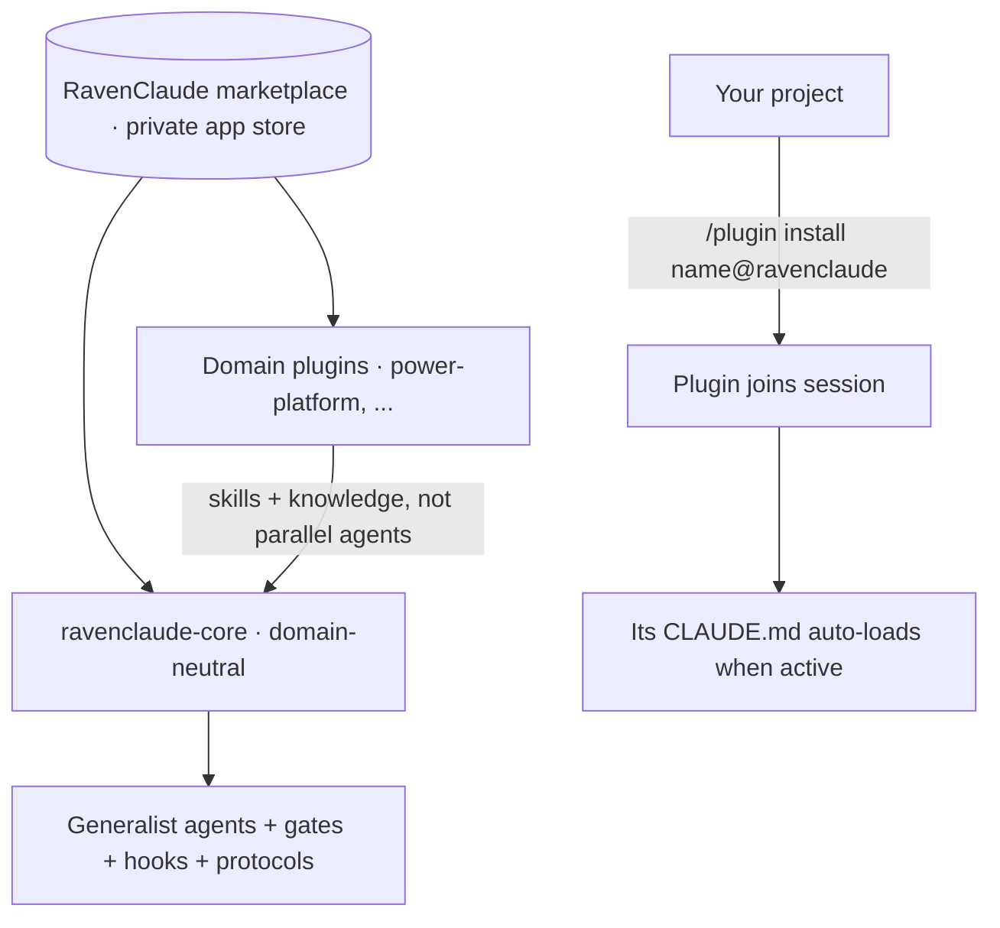
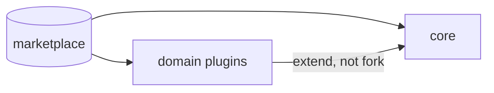

**RavenClaude is a private "app store" for Claude Code.** It is not an application you run — it is a **plugin marketplace**, and its product is the set of **plugins** that live under the `plugins/` directory. Each plugin is a self-contained bundle of capability — agents, skills, hooks, rules, knowledge, slash commands — that a Claude Code (or GitHub Copilot CLI) session can pull in.

To use one, you **install it into whatever project you're working in**:

```
/plugin install <name>@ravenclaude
```

That joins the plugin to your session. From then on, the plugin's `CLAUDE.md` — its operating constitution — **auto-loads whenever the plugin is active**, so its agents, conventions, and guardrails are in force without you having to paste anything. Updating is just `/plugin marketplace update ravenclaude`; the marketplace stays the single source of truth and your projects pull from it.

**Plugin separation — the core-vs-domain split.** The marketplace is deliberately layered so capability composes cleanly:

- **`ravenclaude-core` stays domain-neutral.** It carries the generalist machinery every project needs regardless of subject matter: the Team Lead and the generalist specialist agents (Architect, Coder, Reviewer, …), the dispatch playbook, the quality gates, the lifecycle hooks, and the cross-cutting protocols. Nothing in core is specific to finance, Power Platform, education, or any one vertical.
- **Domain plugins extend core; they don't fork it.** A domain plugin (e.g. `power-platform`) adds its expertise as **skills and knowledge files that core agents invoke** — *not* as a parallel set of agents that duplicate core's roles. The house rule (see `plugins/ravenclaude-core/CLAUDE.md`) is explicit: a domain plugin forks a core agent **only** when the domain's review rubric is genuinely incompatible with core's; otherwise it ships a skill plus a knowledge file and lets the core agent do the work. This keeps review behavior consistent across plugin boundaries and stops every vertical from re-inventing an architect and a security reviewer.

The net effect: install core once for the generalist team, layer on whichever domain plugins your project needs, and the domains *teach* core's agents rather than competing with them.




