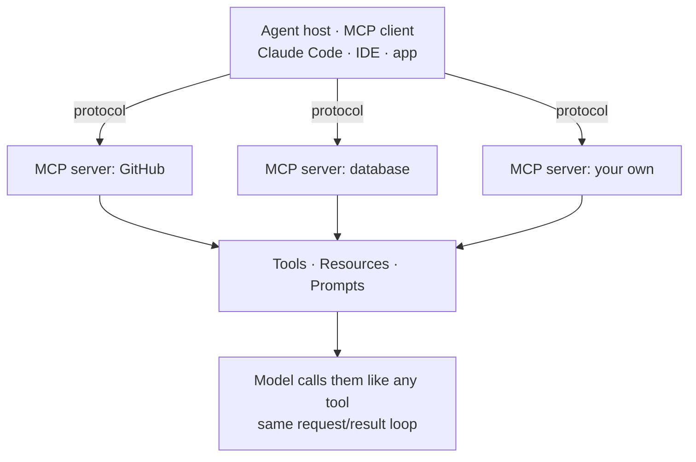
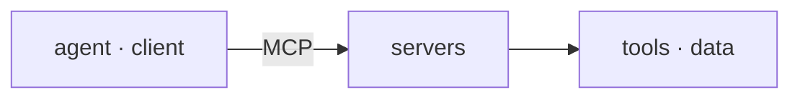

Tool use lets a model call a tool — but who *supplies* the tools? If every integration (GitHub, a database, a ticketing system) had to be hand-wired into every agent, you'd rebuild the same connectors over and over. The **Model Context Protocol (MCP)** is the open standard that fixes this. It's often described as *"a USB-C port for AI"*: a single, uniform way for an agent to plug into outside tools and data.

The shape is **client ↔ server.** Your agent host (Claude Code, an IDE, a desktop app) is an **MCP client**. An **MCP server** is a small program that exposes capabilities over the protocol. Write the server once, and *any* MCP-aware client can use it — the glue is the protocol, not bespoke per-app code. Servers offer three kinds of primitive:

- **Tools** — actions the model can call (the GitHub tools this very session uses are an MCP server).
- **Resources** — data the agent can read (files, records, query results).
- **Prompts** — reusable prompt templates the server provides.

Two things worth knowing:

- **Servers run as separate processes** and connect over a transport (local stdio, or remote HTTP/SSE). A server may be on your machine or across the network — the client talks to both the same way.
- **MCP tools are still just tool use.** Once connected, an MCP tool appears to the model exactly like any built-in tool: same request/result loop, same permission gating. MCP standardizes *where tools come from*, not *how the model calls them*. (In Claude Code a server can show as "still connecting" at startup — its tools are name-only until the schema loads, which is a connection state, not an absent capability.)

