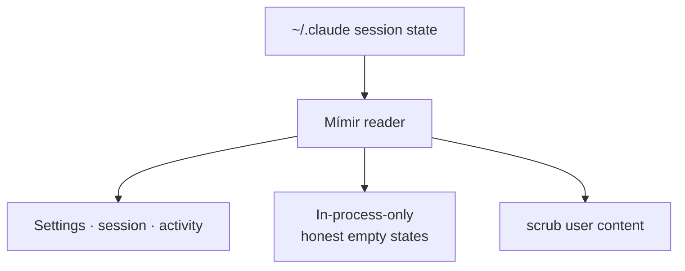

**Mímir** is the wise head at the well of knowledge — and his tab answers one question: *what does Claude Code actually know about **this** session?* It surfaces what's reachable from on-disk session state, replacing the need to remember `/status`, `/usage`, or `/theme`. Its defining discipline is **honesty about reachability** — it never fakes a value it can't read.

Five cards, hydrated from a served endpoint when the tab opens. **Settings** — theme, configured and last-used model, and permission mode, plus an honest in-process pill for reasoning effort (which is runtime-only and rendered as an explainer, never a fake dash). **Current session** — matched by working directory and busy status. **Activity summary** — drawn from the stats cache, carrying a mandatory "as of" date because the cache can be up to a day stale. **Recent project sessions** — the newest few session logs, each with its id prefix, event count, output-token sum, and git branch. And **In-process only** — the explicit list of fields that simply don't exist on disk (the effort dial, plan tier, live status cache), each with a per-field explainer, so the agent never claims dashboard parity for something it can't read.

A hard safety rule runs underneath: user-typed message content is **scrubbed** at the JSON boundary and never surfaced — only structural counts and metadata. Every dynamic byte is read live from the endpoint (nothing inlined at build time, the same freshness-gate reasoning as Norns). On a static host each card shows an honest "open the served dashboard" prompt while still rendering the layout so you see what's available once you switch.

